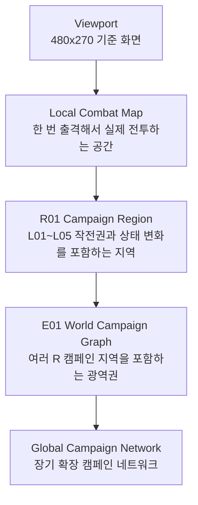
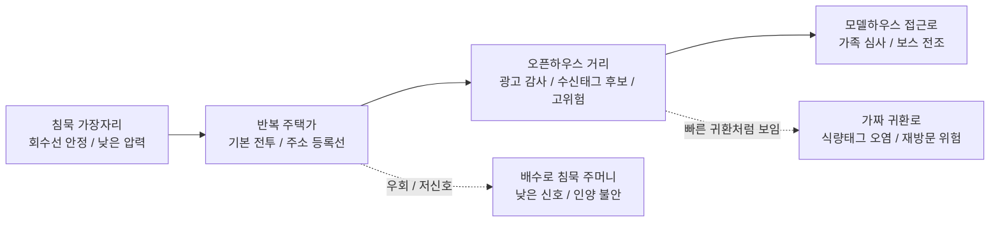
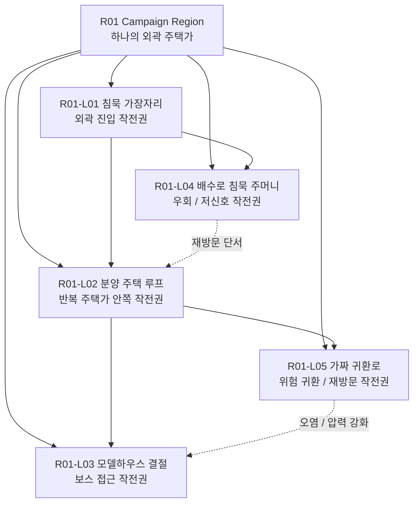
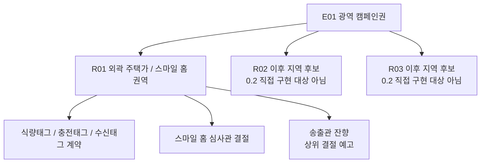

# E01/R01 Map Hierarchy Diagrams

## 0. 결론

현재 혼란은 `화면 크기`, `한 번 출격하는 로컬 전투 공간`, `R01 캠페인 지역`, `E01 광역 캠페인`, `장기 글로벌 네트워크`가 섞이면서 생긴다.

0.2의 기준은 다음이다.

```text
R01은 작은 아레나가 아니다.
L01~L05는 버튼 스테이지가 아니다.
E01 전체를 하나의 거대 seamless 전투맵으로 만들지도 않는다.
```

## 1. 계층 다이어그램



### 계층 설명

| 계층 | 의미 | 0.2 판단 |
|---|---|---|
| Viewport | 플레이어가 한 순간에 보는 화면 | 맵 크기가 아니다. 카메라/읽기/전투 밀도 기준이다. |
| Local Combat Map | 한 번 출격해서 실제로 이동하고 싸우는 공간 | R01 내부의 작전권을 실제 전투로 체험하는 층이다. |
| R01 Campaign Region | L01~L05, 위험 구역, 상태 변화, NPC 잔향을 포함하는 지역 | 0.2의 핵심 제작 대상이다. |
| E01 World Campaign Graph | 여러 R 지역을 묶는 광역 캠페인 | 0.2에서는 구조 기준만 잡고 전체 구현하지 않는다. |
| Global Campaign Network | 장기 확장 네트워크 | 0.2 범위 밖이다. |

## 2. 크기 기준표

| 항목 | 크기 | 의미 |
|---|---:|---|
| 화면 | 480x270 | 맵 크기 아님. 한 화면 단위의 가독성 기준이다. |
| 초기 blockout/짧은 노드 | 1920x810 | 초기 blockout 또는 짧은 전투 노드로는 가능하지만 R01 전체로 부족하다. |
| R01 첫 실전 테스트 권장 | 3840x2160 | 64 screens. R01이 지역으로 읽히는 최소 실전 후보. |
| 큰 R01 blockout 후보 | 5280x2970 | 121 screens. 현재 큰 R01 blockout 후보이며 밀도/동선 검증이 필요하다. |

## 3. R01 구조

R01의 중심 동선은 다음처럼 읽혀야 한다.



### 주 경로

| 구역 | 역할 |
|---|---|
| 침묵 가장자리 | R01 외곽. 회수선이 안정적이고 압력이 낮다. 첫 진입과 복귀 감각의 기준점이다. |
| 반복 주택가 | R01의 기본 리듬. 집 앞, 우편함, 표지판, 주소 등록선이 적/오브젝트 출처가 된다. |
| 오픈하우스 거리 | 광고 감사와 수신태그 후보가 강해지는 위험 구역. 보상보다 절차 압력이 먼저 보여야 한다. |
| 모델하우스 접근로 | 스마일 홈 심사관의 얼굴이 보이기 시작하는 결절 접근 구간이다. |

### 보조 경로

| 구역 | 역할 |
|---|---|
| 배수로 침묵 주머니 | 신호가 낮아 안전해 보이지만 인양 안정도가 흔들린다. |
| 가짜 귀환로 | 빠른 복귀처럼 보이나 실제로는 등록 절차와 식량태그 오염을 강화한다. |

## 4. R01-L01~L05와 실제 맵의 관계



| 작전권 | 실제 맵 관계 |
|---|---|
| R01-L01 | 별도 작은 스테이지가 아니라 R01 지역의 외곽 진입 작전권이다. |
| R01-L02 | 같은 R01 안쪽으로 더 들어가는 작전권이다. 주택가 반복과 주소 등록 압력이 강해진다. |
| R01-L03 | 모델하우스 결절 접근 작전권이다. 보스가 갑자기 등장하는 방이 아니라 지역 약관의 중심으로 수렴해야 한다. |
| R01-L04 | 배수로 침묵 주머니. 낮은 신호와 인양 불안이 함께 있는 우회 작전권이다. |
| R01-L05 | 가짜 귀환로. 빠른 복귀처럼 보이는 길이지만 지역 등록과 태그 오염을 키우는 작전권이다. |

## 5. E01과 R01의 관계



E01은 여러 R 캠페인 지역을 묶는 광역권이다. 0.2에서는 R01을 충분히 지역으로 만들고, E01은 작전도/용어/후속 슬롯으로만 남긴다.

## 6. 금지 결론

1. E01 전체를 하나의 거대 seamless 전투맵으로 만들지 않는다.
2. R01을 작은 아레나로 만들지 않는다.
3. L01~L05를 단순 버튼 스테이지로 만들지 않는다.
4. 480x270 mock을 실제 맵 크기로 착각하지 않는다.
5. 1920x810 초기 blockout을 R01 전체 기준으로 고정하지 않는다.
6. 5280x2970 후보를 “크니까 충분하다”로 승인하지 않는다. 거리, 위험, 회수선, 배치 이유가 있어야 한다.
7. 모델하우스 결절과 캠페인 송출관을 같은 첫 보스로 합치지 않는다.
