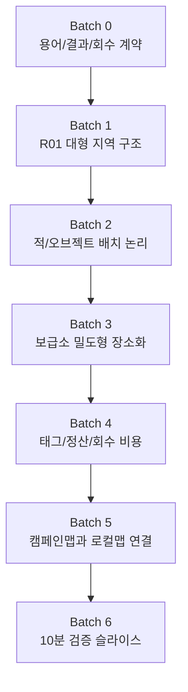

# Foundation-First Implementation Batch Plan

## 0. 원칙

기존 `NEXT_0_2_IMPLEMENTATION_BATCH_PLAN.md`는 10분 검증 슬라이스를 빠르게 만들기 위한 계획으로 유효했다. 그러나 지금 기준에서는 순서를 바꿔야 한다.

```text
Batch 0~5가 기반이다.
Batch 6에서야 10분 검증 슬라이스를 만든다.
```

이 계획은 작게 도망가는 계획이 아니다. 0.2의 RPG 기반을 먼저 고정하고, 그 다음에 테스트 가능한 플레이 흐름을 만든다.

## Batch 0: 용어/결과/회수 계약 정리

| 항목 | 내용 |
|---|---|
| 목표 | 죽음/승리 표현 제거, 회수/정산/보급소 라우팅 의미 정리, 보스명 정리, 태그 용어 정리 |
| 포함 파일 후보 | `scripts/main.gd`, `scripts/hud_controller.gd`, `scripts/meta_progression.gd`, `SYSTEM_FLOW_DIAGRAMS.md`, `GAME_ARCHITECTURE_MAP.md`, 결과 화면 관련 문구 |
| 구현 범위 | 내부 상태명과 유저-facing 표시명 분리, `GAME OVER`/`Victory` 표시 교체, 식량태그/충전태그/수신태그 기준명 적용, 스마일 홈 심사관/가족심사 관리자/시어머니/송출관 역할 분리 |
| 금지 범위 | 저장 구조 대개편, 장기 세이브 완성, 보스전 새 구현, 태그 경제 전체 밸런스 |
| 통과 기준 | 화면에서 죽음/부활/승리/보스 처치가 기본 결과처럼 보이지 않는다. 실패는 긴급 인양/정산 실패로 읽힌다. |
| PMO 판단 지점 | 유저가 첫 결과 화면을 보고 “죽었다”가 아니라 “회수됐고 정산이 꼬였다”고 말할 수 있는가 |
| 예상 리스크 | 내부 변수명과 표시명이 섞여 QA가 어려워질 수 있음. 우선 표시명 매핑표를 만든 뒤 수정해야 한다. |

## Batch 1: R01 대형 지역 구조 정리

| 항목 | 내용 |
|---|---|
| 목표 | R01 64~121 screen 기준 유지, 위험 구역 배치, 이동 시간 기준, 오픈하우스 거리/모델하우스 접근로/가짜 귀환로 의미 확정 |
| 포함 파일 후보 | `scripts/r01_layout_blockout.gd`, `scripts/r01_campaign_map.gd`, `R01_LOCAL_MAP_LAYOUT_LOGIC_SPEC.md`, `R01_REGION_REBUILD_0_2.md`, 충돌/내비 관련 리소스 |
| 구현 범위 | 침묵 가장자리, 반복 주택가, 오픈하우스 거리, 모델하우스 접근로를 실제 맵 동선으로 구분. L04/L05는 위치와 의미를 씨앗으로 배치. |
| 금지 범위 | E01 전체 seamless 맵, R02 이후 지역, 보스 본체 완성, 맵을 크기만 키우는 작업 |
| 통과 기준 | L01/L02/L03가 같은 큰 주택가 안쪽으로 이어진다고 보인다. 480x270 화면을 맵 크기로 착각하지 않는다. |
| PMO 판단 지점 | 플레이어가 “다음 버튼”이 아니라 “더 안쪽 구역”을 선택한다고 느끼는가 |
| 예상 리스크 | 큰 맵이 비어 보일 수 있다. 크기 확장과 배치 논리를 반드시 같이 진행해야 한다. |

## Batch 2: R01 적/오브젝트 배치 논리 적용

| 항목 | 내용 |
|---|---|
| 목표 | 몹을 아무 데나 뿌리지 않음, 광고 인프라 source와 적 출현 연결, trace 위치에 이야기/위험 이유 부여, 30/100/300 밀도는 배치 논리와 같이 검증 |
| 포함 파일 후보 | `scripts/enemy_controller.gd`, `scripts/r01_layout_blockout.gd`, `R01_MONSTER_OBJECT_PLACEMENT_LOGIC.md`, enemy spawn config, object placement data |
| 구현 범위 | 쿠폰 전단, 미소 우편함, 홈케어 청소기, 상담원/키오스크, 행복 보증 상담원의 source 구역 정의. trace는 위험/동선/이야기 이유가 있는 곳에만 배치. |
| 금지 범위 | 랜덤 스폰 밀도만 조정, 적 종류 대량 추가, 모든 보스 패턴 완성 |
| 통과 기준 | 적이 어디서 왜 나왔는지 화면만 봐도 암시된다. trace가 재화 반짝임이 아니라 사건 흔적으로 보인다. |
| PMO 판단 지점 | 전투가 광고/주거/가족 심사 절차와 연결되어 보이는가 |
| 예상 리스크 | source 기반 배치가 전투 리듬을 답답하게 만들 수 있다. 전투 가독성과 절차 의미를 같이 조정해야 한다. |

## Batch 3: 보급소 밀도형 장소화

| 항목 | 내용 |
|---|---|
| 목표 | 작은 공간 안에 회수 플랫폼/정산/정비/이름/게시판/조율대가 읽힘, NPC 2~3명 최소 반응, 업글 메뉴가 아니라 귀환 장소로 보임 |
| 포함 파일 후보 | `scripts/outpost_layout_blockout.gd`, `scripts/main.gd`, `scripts/hud_controller.gd`, `OUTPOST_WORLD_SPACE_DESIGN.md`, outpost UI/scene resources |
| 구현 범위 | 회수 플랫폼에서 진입, 정산 카운터에서 결과 확인, 정비대/차징 조율대에서 최소 1개 조율, 출격 게시판에서 R01 재출격, 이름 보관함에 흔적 1개 anchor |
| 금지 범위 | 큰 마을, 상점/가챠, NPC 5명 전체 대화, 모든 시설 완성 |
| 통과 기준 | 보급소가 화면 전환 메뉴가 아니라 돌아온 장소로 보인다. 정산 카운터와 출격 게시판이 물리적으로 분리되어 읽힌다. |
| PMO 판단 지점 | 유저가 “업글 창을 열었다”가 아니라 “돌아와서 정산했다”고 말하는가 |
| 예상 리스크 | 시설이 많아 보이지만 기능은 얕을 수 있다. P0는 시설 밀도보다 귀환 동선과 첫 반응에 집중한다. |

## Batch 4: 태그/정산/회수 비용

| 항목 | 내용 |
|---|---|
| 목표 | 식량태그/충전태그/수신태그가 돈처럼 보이지 않게 함, 후보/승인/보류/오염 구분, 빠른 죽음 파밍 방지, 회수 실패가 감정과 지역 반응을 남김 |
| 포함 파일 후보 | `scripts/meta_progression.gd`, `scripts/main.gd`, `scripts/hud_controller.gd`, ration/audit/result data, `META_PROGRESSION_ARCHITECTURE.md` |
| 구현 범위 | 결과 화면에서 후보/승인/보류/오염 분리, 첫 강제 회수/일반 실패/정상 회수/보스 회수/보스 처리 후 귀환 비용 분리, 보급소 NPC 반응 연결 |
| 금지 범위 | 장기 경제 밸런스, 태그 교환 상점, 유료 성장, 전체 세이브 구조 |
| 통과 기준 | 실패만으로 보상이 생기지 않는다. 무엇이 승인되고 무엇이 보류됐는지 이해된다. |
| PMO 판단 지점 | 유저가 “죽어서 돈 받았다”가 아니라 “행동 근거가 일부 승인됐다”고 이해하는가 |
| 예상 리스크 | 정산이 복잡해 보일 수 있다. 화면에는 핵심 3줄, 상세는 보급소 반응으로 보낸다. |

## Batch 5: 캠페인맵과 로컬맵 연결

| 항목 | 내용 |
|---|---|
| 목표 | L01/L02/L03가 단순 버튼이 아니라 같은 큰 지역 안쪽으로 느껴짐, R01 작전도와 실제 시작 위치/위험 구역 연결, L04/L05는 가지/위험/후속 루트로 읽힘 |
| 포함 파일 후보 | `scripts/r01_campaign_map.gd`, `scripts/r01_layout_blockout.gd`, `scripts/main.gd`, campaign map UI/scene, `R01_LOCAL_MAP_LAYOUT_LOGIC_SPEC.md` |
| 구현 범위 | R01 작전도에서 선택한 작전권이 실제 로컬맵 시작 위치/위험 구역/회수선과 연결. 회수 후 작전도 변화 최소 1개 표시. |
| 금지 범위 | E01 전체 구현, 글로벌 캠페인 네트워크, 모든 L 노드 완성, 버튼 목록식 스테이지 선택 |
| 통과 기준 | L02 선택이 “다음 스테이지”가 아니라 “같은 지역 안쪽으로 더 들어감”으로 읽힌다. |
| PMO 판단 지점 | 지도와 실제 맵이 서로 다른 UI가 아니라 같은 지역의 두 표현으로 보이는가 |
| 예상 리스크 | 작전도 추상도가 높으면 버튼처럼 보인다. 지도 문구보다 시작 위치와 위험 구역 연결이 중요하다. |

## Batch 6: 그 다음에 10분 검증 슬라이스

| 항목 | 내용 |
|---|---|
| 목표 | 위 기반이 들어간 뒤에야 실제 10분 재미 검증, 질문지 + 행동 지표 + 스크린샷/영상 기준 사용 |
| 포함 파일 후보 | `VERTICAL_SLICE_0_2_FUN_VALIDATION_PLAN.md`, `CORE_10_MINUTE_LOOP_DIAGRAMS.md`, 플레이테스트 체크리스트, QA 기록 |
| 구현 범위 | 윤서 출격, R01-L01/L02, 첫 회수, 보급소, NPC 2~3명 반응, 태그 정산, 캠페인맵 갱신, 재출격, 지역 변화, 보스 신호 예고 |
| 금지 범위 | 기반 미완 상태에서 “일단 재미 확인”, 전체 캠페인 완성, 모든 NPC, 모든 보스 패턴, 20명 플레이어블 |
| 통과 기준 | 플레이어가 10분 안에 이 게임이 단순 뱀서류가 아니라 출격형 광고 정산 액션 RPG임을 행동으로 이해한다. |
| PMO 판단 지점 | 재출격 선택, 위험 구역 선택, 회수 원인 설명, 태그 권한 이해, 보급소 장소감이 모두 관찰되는가 |
| 예상 리스크 | 기반이 들어가도 전투가 재미없으면 전체가 무너진다. Batch 6에서는 액션 감각도 함께 본다. |

## 최종 순서



Batch 6은 앞 단계의 대체물이 아니다. Batch 0~5가 통과되어야 10분 검증이 의미를 가진다.
