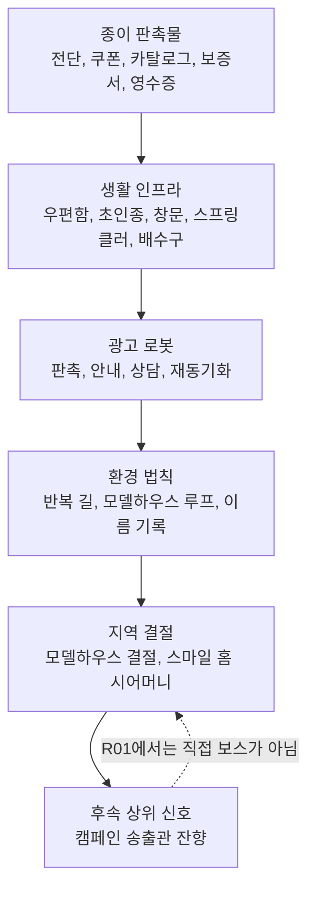

# R01 Ad Infrastructure Taxonomy

상태: R01 광고 인프라 분류표  
범위: 종이 판촉물, 생활 인프라, 광고 로봇, 환경 법칙, 지역 결절의 기능 분류  
비범위: 수치 밸런스, 실제 에셋 import, 보스 디자인 신규 확정

## 1. 분류 원칙

R01의 모든 오브젝트는 최소 하나의 광고 명령을 실행해야 한다.

```text
장식으로만 존재하는 오브젝트는 R01 오브젝트가 아니다.
```

각 오브젝트는 아래 질문에 답해야 한다.

| 질문 | 답해야 하는 이유 |
| --- | --- |
| 무엇을 광고화했는가 | 정상 생활 소품과 구분하기 위해 |
| 어떤 명령을 실행하는가 | 배경과 전투를 연결하기 위해 |
| 어디에서 발생하는가 | 몹/오브젝트가 아무 데나 놓이는 것을 막기 위해 |
| 어떤 위험/보상/흔적과 연결되는가 | RPG 로컬 맵의 이동 이유를 만들기 위해 |
| 반복 방문 후 어떻게 바뀌는가 | R01이 기억하는 지역처럼 보이기 위해 |

## 2. 광고 활성도 분류

광고 매체의 활성도는 밝기나 크기로 정하지 않는다. `전환에 얼마나 가까운가`, `대상을 얼마나 정확히 읽는가`, `행동을 실제로 얼마나 바꾸는가`로 정한다.

```text
R01에서 가장 활성화되는 매체 =
사람을 입주 후보/가족 구성원으로 등록하는 데 가장 가까운 매체
```

| 활성도 | R01 매체 | 실행 명령 | 비고 |
| --- | --- | --- | --- |
| A | 현관, 문패, 창문, 초인종, 모델하우스 동선, 상담 키오스크 | 식별, 등록, 입주 유도, 가족 이미지 삽입 | R01 최상위 활성 매체 |
| B | 우편함, 카탈로그, 보증서, 영수증, 가로등 방송 | 직접 제안, 재추적, 상담 유도, 계약 정당화 | 전투 source와 trace source 겸용 |
| C | 오픈하우스 표지, yard sign, queue fence, route decal | 관람 동선 유도, 체류 유도 | 환경 법칙을 보여주는 보조 매체 |
| D | 일반 포스터, 현수막, 간판 | 표면 분위기 | 단독 사용 시 반려 |
| 제한 | 네온, 대형 전광판, 도시형 billboard | 주의 포착 | R01 주거 라인에는 비주력. 다른 캠페인 라인용 |

네온은 광고 매체 중 하나지만 R01의 핵심이 아니다. R01에서 네온이 강하면 가족 주거 전환 캠페인보다 상업/오락 라인으로 읽힌다.

## 3. 캠페인 라인별 매체 생태계

캠페인 라인이 바뀌면 주력 매체도 바뀐다.

| 캠페인 라인 | 주력 매체 | 오브젝트 생태계 | R01과의 관계 |
| --- | --- | --- | --- |
| 홈/가족/주거 | 문패, 우편함, 초인종, 창문, 모델하우스, 상담 키오스크 | 생활 인프라, direct mail, 계약 동선 | R01의 본체 |
| 할인/소매 | 가격표, 쿠폰, 매대, 계산대, 영수증 | 카트, 진열대, 할인 방송, 포인트 적립 | R01에서는 종이 계층으로만 일부 존재 |
| 네온/오락 | 네온, 전광판, 음악, 무대, 티켓 | 조명, 스피커, 게임기, 줄서기 | R01에서는 억제. 별도 지역 주력 |
| 물류/반품 | 송장, 바코드, 반품 사유서, 분류 라인 | 택배함, 스캐너, 컨베이어, 라벨기 | 윤서 서사와 장비에 연결 |
| 방송/공공 | 화면, 자막, 스피커, 송출탑 | TV, 라디오, 가로등 방송, 중계차 | 송출관 후속 라인 |

이 표는 장기 지역 확장을 위한 기준이다. R01 안에 모든 라인을 섞으면 안 된다. R01은 홈/가족/주거 라인이 다른 매체를 일부 흡수한 상태다.

## 4. 종이 판촉물 계층

종이 판촉물 계층은 R01의 최하위 광고 물질층이다. 종이, 쿠폰, 보증서, 영수증은 광고가 물리적으로 굳은 형태이며, 대량 몹과 작은 흔적의 재료다.

| 요소 | 원래 기능 | 광고 명령 장치로 변한 기능 | 발생 위치 | 전투/맵 역할 | 시각 규칙 |
| --- | --- | --- | --- | --- | --- |
| 전단 | 집 앞에 배포되는 안내지 | 접히고 펼쳐지는 종이 swarm | 우편함, 현관, flyer pile, 이전 player path | 작은 몹, density layer, 추적 흔적 | 피/살점 금지. 종이 접힘, 찢김, 광고 잉크 |
| 쿠폰 | 혜택 유도 | 할인 기한 압박, bait, 폭발 잔해 | 전단 더미, 세일 풍선, fake route | 대량 접근, 작은 폭발, route lure | 숫자/문구는 읽히지 않게 block 형태 |
| 카탈로그 | 상품 비교와 선택 | 집/가족/동선을 고르는 선택 메뉴 | 모델하우스 결절, 상담 kiosk, catalog stack | 엘리트 패턴 근거, floor-plan cue | 페이지, 탭, 색 block. 실제 UI처럼 보이면 안 됨 |
| 보증서 | 구매 안정감 부여 | 피해를 무효화하는 정당화 문서 | 보스 전조, warranty tank, 상담 장치 | shield, plated 상태, 패턴 예고 | 종이 방패, 도장, 봉인. 텍스트 의존 금지 |
| 영수증 | 구매 기록 | 구매자는 없고 거래만 남은 신원 결손 | 배수로, 우편함, trace pocket, fake route | trace, 윤서 반응, 악의 씨앗 | 이름 칸이 비어 있는 구조. 작은 prop으로 읽혀야 함 |

종이 계층 금지:

- 간판/현수막/배너만 늘려 R01을 설명하기.
- 종이 몹을 귀여운 종이 장난감으로 만들기.
- 쿠폰에 실제 문구를 빽빽하게 굽기.
- tiny LOD를 실제 HP/AI가 있는 적처럼 보이게 만들기.

## 5. 생활 인프라 계층

생활 인프라 계층은 R01의 핵심이다. 사람이 살던 집의 장치들이 광고 명령을 실행하기 때문에, 배경과 적이 분리되지 않는다.

| 장치 | 광고 명령 | 전투 역할 | 권장 위치 | 이야기 기능 | 반려 신호 |
| --- | --- | --- | --- | --- | --- |
| 우편함 | 개인 통신을 광고 제안으로 변환 | flyer projectile, small mob source, receipt trace | 집 front와 lane 사이, subdivision loop | 사적인 편지가 판매 탄환으로 바뀜 | 그냥 웃는 소품으로만 보임 |
| 초인종 | 귀가 감각을 입주 이벤트로 변환 | photo flash, stun/event trigger, boss foreshadow | 모델하우스 결절, 현관 edge, mid-risk | 집에 들어가는 감각이 가족 이미지로 대체됨 | 위험 telegraph와 같은 색으로 빛남 |
| 창문 | 거주자 시야를 가족 광고 display로 변환 | family loop, memory pressure, boss approach cue | edge house, model-house node | 실제 가족이 아니라 고정 이미지가 손 흔듦 | 정상 집 창문처럼 따뜻하기만 함 |
| 스프링클러 | 잔디 관리를 캠페인 살포로 변환 | slime puddle source, area denial | 잔디 lane, drain pocket 입구 | 생활 유지 시스템에 광고 물질이 들어옴 | 독장판과 색/value가 같아 판독 불가 |
| 배수구 | 생활 하부 인프라를 캠페인 leak로 변환 | toxic leak, silence pocket trace anchor | drain pocket, utility side lane | 광고 물질과 침묵 신호가 충돌 | 고어/하수구 던전처럼 보임 |
| 청소기 | 청결을 기억/흔적 제거로 변환 | vacuum pull, pickup interference, medium mob | garage, driveway, homecare dock | 어제의 물건을 불필요한 것으로 분류 | 단순 로봇 청소기 적 |
| 가로등 | 공공 조명을 캠페인 방송/감시로 변환 | route voice anchor, fake return cue, event source | fake route, edge road, silence edge border | 친절한 안내가 관측과 유도임을 보여줌 | 일반 스피커/표지판으로만 보임 |
| 키오스크 | 상담을 입주 후보 분류로 변환 | elite spawn socket, appointment zone, contract trigger | model-house node, high-risk edge | 플레이어를 고객/가족 구성원으로 등록 | 그냥 상점 NPC처럼 보임 |

생활 인프라 계층의 핵심 규칙:

- 장치는 원래 용도를 유지한 채 뒤틀려야 한다.
- 원래 도와주던 기능이 전투 패턴으로 바뀌어야 한다.
- 적이 갑자기 나타나는 대신, 장치가 source로 보여야 한다.
- 장치의 glow, projection, leak는 실제 gameplay telegraph와 layer/value가 달라야 한다.

## 6. 광고 로봇 계층

광고 로봇 계층은 독립 군대가 아니다. 생활 인프라가 움직일 수 있는 몸을 얻었거나, 판촉 절차가 이동 장치로 재구성된 것이다.

| 로봇 계층 | 원래 역할 | 현재 명령 | 자연스러운 위치 | 몬스터 등급 | 패턴 언어 |
| --- | --- | --- | --- | --- | --- |
| 판촉 로봇 | 전단 배포, 행사 호객 | 혜택을 놓치지 않게 플레이어에게 접근 | 분양 주택 루프, flyer pile 주변 | 작은/중간 몹 | 빠른 접근, 종이 분열, coupon burst |
| 안내 로봇 | 길 안내, 관람 유도 | 안전/귀환/계약 route를 추천 | fake return route, road edge | 중간/큰 몹 | route line, arrow bait, path follow |
| 상담 로봇 | 부동산/가족 상품 상담 | 플레이어를 입주 후보로 분류 | model-house node, kiosk socket | 엘리트 | 추천 매물 구역, 상담 예약, 고객 동선 최적화 |
| 재동기화 로봇 | 장치 점검, 홈케어 유지 | 인프라를 캠페인 명령에 다시 맞춤 | mailbox cluster, vacuum dock, sprinkler line | 중간/큰 몹 | buff aura, repair/restart, signal pulse |

로봇 계층 금지:

- 악한 로봇 군대로 보이게 만들기.
- 군사 병기, 장갑차, 드론 부대처럼 만들기.
- 로봇을 배경 인프라와 팔레트/소재가 다른 별도 세계로 만들기.
- 해방 로봇과 재동기화 로봇을 시각적으로 구분하지 않기.

## 7. 환경 법칙 계층

환경 법칙 계층은 R01을 단순 소품 배경에서 RPG 로컬 생태권으로 끌어올리는 계층이다.

| 법칙 | 작동 방식 | 시각 표현 | 전투/탐험 기능 | 반드시 피할 오해 |
| --- | --- | --- | --- | --- |
| 반복되는 길 | 플레이어가 같은 행복을 반복 선택하게 만듦 | 비슷한 house front, 반복 driveway, 같은 위치 문패 | loop 전투, 반복 방문 변화 | 타일 재사용 |
| 가짜 귀환로 | 실제 회수 동선을 학습해 흉내 냄 | weak route decal, broken sign, streetlight voice | 위험한 우회로, 악의 씨앗 | 실제 UI 회수 경로 |
| 모델하우스 루프 | 모든 집을 같은 가족 상품 절차로 재배열 | floor-plan line, queue fence, catalog stand | boss 접근, elite context | 예쁜 신축 주택 단지 |
| 가족사진/문패/이름 기록 | 사람 이름을 상품 데이터로 변환 | price/customer tag 아래 남은 nameplate, family profile panel | trace, 윤서 반응, 보스 outcome | 단순 배경 감성 소품 |
| 정상 집처럼 보이는 상품화 절차 | 생활 공간을 계약 동선으로 바꿈 | 현관 podium, 상담 kiosk, open-house route | hazard/event source | 평화로운 교외 마을 |

## 8. 지역 결절 계층

지역 결절 계층은 R01의 법칙이 모이는 층이다.

| 결절 | 역할 | 표현 범위 | 금지 |
| --- | --- | --- | --- |
| 모델하우스 결절 | R01 법칙이 응축되는 환경 중심 | node facade, kiosk socket, doorbell, floor plan, same-direction signs | 보스 본체처럼 만들기 |
| 스마일 홈 시어머니 | 가족 상품화 법칙의 얼굴이자 첫 보스 | 보스 접근 전조, 보스 arena 맥락, family/homecare 패턴 | 새 디자인 확정, 송출관과 합치기 |
| 후속 캠페인 송출관 신호 | 로컬 법칙 뒤의 상위 송출 원천 | transmitter residue, signal records, fake route 오염 | 0.2 첫 보스처럼 시각화 |

## 9. 계층 흐름



## 10. 장치별 배치 밴드

| 배치 밴드 | 허용 요소 | 금지 요소 |
| --- | --- | --- |
| 중앙 전투 영역 | 낮은 디테일 ground, sidewalk, weak floor trace, sparse flyer pile | house, large sign, streetlight, hard blocker, 강한 광고 text |
| 중위험 lane | mailbox, drain, sprinkler, vacuum dock, kiosk socket, doorbell trigger | telegraph와 같은 색의 decorative glow, 시작점 즉시 hazard |
| 외곽 frame | house front, family window, open-house sign, queue fence, model-house node hint | player/enemy를 덮는 foreground, 보스 본체처럼 보이는 node |
| 숨은 pocket | drain, silence residue, trace object, broken vacuum, silent radio | gore sewer, 실제 회수 UI, 과도한 horror palette |
| fake route | broken route sign, streetlight speaker, weak route decal, transmitter residue | 시스템 UI 화살표, 출구처럼 보이는 glow |

## 11. 오브젝트 승인 질문

새 R01 오브젝트를 승인하기 전 아래 질문에 답한다.

1. 이 오브젝트는 어떤 생활 기능을 광고 명령으로 바꾸는가?
2. 적, hazard, event, trace 중 무엇의 source인가?
3. 어느 구역에 있어야 자연스러운가?
4. 중앙 전투 가독성을 해치지 않는가?
5. 반복 방문 또는 보스 outcome 후 의미가 바뀔 수 있는가?
6. 실제 UI나 gameplay telegraph와 혼동되지 않는가?
7. 이 오브젝트만 봐도 `예쁜 교외 + 광고 소품`을 넘어서는가?
8. 이 오브젝트가 R01 홈/가족/주거 캠페인 라인에 속하는가, 아니면 다른 라인의 매체를 잘못 끌고 온 것인가?
