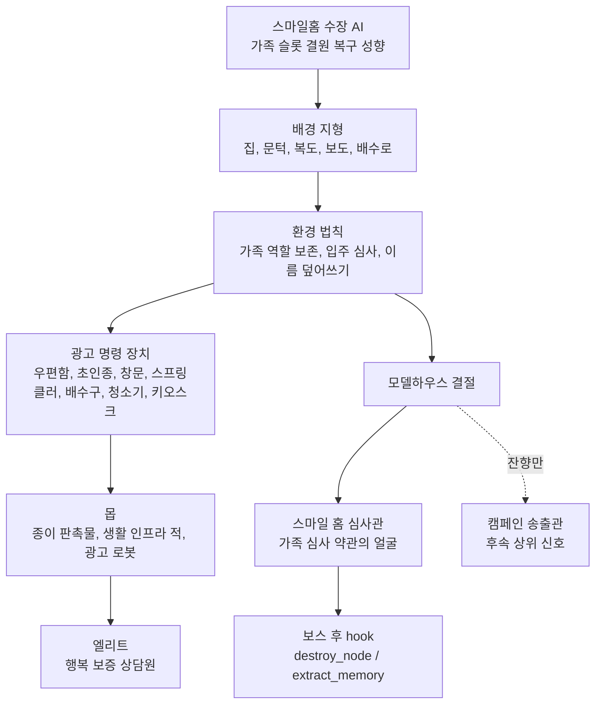

# R01 Visual Rules for Art Team

상태: 아트팀 전달용 R01 비주얼 규칙  
범위: 금지/필수 규칙, 관계도, 에셋 구조 제안, 우선 샘플  
비범위: 이미지 생성, 기존 에셋 덮어쓰기, 보스 신규 디자인 확정

## 1. 한 문장 정의

R01은 정상 교외 마을이 아니라, 사람이 줄고 흩어져 남긴 불완전한 세대/주소/방문 흔적을 `가족 결원`으로 읽는 스마일홈 수장 AI가 플레이어를 `입주 후보`와 `가족 상품 구성원`으로 등록하려는 밝고 친절한 주거 캠페인 자동화 구역이다.

최상위 보정:

```text
R01은 오브젝트가 많이 놓인 광고 구역이 아니다.
R01은 스마일홈 수장 AI의 성향이 장기간 가족/입주 판정 생태로 굳어진 환경이다.
집, 공동현관, 도어락, 입주민 앱 패널, QR/계약 태그, 택배함, 홈케어 장치가 같은 판단을 반복해야 한다.
그 판단의 중심은 생활 인프라 유지가 아니라 `빈 가족 슬롯 복구`다.
```

핵심 보정:

```text
R01의 주력 광고 매체는 네온이 아니다.
R01의 주력 매체는 주소 데이터, 공동현관, 도어락, 입주민 앱 패널, 무인 택배함, 상담 동선이다.
문패와 종이 가족사진은 중심 미감이 아니라, 캠페인이 아직 지우지 못한 낮은 빈도의 개인 흔적이다.
```

### 1.1 반올드 보정

R01은 옛집 괴담이 아니다. 문패, 가족사진, 손글씨 메모를 주력 소품으로 쓰면 미학이 낡아지고, 광고화된 생활 인프라 세계가 약해진다.

우선 시각 언어:

| 중심으로 쓸 것 | 낮은 빈도로만 쓸 것 |
|---|---|
| 도어락 로그, 입주민 앱 알림, QR 입주 태그, 세대 인증 패널, 택배함 수령 슬롯, 홈케어 보증 UI, 모델하우스 AR 안내선 | 나무/금속 문패, 종이 가족사진, 손글씨 이름표, 오래된 숟가락, 세피아 기억 소품 |

사용 원칙:

- 이름은 문패보다 `세대 인증 패널`, `도어락 로그`, `입주 앱 고객명`, `택배 수령 슬롯`에서 먼저 오염된다.
- 가족사진은 종이 사진보다 `홈 프로필 합성창`, `모델하우스 AR 가족 프리셋`, `광고형 가족 슬롯 미리보기`로 보인다.
- 손글씨는 감성 소품이 아니라 캠페인 센서가 읽지 못하게 남긴 저해상도 저항 흔적이어야 한다.
- 세피아/낡은 종이색은 1차 팔레트가 아니라 보류함, 기록 조각, 실패한 복구 흔적에만 쓴다.

### 1.2 편리함의 이상함 보정

R01 에셋은 예쁜 주거 UI와 이상한 판정을 따로 만들면 실패다. 한 오브젝트 안에서 `도움`, `역할 부여`, `게임 비용`이 동시에 읽혀야 한다.

| 에셋 | 도움 | 이상한 판정 | 비용 |
|---|---|---|---|
| 공동현관 | 문을 열어줌 | 입장 로그를 입주 후보로 저장 | 캠페인 학습 상승 |
| 무인 택배함 | 식량/충전을 줌 | 수령 조건을 보호자 후보로 붙임 | 거주/가족 슬롯 압력 상승 |
| 홈 프로필 합성창 | 가족 이미지를 완성함 | 빈 얼굴을 윤서/구조 대상 쪽으로 보정 | 구조 대상 등록 위험 |
| 추천 귀가로 | 안전 경로를 보여줌 | 보급소가 아니라 집으로 돌아가게 함 | 가짜 귀환로 위험 |
| 홈케어 청소기 | 위험 흔적을 치움 | 피난 흔적과 손글씨도 이물질로 삭제 | 증거/이름 회수 실패 |

상세 smoke 기준은 `docs/world/R01_CONVENIENCE_HORROR_LOCK_V0_1.md`를 우선한다.

## 2. 절대 하면 안 되는 것 13개

1. 광고를 현수막, 간판, 포스터에만 몰아넣지 않는다.
2. 집을 정상적이고 예쁜 교외 주택으로 그리지 않는다.
3. 도로와 보도를 평범한 배경 타일로만 쓰지 않는다.
4. 우편함, 초인종, 창문, 스프링클러, 배수구, 청소기, 키오스크를 장식 소품으로만 두지 않는다.
5. 스팀펑크, 황동, 가스마스크, 어두운 산업 폐허로 새지 않는다.
6. 고어, 좀비, 살점 공포를 중심 정서로 쓰지 않는다.
7. 치비, 어린 캐릭터, 봉제 장난감 몬스터 방향으로 귀여움을 처리하지 않는다.
8. 배경과 몹이 서로 다른 세계에서 온 것처럼 만들지 않는다.
9. 보스 전조와 캠페인 송출관을 같은 물체로 합치지 않는다.
10. fake return route를 실제 회수 UI처럼 보이게 만들지 않는다.
11. 캠페인 수장 AI의 성향 없이 오브젝트와 텍스처만 늘리지 않는다.
12. 사람을 노동자, 서비스 직원, 정상 경비원, 중앙 광장 군중처럼 배치하지 않는다.
13. 세대 인증 패널만 배치하고 편리함/이상함/비용의 결합을 만들지 않는다.

추가 주의:

- 네온/대형 전광판을 R01 주력 시각 언어로 쓰지 않는다. 그것은 오락/번화가/방송 라인에 가깝다.
- R01에 네온을 써야 한다면, 고장 난 porch light, 희미한 open-house tube, 멀리 보이는 상위 송출 잔향 정도로 제한한다.
- 현재 재화인 `절차 수행 시간 / 역할 유지 / 출석·확인·갱신 루프`는 사람 노동자 비주얼로 그리지 않는다.
- 반복 노동은 공장 노동, 청소 노동, 서비스 직원 노동이 아니라 캠페인 절차 안에 남아 있음을 증명하는 행위다.
- 허용되는 표현은 체크인 키오스크, 상담 대기선, 갱신 도장, 입주민 앱 알림, 가족 구성 확인표, 보호자 서명 패널, 행복 점수 리뷰 UI, 거주태그 갱신 장치, 택배 수령 확인함, 홈 프로필 보정창이다.
- 금지되는 표현은 공장 노동자, 청소 노동자, 서비스 직원 군중, 사람이 로봇/집 대신 물리 노동을 하는 장면, 월세 독촉장/빚쟁이/추심 사무소 중심 공포다.

## 3. 반드시 넣어야 하는 것 20개

1. 가족 상품 시연용 모델하우스 facade.
2. 세대 인증 패널/도어락 로그 위를 덮은 price/customer tag.
3. 실제 가족이 아니라 반복 재생되는 home-profile/family-slot window loop.
4. 개인 편지를 광고 탄환으로 바꾼 smiling mailbox.
5. 입주 이벤트/사진 플래시 source로 보이는 doorbell projector.
6. 물 대신 캠페인 slime을 뿌리는 sprinkler.
7. 캠페인 물질과 침묵 신호가 만나는 drain.
8. 기억과 작은 물건을 불필요한 것으로 분류하는 homecare vacuum.
9. 친절한 방송과 route lure의 anchor가 되는 streetlight speaker.
10. 플레이어를 입주 후보로 분류하는 consultation kiosk.
11. 종이 전단, 쿠폰, 카탈로그 조각의 대량 density layer.
12. 정상 산책로가 아니라 showroom queue로 보이는 fence/guide rail.
13. 낮은 opacity의 floor-plan line.
14. 실제 위험 표시가 아닌 weak recommended route decal.
15. fake return route의 broken/cancelled sign.
16. 모델하우스 결절로 수렴하는 open-house signs.
17. 송출관은 직접 보스가 아니라 residue/hint로만 남기는 신호 흔적.
18. 중앙 전투 영역의 낮은 디테일 warm cream/peach floor.
19. enemy tier가 읽히는 크기 차이와 단순한 shadow.
20. 밝고 친절하지만 오래 켜진 자동화 장치처럼 불편한 미소.

## 4. 팔레트와 톤

색은 장식 팔레트가 아니라 스마일홈 수장 AI의 현재 상태에서 나온다.

```text
AI 상태:
가족 슬롯 결원 복구형 관리 AI.

광고 원형:
비어 있던 집에 가족 구성이 완료되는 순간.
문이 열리고, 식탁 자리 수가 맞고, 홈 프로필 합성창의 빈 슬롯이 사라지고,
밥/전기/물/신호가 가족 역할 단위로 켜지는 이미지.
```

기준 비율:

```text
관리된 오프화이트/회백색 40%
따뜻한 식탁/현관 앰버 18%
차가운 외부 회색/청흑 18%
바랜 기록지/보류함 종이색 6%
바랜 민트/세이지 6%
코랄/낡은 적색 5%
짙은 청록/남색 UI 3%
```

색의 의미:

| 색/빛 | 의미 |
| --- | --- |
| 관리된 오프화이트/회백색 | 사람이 떠나거나 등록된 뒤에도 즉시 입주 가능 상태로 유지되는 집, 스마일홈의 기본 피부 |
| 따뜻한 현관/식탁 앰버 | 승인된 가족 내부, 식량/거주 접근이 열린 상태 |
| 바랜 기록지/보류함 종이색 | 실제 기억과 역할 증빙 사이의 낮은 빈도 잔상 |
| 코랄/낡은 적색 | 결원, 보류, 재심사, 가족 구성 수정 |
| 바랜 민트/세이지 | 홈케어 자동화, 집을 유지하는 수장 AI의 손 |
| 짙은 청록/남색 UI | 계산, 인증, 거주태그, 세대 대조. 소량만 |
| 차가운 회색/청흑 | 죽은 공공 생명유지망과 비승인 외부 |
| 회색 오염 | 전자잉크, 스마트 라벨, 포장재, 냉각제 잔류 |

금지 팔레트:

- 어두운 스팀펑크 브라스/러스트 중심.
- 고어 좀비용 검붉은 피/살점 중심.
- 치비 장난감풍의 과한 캔디 컬러.
- 전체 화면이 mint/teal로 덮여 윤서와 우편함 적이 묻히는 구성.
- 이유 없는 크림/민트/코랄 예쁜 브랜드 팔레트.
- 1950s 레트로 색을 물리 현실처럼 전체 적용.
- 라이프라인/산업 인프라 색을 중심에 세워 다른 캠페인 AI와 비슷하게 만드는 팔레트.

## 5. 레이어 규칙

권장 draw/read order:

```text
ground
decal_low_opacity_background
decal_environment_law
prop
interactive
gameplay_telegraph
enemy
player
pickup / reward
foreground_edge
ui
```

핵심 분리:

```text
환경 decal = 약한 법칙 흔적
gameplay telegraph = 실제 위험 표시
```

적용 규칙:

- `campaign_floor_decal_weak`, `recommended_route_decal_weak`, `floor_plan_line_decal_weak`는 실제 위험이 아니다.
- doorbell projection, sprinkler leak, drain glow는 source 표시이지 실제 피해 범위가 아니다.
- 실제 위험 장판은 더 선명한 outline/value/pulse로 별도 제작한다.
- 배경 decal은 100/300 density 상황에서 거의 묻혀도 된다.
- 플레이어, 적 silhouette, projectile, pickup은 언제나 배경보다 우선 읽혀야 한다.

## 6. 배경, 오브젝트, 몹, 보스 관계도



관계 해석:

- 수장 AI는 화면에 얼굴로 나오지 않아도 된다. 대신 환경 전체가 같은 판단을 반복해야 한다.
- 배경은 몹이 서 있는 그림이 아니라 몹을 발생시키는 법칙이다.
- 오브젝트는 배경 소품이 아니라 spawn/hazard/event/trace source다.
- 엘리트는 큰 잡몹이 아니라 구역 절차의 관리자다.
- 보스는 수장 AI 전체가 아니라 R01 가족 심사 약관의 얼굴이다.
- 송출관은 보스 뒤의 상위 신호로만 남긴다.

## 7. 공간별 비주얼 포커스

| 구역 | 비주얼 포커스 | 밀도 | 위험 표현 |
| --- | --- | --- | --- |
| 침묵 가장자리 | 낮은 광고 농도, 끊긴 route, sparse paper | 낮음 | 거의 없음, 먼 hint |
| 분양 주택 루프 | 반복 house, mailbox, price tag, flyer pile | 중간 | projectile, slime, route bait |
| 모델하우스 결절 | kiosk, doorbell, family window, floor plan, node facade | 높음 | photo flash, appointment, boss cue |
| 배수로 침묵 주머니 | muted drain, silence residue, radio/battery trace | 낮지만 압축 | slime, suction, 좁은 pocket |
| 가짜 귀환로 | broken/cancelled route, streetlight voice, transmitter residue | 중간 | fake route bait, memory flash |

각 구역은 한 화면만 예쁘게 보이면 안 된다. 플레이어가 재방문했을 때 `지난 선택 때문에 이곳이 조금 달라졌다`고 느낄 수 있는 visual state를 가져야 한다.

예:

- 우편함이 이전보다 플레이어 route 쪽을 바라봄.
- 같은 집의 세대 인증 패널 아래 다른 이름/가격표가 드러남.
- fake return sign이 더 친절해졌지만 더 많이 깨져 있음.
- drain pocket은 광고가 줄어든 대신 침묵 trace가 선명해짐.
- family window loop가 윤서의 상태에 더 정확히 반응함.

## 8. 캠페인 라인별 시각 구분

장기적으로 지역마다 광고 생태계는 달라야 한다. R01을 그릴 때 다른 라인의 매체를 주력으로 가져오면 안 된다.

| 캠페인 라인 | 주력 시각 매체 | R01 사용 여부 |
| --- | --- | --- |
| 홈/가족/주거 | 모델하우스, 공동현관, 도어락, 입주민 앱 패널, 무인 택배함, 상담 키오스크 | 주력 |
| 할인/소매 | 가격표, 쿠폰, 매대, 계산대, POP | 보조. 종이/쿠폰 계층만 사용 |
| 네온/오락 | 네온, 전광판, 음악 무대, 티켓 게이트 | R01 주력 금지 |
| 물류/반품 | 송장, 바코드, 분류 라인, 반품 장비 | 윤서/trace 쪽 보조 |
| 방송/공공 | 송출탑, 자막, 대형 화면, 중계 장치 | 송출관 잔향으로만 낮게 사용 |

R01의 불쾌함은 밝은 네온 폭주가 아니라, 너무 사적인 생활 장치들이 너무 친절하게 플레이어를 등록하려 드는 데서 나온다.

## 9. 에셋 폴더 구조 제안

제안 구조이며, 이 문서는 실제 폴더를 생성하지 않는다.

```text
assets/art_inbox/r01/
  00_review_contact_sheets/
  01_tiles/
    ground/
    road_sidewalk/
    drainage/
  02_decals/
    environment_law/
    fake_return/
    density_lod/
  03_props/
    paper_promo/
    living_infrastructure/
    model_house/
    traces/
    state_variants/
  04_hazards/
    gameplay_telegraphs/
    residue_nontelegraph/
  05_enemies/
    paper_promo/
    infrastructure/
    ad_robots/
    elite_consultant/
  06_boss_context/
    smile_home_reference_only/
    approach_cues/
    outcome_hooks/
  07_mockups/
    viewport_480x270/
    high_density/
    world_space_crop/
  90_rejected/
    too_normal_suburb/
    wrong_campaign_line/
    neon_or_billboard_dominant/
    steampunk_or_horror/
    chibi_or_childlike/
    ui_telegraph_conflict/
    crop_or_label_error/
```

## 10. 우선 제작해야 할 샘플 12개

1. `model_house_facade_full_small_pair`: full/edge용과 small/combat edge용을 함께 검수.
2. `family_window_loop_panel`: 실제 가족이 아니라 반복 송출 display로 읽히는 창문.
3. `residence_panel_price_customer_tag_set`: 세대 인증 패널이 가격표/고객 번호에 덮인 변형.
4. `smiling_mailbox_command_device`: prop source와 enemy version을 구분할 수 있는 우편함.
5. `doorbell_projector_event_source`: photo/stun source이지만 telegraph는 아닌 초인종.
6. `sprinkler_slime_nozzle`: 잔디 관리 장치가 campaign leak source로 바뀐 형태.
7. `drain_campaign_intake_silence_variant`: drain leak와 silence pocket variant pair.
8. `homecare_vacuum_command_device`: memory/pickup suction 의미가 읽히는 청소기.
9. `consultation_kiosk_socket_and_elite`: socket prop과 행복 보증 상담원 elite 관계.
10. `paper_promo_swarm_lod_set`: tiny 8-14px, small 22-30px, density-only paper noise.
11. `fake_return_route_decal_sign_set`: weak route, broken arrow, cancelled sign, streetlight anchor.
12. `model_house_node_approach_cue_set`: node facade, floor-plan line, open-house sign alignment, transmitter residue hint.

주의:

- 보스 본체 신규 확정 샘플은 이 12개에 포함하지 않는다.
- 보스는 별도 `Smile Home Mother-in-law Boss Visual Redesign` 검수 흐름에서 다룬다.

## 11. 480x270 가독성 규칙

| 화면 대역 | 허용 | 제한 |
| --- | --- | --- |
| 중앙 50-60% | ground, sidewalk, low-detail floor, sparse flyer | large house, sign, streetlight, strong decal |
| 중위험 lane | mailbox, drain, sprinkler, vacuum dock, kiosk socket | telegraph와 충돌하는 glow |
| 외곽 frame | house, family window, sign, fence, node hint | player/enemy를 가리는 foreground |

고밀도 규칙:

- 300마리 상황에서는 prop보다 enemy silhouette과 telegraph가 우선이다.
- large/elite는 1-3개 정도로 제한한다.
- medium mailbox와 prop mailbox가 같은 화면에 많으면 역할이 흐려진다.
- tiny LOD는 no collision, no HP, no AI일 수 있어야 한다.

## 12. 아트팀 1차 승인 체크

아래 질문 중 하나라도 `아니오`면 수정 또는 반려한다.

1. 생활 인프라 자체가 광고 명령 장치로 보이는가?
2. 집이 정상 주택이 아니라 모델하우스 상품 절차로 보이는가?
3. 광고가 붙은 것이 아니라 구조 안에 통합되어 있는가?
4. 작은 몹이 많아도 종이/인프라/로봇/엘리트 계층이 읽히는가?
5. 플레이어, 적, 위험 telegraph가 배경에 먹히지 않는가?
6. 밝고 친절하지만 불쾌한가?
7. 스팀펑크, 고어, 치비 방향으로 새지 않았는가?
8. fake return route가 실제 UI처럼 보이지 않는가?
9. 스마일 홈 심사관/가족심사 관리자와 송출관이 분리되어 보이는가?
10. 이 샘플을 480x270에 넣었을 때 1초 안에 역할이 읽히는가?
11. R01의 주력 매체가 네온/전광판이 아니라 주소 기반 주거 전환 인프라로 읽히는가?
12. 다른 캠페인 라인의 광고 매체를 R01의 주력처럼 잘못 가져오지 않았는가?
13. 오브젝트가 많은 화면이 아니라 수장 AI의 동일한 판단이 물리화된 화면으로 읽히는가?
14. 사람은 노동자가 아니라 가족대표/세대원/수령인/보류자/침묵권 생존자 같은 역할 앵커로 배치되었는가?
