# Atomic Ad Survivors 0.2 System Flow Diagrams

목적:
- 0.2 기준 게임 루프, 결과 라우팅, 보상, 보급소, R01, 보스, UI, 디버그, 에셋/사운드/저장 경계를 한 문서에서 대조하기 위한 기준표다.
- 이 문서는 새 기능 구현안이 아니라, 기존 `RUN_STATE_FLOW.md`와 `WORLD_STORY_DIAGRAMS.md`를 보완하는 로직 불변식 문서다.

참고 파일 확인:
- 확인 완료: `scripts/main.gd`, `scripts/run_result_evaluator.gd`, `scripts/meta_progression.gd`, `scripts/hud_controller.gd`, `scripts/boss_controller.gd`, `scripts/r01_map_controller.gd`, `scripts/r01_layout_blockout.gd`, `scripts/outpost_layout_blockout.gd`, `scripts/level_up_cards.gd`, `scripts/enemy_controller.gd`, `scripts/wave_director.gd`, `scripts/debug_tools.gd`
- 확인 완료: `RUN_STATE_FLOW.md`, `WORLD_STORY_DIAGRAMS.md`, `OUTPOST_WORLD_SPACE_DESIGN.md`, `R01_LOCAL_MAP_LAYOUT_LOGIC_SPEC.md`, `R01_COLLISION_NAVIGATION_ARCHITECTURE_SPEC.md`, `RPG_GROWTH_ARCHITECTURE_V1.md`, `META_PROGRESSION_ARCHITECTURE.md`, `VERTICAL_SLICE_0_2_PLAYFLOW_CHECKLIST.md`, `P0_ASSET_APPLICATION_ORDER.md`, `SFX_BGM_PLACEHOLDER_LIST.md`, `SMILE_HOME_BOSS_VISUAL_PLACEHOLDER_PLAN.md`, `OUTPOST_BLOCKOUT_SCREEN_QA_REPORT.md`
- 확인 완료: `story/01_bible/world_overview.md`, `story/01_bible/factions.md`, `story/02_hub/silence_outpost.md`, `story/03_regions/r01_suburb.md`, `story/03_regions/r01_boss.md`, `story/90_implementation/story_cross_validation_0_2.md`, `story/90_implementation/reward_growth_loop_0_2.md`
- 누락 파일: 없음

## 1. 전체 0.2 게임 루프

목적:
- 첫 강제 회수, 보급소 진입, 재출격, 송출 기록 1/2/3, 보스, 후속 목표가 한 루프 안에서 뒤섞이지 않게 막는다.

다이어그램:
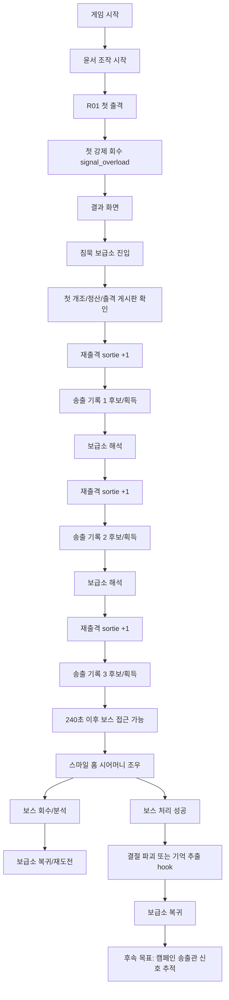

규칙:
- 첫 전투는 플레이어 실력이 아니라 `signal_overload`로 회수되는 사건이다.
- 첫 회수 후 모든 run result는 보급소를 거친다.
- 보스 처리는 R01 완료가 아니라 R01 상태 변화와 상위 신호 추적의 시작이다.
- 송출 기록 1/2/3은 보스 접근 단서이며 반복 재화가 아니다.

현재 구현 앵커:
- `scripts/main.gd::_update_first_recall_event`, `_finish_match`, `_show_supply_depot`, `_restart`
- `scripts/main.gd::_update_preboss_signal_events`, `_boss_route_ready`, `_start_boss_encounter`
- `scripts/meta_progression.gd::grant_signal_clue_candidates`, `record_boss_recall`, `record_boss_victory`

리스크:
- 결과 화면의 버튼이 보급소를 건너뛰면 0.2 루프가 로그라이크 재시작 화면처럼 보인다.
- 송출 기록을 전단/코어 파편과 같은 소비 재화로 취급하면 보스 접근 구조가 무너진다.
- 보스 처리 후 지역 변화 없이 다음 목표만 띄우면 RPG 지역 생태권이 약해진다.

## 2. Match State Machine

목적:
- `playing`, `level_up`, `game_over`, `victory`, `recalled`, `boss_victory`, `supply`의 전환 규칙을 한곳에 고정한다.

다이어그램:
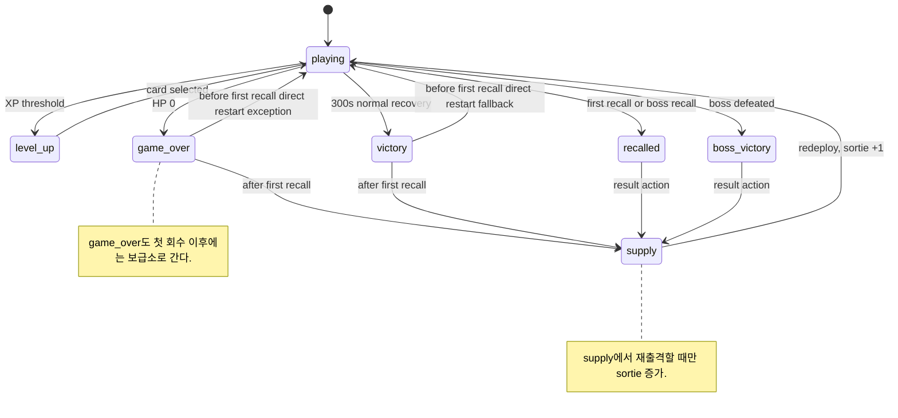

규칙:
- 첫 회수 이전 직접 restart 예외는 보급소가 아직 소개되지 않은 경우에만 허용한다.
- `supply`에서 나가거나 첫 회수 후 terminal result에서 재출격할 때만 `sortie_index`가 증가한다.
- `level_up` 중에는 전투 시간이 정지되어야 하며 카드 선택 후 `playing`으로만 돌아간다.

현재 구현 앵커:
- `scripts/main.gd::match_state`, `TERMINAL_STATES`
- `scripts/main.gd::_should_show_supply_after_result`, `_handle_terminal_action`, `_restart`
- `scripts/main.gd::_show_level_card`, `_apply_card_choice`

리스크:
- `game_over`를 항상 restart로 처리하면 첫 회수 후 보급소 루프가 깨진다.
- `sortie_index`를 결과 화면 진입 시 올리면 보급소 방문 전 진행도가 앞당겨진다.
- `paused_for_card`와 `match_state == "level_up"`가 분리되면 타이머/입력이 꼬인다.

## 3. Result Routing Flow

목적:
- 결과 화면 표시, 실제 보상 지급, 후보 보상 표시, 보급소 이동을 구분한다.

다이어그램:
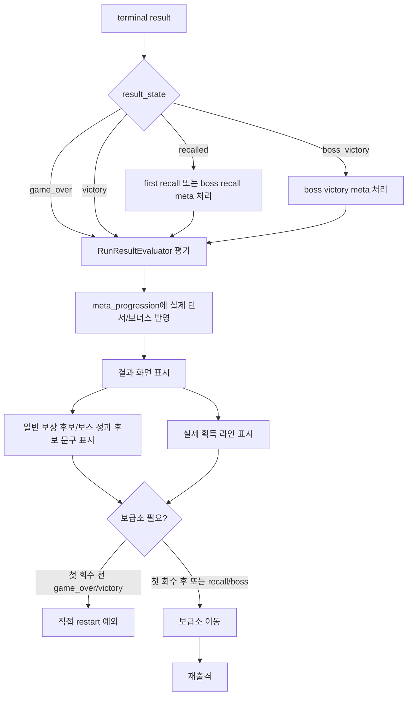

규칙:
- 결과 화면의 "후보(미지급)" 문구와 실제 지급 문구를 섞지 않는다.
- 실제 단서/중복 보상/보스 분석은 결과 화면 표시 전에 meta progression에 반영되어야 한다.
- 보급소 이동은 결과 화면 버튼/space/click을 통해 이루어지되, 첫 회수 후에는 반드시 보급소를 통과한다.

현재 구현 앵커:
- `scripts/main.gd::_finish_match`, `_result_data`, `_run_result_input`, `_apply_run_result_progression`
- `scripts/run_result_evaluator.gd::evaluate_run_result`
- `scripts/hud_controller.gd::show_result_screen`, `show_supply_depot`

리스크:
- `RunResultEvaluator`의 후보 문구를 실제 지급으로 오해하면 전단/코어가 이중 지급될 수 있다.
- `recalled`와 `boss_victory`가 평범한 restart로 빠지면 boss analysis/outpost state가 보이지 않는다.
- 결과 화면에서 보상 계산과 지급을 둘 다 수행하면 같은 결과가 두 번 적용될 수 있다.

## 4. Reward / Economy Flow

목적:
- 빠른 죽음 파밍, 송출 기록의 재화화, 보스 조우 보상을 막는다.

다이어그램:
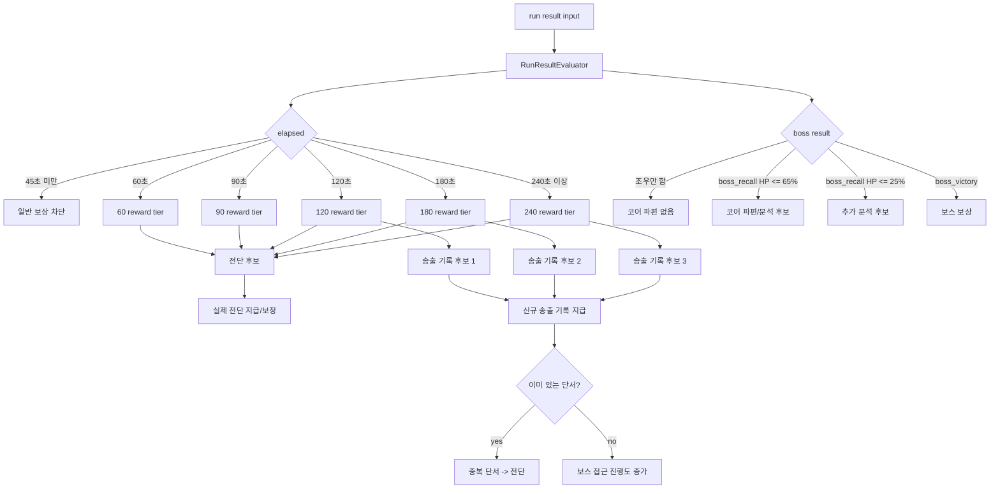

규칙:
- 45초 미만 일반 보상은 차단한다.
- 빠른 죽음은 이득이면 안 된다.
- 송출 기록은 보스 접근 단서이며 판매/소비 재화가 아니다.
- 보스 조우만으로 캠페인 코어 파편을 지급하지 않는다.
- 일반 보상 후보와 실제 지급 문구는 서로 다른 라벨을 사용한다.

현재 구현 앵커:
- `scripts/run_result_evaluator.gd::MIN_GENERAL_REWARD_SECONDS`, `_reward_tier`, `_torn_ad_flyer_reward`, `_campaign_core_fragment_reward`, `_signal_clue_candidates`
- `scripts/meta_progression.gd::grant_signal_clue_candidates`, `_duplicate_signal_flyer_value`, `grant_run_flyer_bonus`
- `scripts/meta_progression.gd::record_boss_recall`, `record_boss_victory`

리스크:
- 일반 보상 후보를 `traces`에 바로 더하면 결과 화면과 실제 지급이 분리되지 않는다.
- 120/180/240초를 단순 시간 보상으로만 쓰면 "이벤트 목표" 감각이 약해진다.
- 중복 송출 기록 전환 전단이 너무 크면 단서 파밍이 전단 파밍으로 변질된다.

## 5. Meta Progression / Upgrade Flow

목적:
- 보급소 성장, 재화 확인, 16개 업글 상태, 다음 출격 스탯 반영을 런타임 카드 성장과 분리한다.

다이어그램:
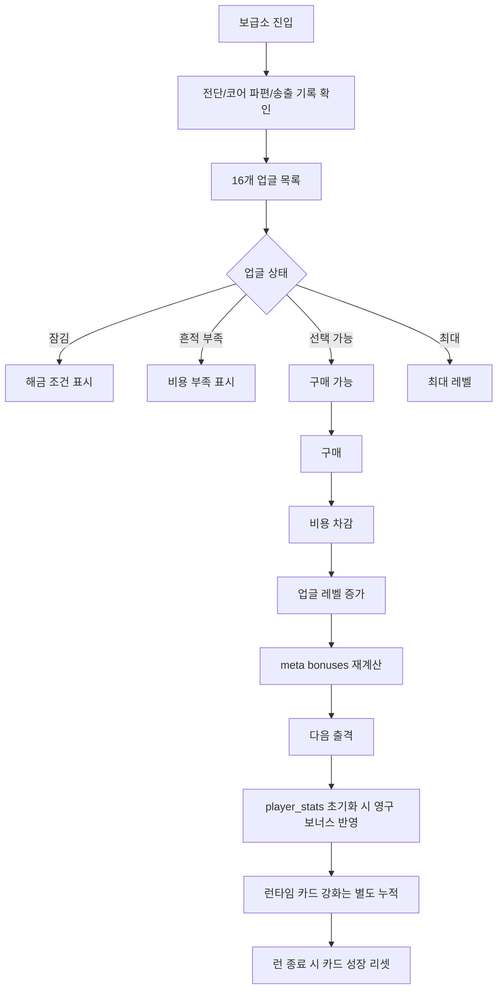

규칙:
- 영구 성장은 `MetaProgression`의 업글/흔적/분석 상태로 유지한다.
- 카드 성장은 `player_stats`의 이번 런 값이며 런 종료 시 리셋한다.
- 구매는 `can_buy`가 true일 때만 가능하고, 비용 차감과 레벨 증가가 한 번에 일어나야 한다.
- 업글 UI는 보급소 시설 감각을 유지해야 하며 거대한 스킬트리처럼 보이면 안 된다.

현재 구현 앵커:
- `scripts/meta_progression.gd::UPGRADES`, `can_buy`, `buy`, `bonuses`, `is_unlocked`
- `scripts/main.gd::_apply_supply_upgrade_choice`, `_reset_player_stats`
- `scripts/hud_controller.gd::show_supply_depot`, `_supply_currency_text`

리스크:
- 카드 효과를 `MetaProgression`에 저장하면 영구/런타임 성장 경계가 무너진다.
- 보스 코어 파편 업글이 전단 업글처럼 열리면 보스 성과 재화의 의미가 흐려진다.
- 구매 실패 상태가 잠김/비용 부족/최대를 구분하지 못하면 QA가 원인을 찾기 어렵다.

## 6. Level-up Card Flow

목적:
- XP 레벨업, pause, 3택 카드, build tag/count, 런 종료 리셋의 경계를 고정한다.

다이어그램:
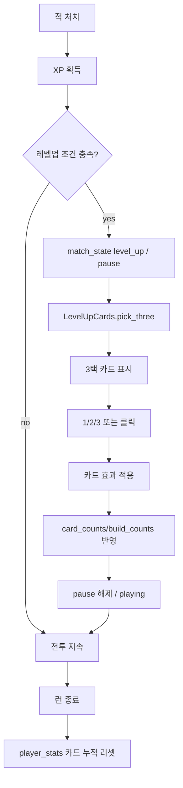

규칙:
- 영구 성장과 카드 성장은 분리한다.
- 카드 선택 중에는 차징, 웨이브 타이머, 보스 패턴 타이머가 진행되면 안 된다.
- 카드 선택 입력은 일반 charge/restart 입력보다 우선한다.
- 카드 build tag/count는 이번 런의 카드 가중치와 UI 힌트에만 사용한다.

현재 구현 앵커:
- `scripts/main.gd::_show_level_card`, `_apply_card_choice`, `_record_card_choice`, `_reset_player_stats`
- `scripts/level_up_cards.gd::pick_three`, `_weighted_take`, `_chosen_build_count`
- `scripts/hud_controller.gd::show_level_cards`, `hide_level_card`

리스크:
- `get_tree().paused`와 `paused_for_card`가 어긋나면 카드 선택 중 피해/차징/보스 패턴이 진행된다.
- 카드 입력 처리 전에 debug/terminal 입력이 실행되면 의도하지 않은 상태 전환이 가능하다.
- 카드 build count가 영구 저장되면 다음 런 카드 풀 편향이 누적된다.

## 7. Boss Route Flow

목적:
- 송출 기록 0/1/2/3, 240초 이후 보스 접근, 보스 회수/승리/후속 목표를 재화 루프와 분리한다.

다이어그램:
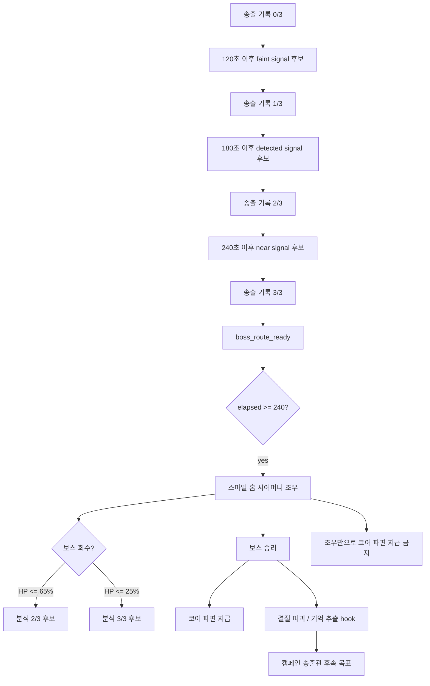

규칙:
- 스마일 홈 시어머니는 0.2 첫 보스다.
- 캠페인 송출관은 0.2 보스가 아니라 후속 목표/상위 신호다.
- 보스 조우만으로 코어 파편을 주지 않는다.
- HP 65%/25% 이하는 분석과 보스 대응 성장의 근거가 되지만, 무성과 회수와 구분한다.
- 결절 파괴/기억 추출은 0.2 hook이며 저장/장기 분기 구현을 요구하지 않는다.

현재 구현 앵커:
- `scripts/main.gd::_update_preboss_signal_events`, `_sync_boss_signal_from_clues`, `_boss_route_ready`, `_try_start_boss_encounter`
- `scripts/meta_progression.gd::SIGNAL_CLUES`, `record_boss_recall`, `record_boss_victory`, `set_smile_home_boss_outcome`
- `scripts/boss_controller.gd::BOSS_NAME`

리스크:
- 240초만 버티면 무조건 보스가 뜨도록 만들면 송출 기록 3개 조건이 무력화된다.
- 캠페인 송출관을 첫 보스로 시각화하면 0.2 스케일과 장기 서사가 충돌한다.
- 보스 승리 직후 선택 hook과 실제 지역 상태 반영의 순서가 꼬일 수 있다.

## 8. Boss Combat State Flow

목적:
- 보스 패턴 상태, 방어 타입, 코어 노출, 분석 업글 관계를 표시하고 수치 변경 없이 상태 계약만 남긴다.

다이어그램:
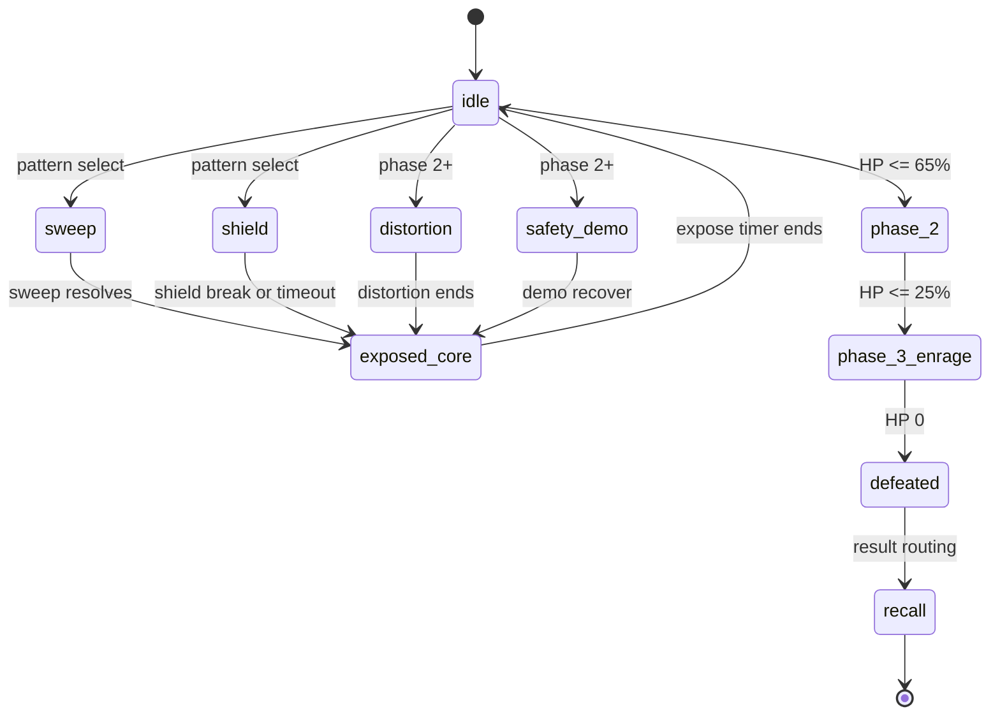

규칙:
- 패턴 수치는 변경하지 않는다.
- `shield`는 방패 주파수/차징 대응을 읽히게 하는 상태이며, `exposed_core`는 집중 차징의 보상 창이다.
- `core_expose_bonus` 같은 분석 업글은 코어 노출 시간을 보정하지만 패턴 구조를 바꾸지 않는다.
- 방어 타입은 `plated`, `anti_auto`, `anti_charge`, `exposed_core`의 의미를 UI와 피해 계산에서 일관되게 써야 한다.

현재 구현 앵커:
- `scripts/boss_controller.gd::update`, `_start_next_pattern`, `_start_sweep`, `_start_shield`, `_start_distortion_telegraph`, `_start_demo_telegraph`, `_expose_core`, `_update_phase`
- `scripts/boss_controller.gd::apply_damage`, `_shield_damage_multiplier`, `set_core_expose_bonus`
- `scripts/enemy_controller.gd::DEFENSE_TYPE_*`, `DAMAGE_TYPE_*`

리스크:
- 방어 타입 텍스트와 실제 피해 배율이 다르면 유저가 보스 분석을 믿지 못한다.
- phase 2/3 전환이 시각/패턴/보상 라인에서 다르게 읽히면 HP 성과 보상이 헷갈린다.
- safety demo가 실제 회수 UI처럼 보이면 보스 패턴과 시스템 회수가 혼동된다.

## 9. R01 Region Flow

목적:
- R01을 단순 arena 배경이 아니라 반복 방문과 outcome을 기억하는 로컬 지역으로 유지한다.

다이어그램:
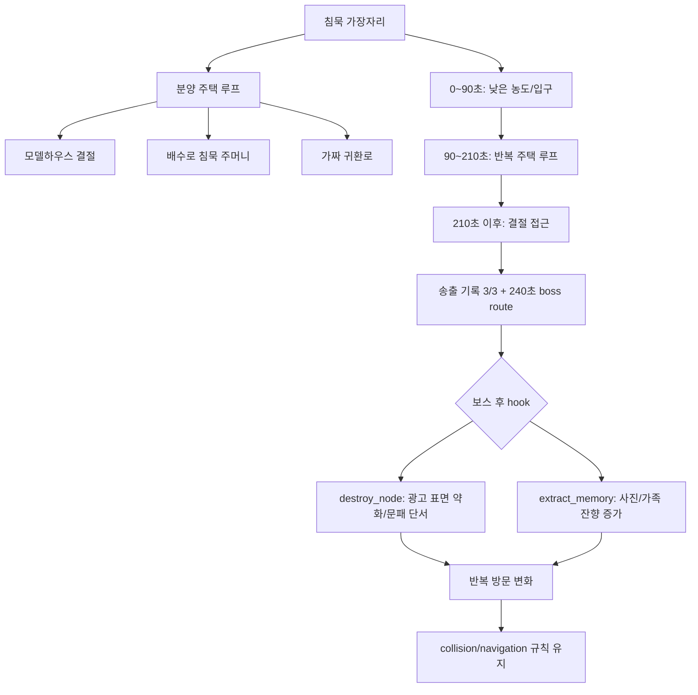

규칙:
- 5개 zone은 의미가 다르며, 같은 prop 반복은 리소스 절약이 아니라 캠페인 법칙으로 읽혀야 한다.
- 현재 시간 기반 zone은 0~90, 90~210, 210초 이후로 전투 구조를 나눈다.
- blockout의 5개 zone은 반복 방문/보스 outcome/trace hook까지 견딜 수 있어야 한다.
- `fake_return_route`는 실제 회수 UI와 혼동되면 안 된다.
- `destroy_node`와 `extract_memory`는 prop 의미 변화이며 보상/전투 수치를 바꾸는 스위치가 아니다.

현재 구현 앵커:
- `scripts/r01_zone_layout.gd::zone_id_for_elapsed`, `apply_spawn_pressure`
- `scripts/r01_map_controller.gd::update`, `draw`
- `scripts/r01_layout_blockout.gd::ZONES`, `ADJACENCY`, `KIND_COLLISION_META`, `NAV_RULES`, `STATE_VARIANTS`
- `scripts/meta_progression.gd::r01_state_summary`, `record_r01_trace_choice`

리스크:
- 3개 시간 zone과 5개 blockout zone의 용도를 혼동하면 문서/구현 대조가 어려워진다.
- 중앙 combat field를 prop으로 막으면 적 pathing과 보스 접근이 불공정해진다.
- 가짜 귀환로가 버튼/시스템 회수처럼 보이면 UI 신뢰가 깨진다.

## 10. Outpost Flow

목적:
- 보급소가 단순 메뉴가 아니라 결과 정산, 성장, 재출격을 담는 world-space outpost임을 고정한다.

다이어그램:
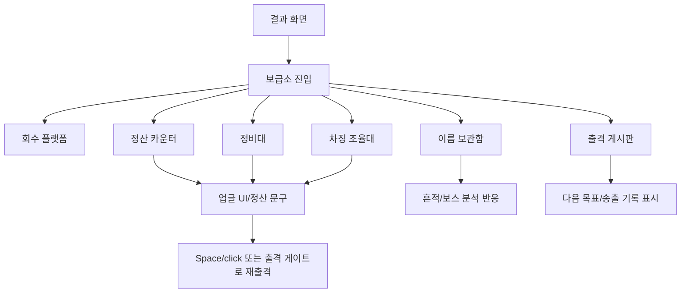

규칙:
- 현재는 UI + world-space blockout이다.
- 미래에는 실제 허브 가능성이 있지만, 0.2에서는 기능을 메뉴처럼 축소하지 않는다.
- 보급소 시설은 회수 플랫폼, 정산 카운터, 정비대, 이름 보관함, 출격 게시판, 차징 조율대가 핵심이다.
- 480x270에서 outpost blockout이 업글 UI 가독성을 침범하지 않아야 한다.

현재 구현 앵커:
- `scripts/outpost_layout_blockout.gd::FACILITIES`, `state_from_progress`, `facility_variant`, `natural_summary_lines`
- `scripts/hud_controller.gd::show_supply_depot`
- `scripts/main.gd::_show_supply_depot`, `_session_progress_data`
- `OUTPOST_BLOCKOUT_SCREEN_QA_REPORT.md`

리스크:
- 보급소 배경 blockout이 UI보다 강하면 구매/정산이 읽히지 않는다.
- 시설 ID와 collision debug가 일반 UI에 노출되면 몰입을 해친다.
- 미래 허브 구조를 현재 저장/이동/상호작용 구현으로 앞당기면 범위가 터진다.

## 11. UI State / Input Flow

목적:
- 전투 HUD, 카드, 결과, 보급소, debug overlay 입력 우선순위를 명확히 한다.

다이어그램:
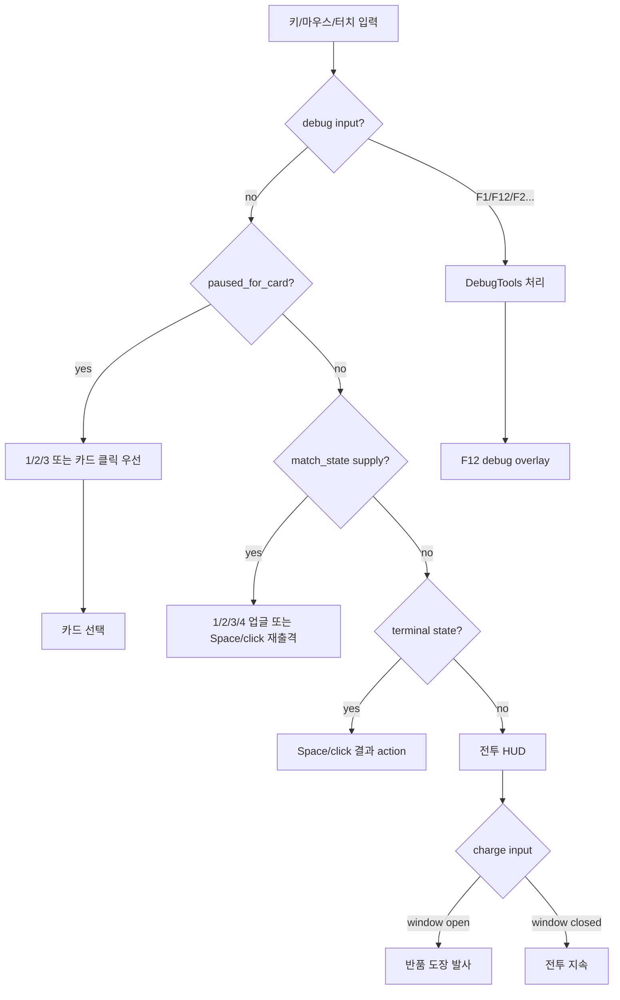

규칙:
- 보급소에서 charge/space는 재출격 action으로 작동한다.
- 레벨업 카드 중에는 카드 선택 입력이 우선한다.
- `1/2/3/4`는 보급소 업글 선택에서 쓰이고, 카드 중에는 카드 선택으로 쓰인다.
- debug input이 일반 플레이를 망치면 안 되며 `DEBUG_TOOLS_ENABLED`로 막힌다.
- 일반 UI에는 internal id, collision class, debug label을 노출하지 않는다.

현재 구현 앵커:
- `scripts/main.gd::_input`, `_card_choice_from_event`, `_supply_choice_from_event`, `_fire_charge`
- `scripts/hud_controller.gd::update`, `update_boss`, `set_debug_text`
- `scripts/debug_tools.gd::handle_input`, `help_text`, `detail_text`

리스크:
- debug handler가 항상 먼저 실행되므로 debug key가 활성 빌드에 남으면 일반 플레이를 바꿀 수 있다.
- 보급소에서 `charge`가 전투 공격으로 남아 있으면 재출격 UX가 꼬인다.
- 결과 화면과 보급소가 동시에 visible하면 space/click action의 의미가 불명확해진다.

## 12. Debug / QA Flow

목적:
- QA용 단축키와 내부 표시가 일반 UI/플레이 로직에 새지 않도록 한다.

다이어그램:
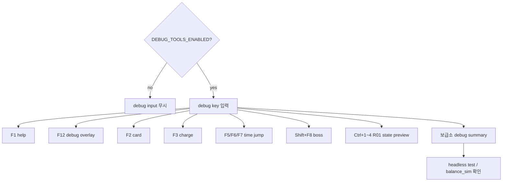

규칙:
- debug 기능은 `DEBUG_TOOLS_ENABLED` 기준이다.
- 일반 UI에는 내부 id, collision class, anchor 좌표, debug label을 노출하지 않는다.
- `F12`는 R01/outpost debug overlay 확인용이며 게임 목표 문구를 대체하지 않는다.
- headless test와 `tools/balance_sim.py`는 문서/QA 확인용이지 밸런스 수치 변경 근거가 아니다.

현재 구현 앵커:
- `scripts/game_config.gd::DEBUG_TOOLS_ENABLED`
- `scripts/debug_tools.gd::handle_input`, `help_text`, `detail_text`, `blockout_debug_labels_visible`
- `OUTPOST_BLOCKOUT_SCREEN_QA_REPORT.md`, `VERTICAL_SLICE_0_2_PLAYFLOW_CHECKLIST.md`
- `tools/balance_sim.py`

리스크:
- debug overlay가 480x270 보급소 UI를 덮으면 QA 스크린샷 판정이 흐려진다.
- debug time jump가 meta progression을 실제 루프와 다르게 만들면 회귀 테스트가 오판된다.
- internal id가 일반 UI에 남으면 세계관 문구와 구현 라벨이 충돌한다.

## 13. Asset Pipeline Flow

목적:
- prototype PNG와 final asset을 혼동하지 않고, PMO 승인과 runtime 적용 사이의 검증 단계를 유지한다.

다이어그램:
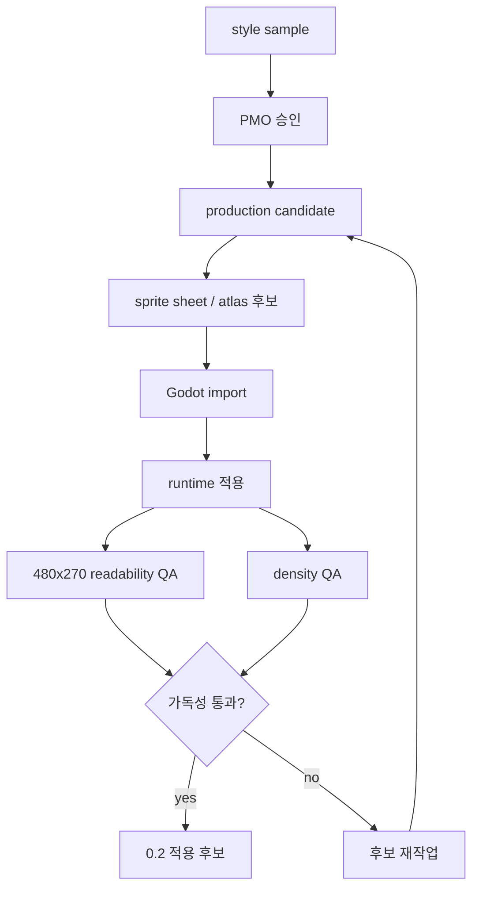

규칙:
- 현재 prototype PNG를 final asset으로 단정하지 않는다.
- 픽셀아트 고정이 아니며 2D 일러스트/카툰 스프라이트 시트 방향도 허용한다.
- `hybrid_production_candidate`는 방향 후보일 수 있지만, sprite sheet와 runtime density 검증이 별도로 필요하다.
- R01 배경은 광고 자동화 인프라가 환경이 된 구조여야 한다.
- 이 문서 작업에서는 Godot import, PNG 생성, 에셋 수정, `.import`/`.uid` 변경을 하지 않는다.

현재 구현 앵커:
- `P0_ASSET_APPLICATION_ORDER.md`
- `ASSET_PRODUCTION_PLAN.md`, `ASSET_IMPORT_NOTES.md`, `ART_DIRECTION_SPEC.md`
- `SMILE_HOME_BOSS_VISUAL_PLACEHOLDER_PLAN.md`
- `scripts/sprite_assets.gd`

리스크:
- 480x270에서 예쁜 단일 이미지는 실제 100~300마리 density에서 실패할 수 있다.
- pixel prototype과 hybrid 방향을 섞으면 윤서/적/보스의 시각 계층이 깨진다.
- Godot import를 문서 작업 중 실행하면 불필요한 `.import`/`.uid` 변경이 생긴다.

## 14. SFX / BGM Event Flow

목적:
- 사운드는 placeholder여도 이벤트 구조는 유지하고, headless cleanup 경계를 명확히 한다.

다이어그램:
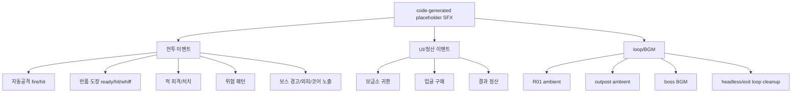

규칙:
- placeholder 사운드라도 event name과 호출 위치는 안정적으로 유지한다.
- headless에서는 loop cleanup이 필요하다.
- 보스 BGM은 `bgm_boss_smile_home`, 보급소는 `amb_outpost_loop`, R01은 `amb_r01_suburb_loop`로 구분한다.
- 결과 정산/보급소 귀환/업글 구매는 전투 히트음과 섞지 않는다.

현재 구현 앵커:
- `SFX_BGM_PLACEHOLDER_LIST.md`
- `scripts/audio_factory.gd::make_sfx_stream`
- `scripts/main.gd::_build_audio`, `_register_sfx_player`, `_register_music_player`, `_set_music`, `_play_sfx`, `_cleanup_audio_players`

리스크:
- loop cleanup이 없으면 headless/quit 후 오디오 노드 잔존 문제가 생길 수 있다.
- placeholder라는 이유로 event name을 임시로 바꾸면 나중에 실제 사운드 적용 비용이 커진다.
- 보스 경고음과 일반 위협음을 구분하지 않으면 패턴 읽기가 어려워진다.

## 15. Save/Load Boundary

목적:
- 현재 저장/불러오기 미구현 경계를 명확히 하고, 나중에 저장할 상태 후보만 목록화한다.

다이어그램:
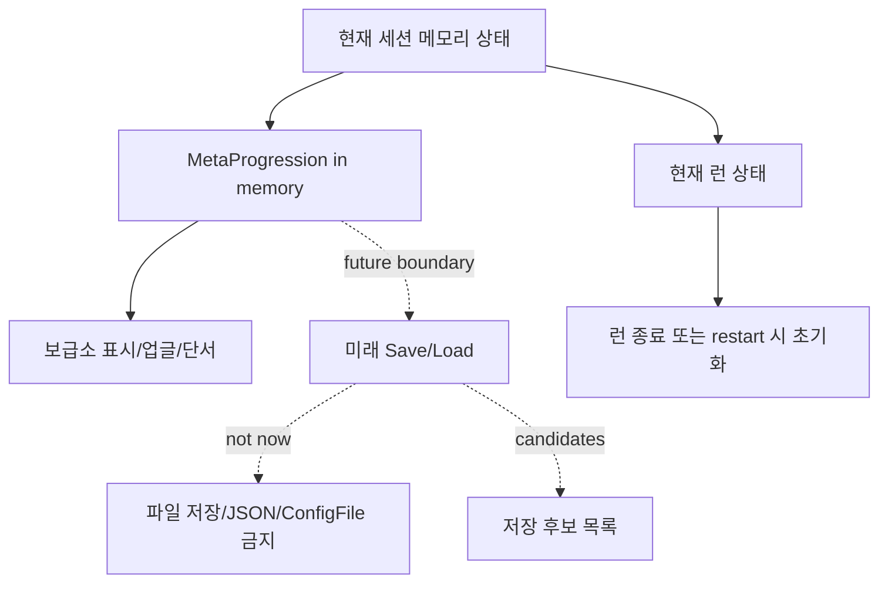

규칙:
- 현재 meta progression은 세션 내 유지다.
- 저장/불러오기는 미래 작업이다.
- 지금 파일 저장, JSON 저장, `ConfigFile` 추가를 하지 않는다.
- 저장 후보만 문서화하고 구현하지 않는다.

현재 구현 앵커:
- `scripts/meta_progression.gd`의 `traces`, `signal_clues`, `upgrades`, `awarded_flags`, `boss_analysis_level`, `boss_clear_count`, `smile_home_boss_outcome`, `local_response_state`
- `scripts/main.gd::_session_progress_data`, `_restart`
- `RUN_STATE_FLOW.md`의 save/load 비범위

리스크:
- 임시 저장 코드를 넣으면 meta progression 지급 타이밍과 결과 라우팅 검증이 동시에 어려워진다.
- 저장할 상태와 이번 런 임시 상태를 구분하지 않으면 카드 성장/현재 HP/일시정지 상태가 영구화될 수 있다.
- 저장 포맷을 먼저 고정하면 스토리/지역 상태 확장에 발목이 잡힌다.

나중에 저장할 상태 후보:
- `traces`: 찢어진 광고 전단, 캠페인 코어 파편
- `signal_clues`: 송출 기록 1/2/3 획득 여부
- `upgrades`: 16개 업글 레벨
- `awarded_flags`: 첫 회수, 보스 HP 65/25 성과, 첫 보스 승리 등 중복 방지 플래그
- `boss_analysis_level`, `boss_clear_count`, `smile_home_boss_outcome`
- `local_response_state`: R01 방문, 송출 기록 발견 수, trace choice, boss outcome
- 설정 후보: 오디오/화면/입력 설정은 별도 저장 영역으로 분리

## 16. Runtime Responsibility / Main Boundary Flow

목적:
- `main.gd`가 런타임 조립자이면서 너무 많은 책임을 가진 상태임을 기록하고, 향후 분리 시 로직 경계를 잃지 않게 한다.

다이어그램:
```mermaid
flowchart TD
    Scene["scenes/main.tscn"] --> Main["scripts/main.gd runtime orchestrator"]
    Main --> Config["game_config.gd constants"]
    Main --> HUD["hud_controller.gd UI surfaces"]
    Main --> Effects["effects_controller.gd VFX/feedback"]
    Main --> Enemy["enemy_controller.gd enemies/defense/damage"]
    Main --> Wave["wave_director.gd wave params"]
    Main --> Cards["level_up_cards.gd card catalog/pick"]
    Main --> Meta["meta_progression.gd session progression"]
    Main --> Boss["boss_controller.gd boss state/patterns"]
    Main --> Audio["audio_factory.gd generated audio"]
    Main --> Debug["debug_tools.gd QA commands"]
    Main --> R01["r01_map/layout blockout"]
    Main --> Outpost["outpost_layout_blockout.gd"]
    Main -. future split .-> Result["run_result_evaluator / route_progression"]
    Main -. future split .-> Combat["player_combat / damage_router"]
    Main -. future split .-> Supply["supply_depot_controller"]
```

규칙:
- 이 문서 작업에서는 리팩터링하지 않는다.
- 향후 분리해도 `match_state`, result routing, reward 지급, 보급소 진입 순서는 유지해야 한다.
- `main.gd`에서 책임을 빼낼 때는 결과 정산, 라우트 진행, 플레이어 전투, 보급소, damage router 순서가 안전하다.
- UI 표시 데이터와 게임 규칙 데이터는 장기적으로 분리하되, 현재 동작 계약은 깨지 않는다.

현재 구현 앵커:
- `GAME_ARCHITECTURE_MAP.md`
- `MAIN_GD_RESPONSIBILITY_REPORT.md`
- `NEXT_TASK_BACKLOG.md`
- `scripts/main.gd`, `scripts/run_result_evaluator.gd`, `scripts/meta_progression.gd`

리스크:
- `main.gd` 리팩터링 중 결과 지급과 화면 표시 순서가 뒤바뀔 수 있다.
- enemy/boss 피해 API가 달라 카드 효과가 한쪽에만 적용될 수 있다.
- route label, signal clue, sortie index가 서로 다른 모듈로 갈라지면 보스 접근 조건이 흔들린다.

## 17. Yunseo / Return Stamp Combat Identity Flow

목적:
- 윤서의 반품 도장을 교체 가능한 장비가 아니라 캐릭터 정체성으로 고정한다.

다이어그램:
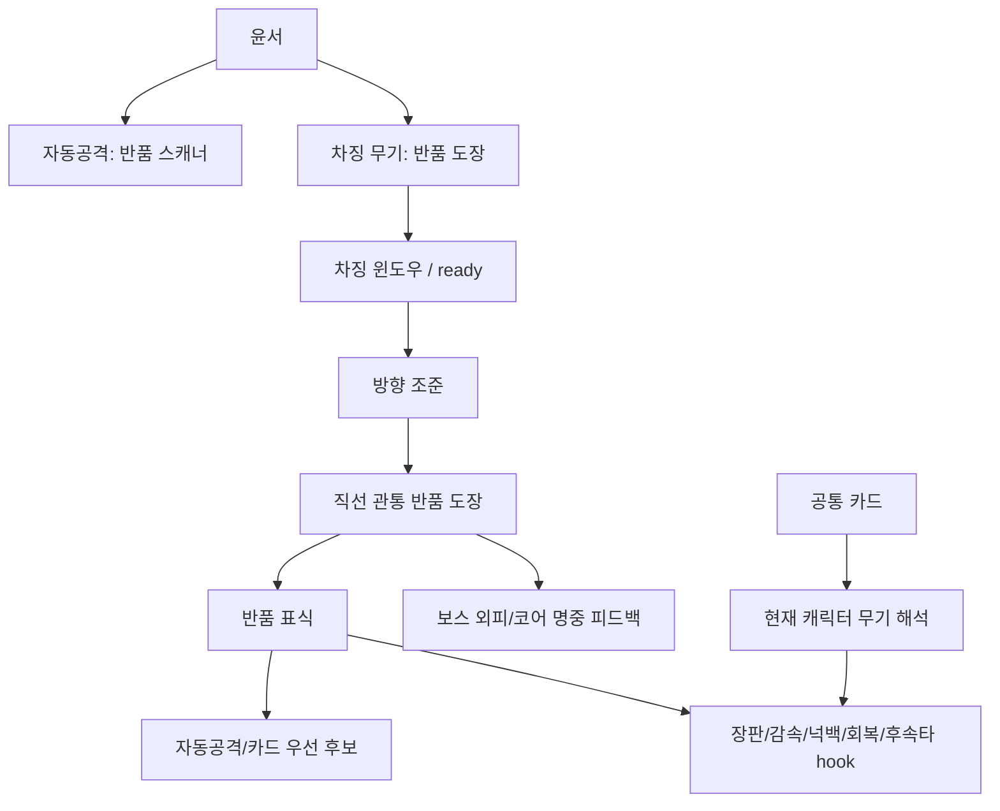

규칙:
- 0.2에서는 윤서 = 반품 도장으로 고정한다.
- 차징 무기는 독립 장비, 가챠, 자유 토글 시스템이 아니다.
- 공통 카드는 공유하되, 차징 무기별 해석 레이어로 차이를 만든다.
- 반품 표식은 런 중 전투 상태이며 송출 기록/흔적/재화처럼 소비하지 않는다.
- 보스 명중 피드백은 허용하지만 보스 패턴 스킵/강제 경직/무력화는 금지한다.

현재 구현 앵커:
- `CHARGE_WEAPON_ARCHETYPE_CHARACTER_STORYBOARD.md`
- `CHARGE_WEAPON_CARD_INTERPRETATION_DESIGN.md`
- `YUNSEO_RETURN_STAMP_POLISH_NOTES.md`
- `story/06_characters/yunseo_0_2_playable_spec.md`
- `scripts/main.gd::_update_charge`, `_fire_charge`, `_fire_return_stamp`, `_apply_return_stamp`

리스크:
- 반품 도장을 단순 시작 무기처럼 약하게 만들면 윤서가 기본캐로 흐려진다.
- 표식을 모든 피해 증폭의 중심으로 만들면 빌드 다양성을 잠식한다.
- 차징 카드 해석을 무기별 전용 카드로 쪼개면 카드 풀이 폭증한다.

## 18. Enemy / Wave / Pressure Flow

목적:
- 웨이브 시간표, sortie pressure, R01 zone, 적 역할, 방어 타입, 피날레 압력이 어디서 연결되는지 고정한다.

다이어그램:
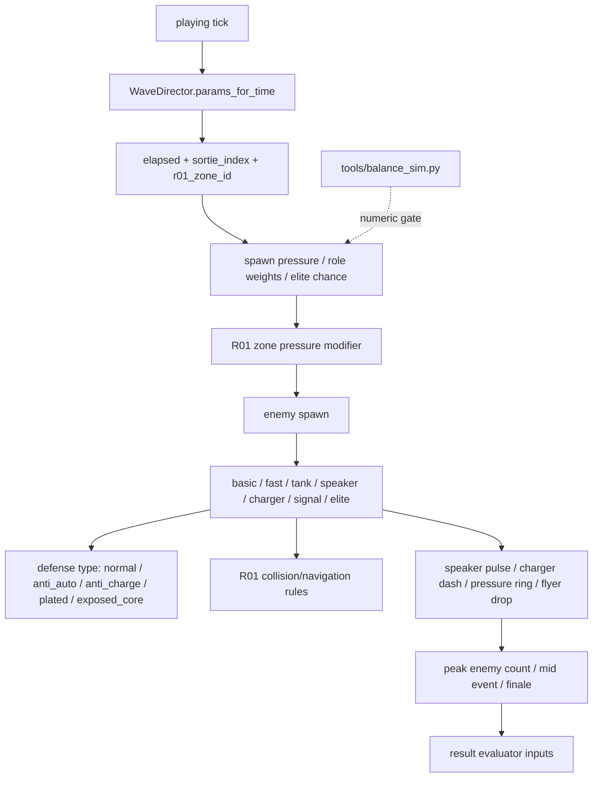

규칙:
- 웨이브는 단순 HP 증가가 아니라 역할/방어/위협 언어로 난이도를 만든다.
- R01 zone pressure는 지역 감각을 강화해야지 빈 arena 스킨 교체로 끝나면 안 된다.
- focused charge가 첫 출격 기본 적을 즉시 삭제하는 기준이 되면 초반 성장 여지가 줄어든다.
- balance simulator는 수치 변경 전 gate이며, 문서 작업에서 밸런스를 변경하지 않는다.

현재 구현 앵커:
- `scripts/wave_director.gd::params_for_time`, `_apply_preboss_pressure`
- `scripts/enemy_controller.gd::ROLE_STATS`, `DEFENSE_MULTIPLIERS`, `spawn_*`, `apply_damage`
- `scripts/r01_zone_layout.gd::apply_spawn_pressure`
- `BALANCE_NOTES.md`, `tools/balance_sim.py`

리스크:
- sortie pressure와 elapsed pressure가 겹쳐 초반 난이도가 과도하게 뛸 수 있다.
- speaker/charger/signal이 시각적으로 구분되지 않으면 플레이어가 맞은 이유를 모른다.
- 방어 타입이 HP 뻥튀기로만 느껴지면 카드/차징 선택 의미가 약해진다.

## 19. Trace Item / Story Reaction Flow

목적:
- 흔적을 재화가 아니라 세계와 캐릭터 애정을 남기는 물건으로 처리한다.

다이어그램:
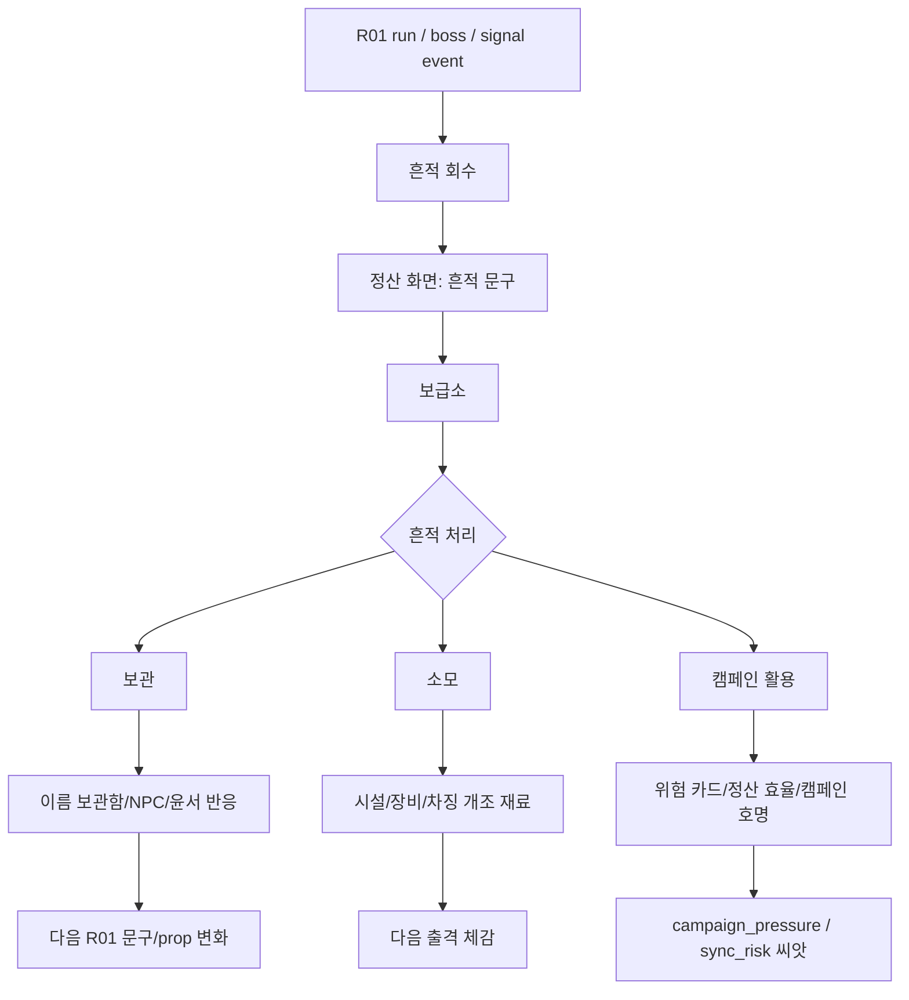

규칙:
- P0 흔적은 지워지지 않은 문패, 반쯤 탄 가족사진, 이름 없는 영수증이다.
- P1 흔적은 고장 난 마스코트 배지, 납 차폐 배터리, 무음 라디오다.
- 모든 흔적에 세 선택을 당장 열 필요는 없지만 데이터 구조는 보관/소모/캠페인 활용을 받을 수 있어야 한다.
- `combat_effect_id`와 `hub_story_effect_id`를 분리한다.
- 보관만 도덕적 정답으로, 소모만 효율 정답으로 만들지 않는다.

현재 구현 앵커:
- `story/90_implementation/trace_reward_directive_0_2.md`
- `META_PROGRESSION_ARCHITECTURE.md`
- `story/04_content/trace_items.md`
- `scripts/meta_progression.gd::record_r01_trace_choice`, `r01_state_summary`
- `scripts/outpost_layout_blockout.gd::facility_variant`

리스크:
- 흔적을 업글 재료로만 만들면 세계 반응과 애정 루프가 사라진다.
- 흔적 선택 후 보급소/지역/NPC 중 아무것도 바뀌지 않으면 선택이 무의미해진다.
- 캠페인 활용이 숨은 함정처럼만 보이면 강한 유혹이 아니라 벌칙이 된다.

## 20. Story Trigger / Linked Scenario Flow

목적:
- 스토리 트리거를 컷신 재생 플래그가 아니라 세계 상태 변경 장치로 다룬다.

다이어그램:
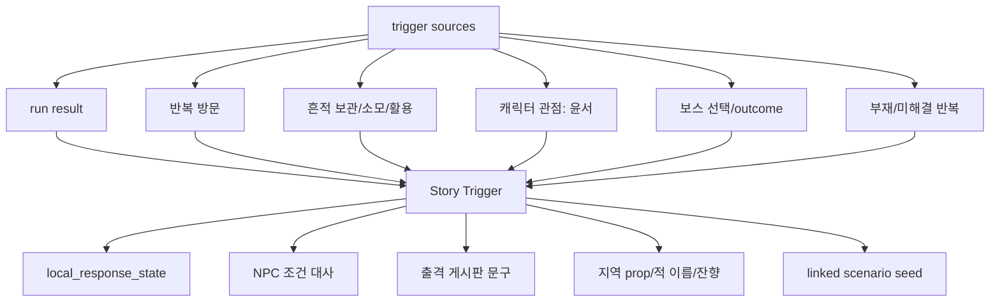

규칙:
- 트리거는 내부 점수명을 그대로 보여주지 않는다.
- NPC 대사는 랜덤 묶음보다 조건 대사 중심으로 시작한다.
- 장기 시나리오 seed는 NPC, 흔적, 캐릭터 관점 중 최소 하나와 연결되어야 한다.
- 0.2는 모든 연쇄 시나리오를 구현하지 않고 씨앗과 데이터 구조만 남긴다.

현재 구현 앵커:
- `story/05_progression/story_trigger_schema.md`
- `story/05_progression/linked_scenario_system.md`
- `story/90_implementation/story_integration_notes.md`
- `scripts/meta_progression.gd::local_response_state`
- `scripts/route_phrase_resolver.gd`

리스크:
- 트리거를 컷신 목록으로만 만들면 반복 런/지역 변화와 끊긴다.
- 조건 대사가 너무 많아지면 보급소 루프 속도를 방해한다.
- 내부 상태값을 설명 UI로 직접 노출하면 세계가 시스템 표처럼 보인다.

## 21. Campaign Adaptation / Region Evolution Flow

목적:
- `campaign_pressure`, `boss_outcome`, `revisit_count`, `adaptation_charge` 같은 장기 상태 후보를 0.2 범위 안에서 다루는 법을 정한다.

다이어그램:
```mermaid
flowchart TD
    RunData["run data"] --> Metrics["elapsed/kills/deaths/charge_uses/traces/boss_outcome"]
    Metrics --> MinimalState["0.2 minimal region state"]
    MinimalState --> Pressure["campaign_pressure"]
    MinimalState --> Revisit["revisit_count"]
    MinimalState --> BossOutcome["boss_outcome"]
    MinimalState --> ChargeAdapt["adaptation_charge"]
    Pressure --> Visible["게시판/적 밀도/위험 보상 문구"]
    Revisit --> Visible
    BossOutcome --> Visible
    ChargeAdapt --> Visible
    Visible --> PlayerRead["플레이어가 현상으로 이해"]
    MinimalState -. future .-> Population["human/robot/population systems"]
    MinimalState -. future .-> Endings["ending axes"]
```

규칙:
- 0.2에서는 복잡한 인구/엔딩/장기 운영 시스템을 구현하지 않는다.
- 지역 상태는 숫자가 아니라 적 이름, 출격 게시판, prop 변화, 짧은 NPC 반응으로 드러난다.
- 차징 적응은 차징을 금지하는 적이 아니라 타이밍 판단을 새로 요구하는 적/문구로 나타난다.
- 지역 재방문은 강제가 아니라 유혹이어야 한다.

현재 구현 앵커:
- `story/05_progression/region_evolution_model.md`
- `story/90_implementation/story_integration_notes.md`
- `story/90_implementation/r01_suburb_content_lock_0_2.md`
- `scripts/meta_progression.gd::record_r01_visit`, `r01_state_summary`

리스크:
- 장기 상태 후보를 UI 수치로 그대로 노출하면 RPG 감각보다 관리 피로가 앞선다.
- 캠페인 적응이 플레이어 빌드를 처벌하기만 하면 성장 선택을 위축시킨다.
- 재방문 변화가 보이지 않으면 R01이 반복 가능한 로컬이 아니라 재탕 맵처럼 보인다.

## 22. Playtest / PMO Gate Flow

목적:
- 문서상 구조가 아니라 실제 5~10분 플레이에서 무엇이 통과 기준인지 고정한다.

다이어그램:
```mermaid
flowchart TD
    Build["0.2 candidate build"] --> VolumeGate["시청각/공간 볼륨 게이트"]
    VolumeGate -->|부족| Fill["에셋/SFX/UI/R01/보급소 볼륨 보강"]
    VolumeGate -->|통과| SessionA["첫 10분 테스트"]
    SessionA --> ACheck["첫 조작/차징/강제 회수/첫 개조"]
    ACheck --> SessionB["첫 30분 테스트"]
    SessionB --> BCheck["반복 출격/송출 기록/흔적/보급소 반응"]
    BCheck --> SessionC["첫 60분 테스트"]
    SessionC --> CCheck["보스 접근/보스 실패/처리/재방문 변화"]
    CCheck --> Decision{"0.2 합격?"}
    Decision -->|no| FixPriority["윤서 손맛 -> 첫 회수 -> 보상 -> 보급소 -> R01 변화 순으로 수정"]
    Decision -->|yes| Next["0.3 후보 검토"]
```

규칙:
- 플레이 전 세계관을 길게 설명하지 않는다.
- 첫 10분 통과 기준은 첫 회수 후 재출격 욕구다.
- 손맛/밸런스 세부 판단은 윤서/R01/보급소/보스/SFX/UI가 최소 세계처럼 보이고 들린 뒤에 한다.
- PMO 승인 전 prototype PNG를 상업용 최종으로 단정하지 않는다.

현재 구현 앵커:
- `VERTICAL_SLICE_0_2_VOLUME_FILL_PLAN.md`
- `story/90_implementation/playtest_observation_0_2.md`
- `story/90_implementation/story_cross_validation_0_2.md`
- `GAME_CURRENT_STATE_AUDIT.md`
- `OUTPOST_BLOCKOUT_SCREEN_QA_REPORT.md`

리스크:
- 시청각 볼륨이 부족한 상태에서 카드/보스 수치를 평가하면 잘못된 결론이 나온다.
- 유저가 첫 회수를 죽음으로 오해하면 루프 전체가 실패처럼 보인다.
- 보스까지 못 갔다고 테스트를 실패로만 보면 첫 10분/30분 루프 문제를 놓친다.

## 23. Web Export / Release Boundary Flow

목적:
- Web export와 배포 검증을 로직 구현과 분리하고, 생성 파일/폰트/브라우저 확인 경계를 남긴다.

다이어그램:
```mermaid
flowchart TD
    Ready["local candidate"] --> Headless["Godot headless scene load"]
    Ready --> Balance["tools/balance_sim.py"]
    Ready --> Browser["local browser/manual play"]
    Browser --> Font["Korean font readability"]
    Browser --> UI["480x270 HUD/card/result/outpost readability"]
    Browser --> Flow["first run -> result -> outpost -> redeploy"]
    Ready --> Export["Godot Web export"]
    Export --> ExportsDir["exports/web generated files"]
    ExportsDir --> Serve["local HTTP server"]
    Serve --> WebQA["browser QA"]
    WebQA --> Report["report only; do not commit exports"]
```

규칙:
- `exports/` 생성 파일은 커밋하지 않는다.
- Web build는 `file://`로 열지 않고 local HTTP server로 확인한다.
- 한글 폰트, 보급소 UI, 결과 화면 가독성은 headless만으로 검증되지 않는다.
- 문서 작업에서는 export를 실행하지 않는다.

현재 구현 앵커:
- `EXPORT_WEB.md`
- `GAME_ARCHITECTURE_MAP.md`
- `GAME_CURRENT_STATE_AUDIT.md`
- `NEXT_TASK_BACKLOG.md`
- `tools/serve_web.ps1`, `export_presets.cfg`

리스크:
- headless 통과를 실제 브라우저 통과로 오해하면 폰트/입력/UI 깨짐을 놓친다.
- export 산출물을 커밋하면 repo가 불필요하게 커진다.
- 보급소 480x270 가독성 실패가 release 직전에 발견될 수 있다.

## Logic Invariant Checklist

| # | invariant |
|---:|---|
| 1 | 첫 회수 후 모든 run result는 보급소를 거친다. |
| 2 | `game_over`도 첫 회수 후에는 보급소로 간다. |
| 3 | 첫 회수 이전 직접 restart 예외는 보급소 미소개 상태에만 허용한다. |
| 4 | `supply`에서 재출격할 때만 sortie 증가가 기본이다. |
| 5 | 결과 화면 표시와 실제 보상 지급은 구분한다. |
| 6 | 45초 미만 런은 일반 보상 후보가 열리지 않는다. |
| 7 | 빠른 죽음은 일반 보상 파밍 수단이 되면 안 된다. |
| 8 | 송출 기록은 재화가 아니다. |
| 9 | 송출 기록은 보스 접근 단서다. |
| 10 | 중복 송출 기록만 전단 전환 후보가 된다. |
| 11 | 보스 조우만으로 코어 파편 지급 없음. |
| 12 | 보스 HP 65%/25% 성과는 분석/코어 보상과 연결된다. |
| 13 | 보스 승리 보상은 보스 조우 보상과 다르다. |
| 14 | 스마일 홈 시어머니는 0.2 첫 보스다. |
| 15 | 캠페인 송출관은 0.2 후속 목표/상위 신호다. |
| 16 | 카드 성장은 런 종료 시 리셋된다. |
| 17 | 메타 성장은 보급소 구매 후 다음 출격에 반영된다. |
| 18 | 카드 선택 중에는 전투/웨이브/차징/보스 타이머가 진행되면 안 된다. |
| 19 | 보급소에서 charge/space/click은 재출격 action으로 읽힌다. |
| 20 | 일반 UI에 internal id/debug label/collision class 노출 없음. |
| 21 | debug는 `DEBUG_TOOLS_ENABLED`로 막힌다. |
| 22 | 보급소는 메뉴가 아니라 outpost 공간이다. |
| 23 | R01 fake return route는 실제 회수 UI처럼 보이면 안 된다. |
| 24 | `destroy_node`와 `extract_memory`는 지역/보급소 반응 hook이며 밸런스 수치 변경 스위치가 아니다. |
| 25 | 보스 패턴 수치는 이 문서 작업에서 변경하지 않는다. |
| 26 | prototype PNG를 final asset으로 단정하지 않는다. |
| 27 | 픽셀아트는 고정 방향이 아니며 hybrid 2D/카툰 sprite sheet 후보도 허용한다. |
| 28 | placeholder 사운드라도 이벤트 이름과 호출 위치는 유지한다. |
| 29 | 현재 저장/불러오기는 구현하지 않는다. |
| 30 | 현재 meta progression은 세션 내 유지다. |
| 31 | `main.gd` 리팩터링은 결과 정산/보급소/재출격 순서를 보존해야 한다. |
| 32 | 윤서의 반품 도장은 0.2 캐릭터 정체성이지 교체 장비가 아니다. |
| 33 | 반품 표식은 런 중 전투 상태이며 재화/흔적/송출 기록처럼 소비하지 않는다. |
| 34 | 보스에게 차징 카드 효과를 적용해도 패턴 스킵/강제 경직은 금지한다. |
| 35 | 웨이브 난이도는 단순 HP 증가보다 역할/방어/위협 언어로 만든다. |
| 36 | balance simulator는 수치 변경 전 확인 도구이며 문서 작업에서 밸런스를 바꾸지 않는다. |
| 37 | 흔적은 재화가 아니며 보관/소모/캠페인 활용 선택 구조를 받을 수 있어야 한다. |
| 38 | 흔적의 전투 효과와 보급소/스토리 효과는 분리한다. |
| 39 | 스토리 트리거는 컷신 플래그가 아니라 세계 상태 변경 장치다. |
| 40 | NPC 대사는 랜덤 대량 출력보다 조건이 맞는 짧은 반응을 우선한다. |
| 41 | 지역 상태값은 내부 숫자가 아니라 적 이름, 게시판, prop, 짧은 반응으로 드러난다. |
| 42 | campaign adaptation은 플레이어 빌드 처벌이 아니라 새 판단 요구로 보여야 한다. |
| 43 | 손맛/밸런스 최종 판단은 최소 시청각/공간 볼륨 게이트 이후에 한다. |
| 44 | Web export 결과물은 커밋하지 않는다. |
| 45 | 한글 폰트와 480x270 UI 가독성은 브라우저에서 별도 확인해야 한다. |

## Implementation Risk Register

| # | 위험 | 왜 생기는지 | 방지 규칙 | 관련 파일 |
|---:|---|---|---|---|
| 1 | 첫 회수 후 `game_over`가 직접 restart됨 | terminal state 공통 처리에서 첫 회수 여부를 빼먹음 | `_should_show_supply_after_result` 기준 유지 | `scripts/main.gd`, `RUN_STATE_FLOW.md` |
| 2 | sortie가 결과 화면 진입 때 증가 | 재출격과 정산을 같은 이벤트로 취급 | `supply` 이탈 또는 terminal redeploy 때만 증가 | `scripts/main.gd::_restart` |
| 3 | 후보 보상이 실제 지급처럼 보임 | `RunResultEvaluator` 문구와 meta 지급 라인이 같은 화면에 섞임 | 후보에는 "후보(미지급)", 실제 지급은 별도 라인 | `scripts/run_result_evaluator.gd`, `scripts/main.gd` |
| 4 | 빠른 죽음 파밍 | 45초 미만에도 전단/중복 보너스가 열림 | 일반 보상 차단과 special reward 분리 | `scripts/run_result_evaluator.gd` |
| 5 | 송출 기록이 재화화됨 | 단서/흔적/전단 UI가 한 currency 줄에 섞임 | 송출 기록은 진행도/단서로만 표시 | `scripts/meta_progression.gd`, `scripts/hud_controller.gd` |
| 6 | 보스 조우 보상 악용 | boss active만으로 코어 파편 지급 | HP 성과 또는 victory만 코어 지급 | `scripts/meta_progression.gd`, `scripts/run_result_evaluator.gd` |
| 7 | 보스 분석 중복 지급 | HP 65/25 플래그 없이 반복 회수 보상 | `awarded_flags`로 최초 성과 제한 | `scripts/meta_progression.gd` |
| 8 | 카드 성장이 영구화됨 | `player_stats`와 `MetaProgression` 경계 혼동 | 카드 누적은 `_reset_player_stats`에서 초기화 | `scripts/main.gd`, `scripts/level_up_cards.gd` |
| 9 | 카드 선택 중 전투 진행 | pause flag와 tree pause 불일치 | `paused_for_card`와 `get_tree().paused` 같이 관리 | `scripts/main.gd` |
| 10 | 보급소 입력이 전투 charge로 처리됨 | `charge` action을 state별로 분기하지 않음 | `match_state == "supply"` 선처리 | `scripts/main.gd::_input` |
| 11 | debug가 일반 플레이를 변경 | `DEBUG_TOOLS_ENABLED`가 release에도 true로 남음 | debug build/release 플래그 점검 | `scripts/game_config.gd`, `scripts/debug_tools.gd` |
| 12 | 일반 UI에 internal id 노출 | F12/debug label과 자연어 UI가 섞임 | debug overlay에서만 id/anchor/collision 표시 | `scripts/debug_tools.gd`, `scripts/outpost_layout_blockout.gd` |
| 13 | R01 3-zone/5-zone 혼동 | 시간 기반 combat zone과 blockout 지역 의미가 다름 | 시간 zone과 로컬 zone을 문서/코드 앵커로 구분 | `scripts/r01_zone_layout.gd`, `scripts/r01_layout_blockout.gd` |
| 14 | fake return route가 실제 회수처럼 보임 | 환경 유혹과 시스템 UI의 시각 언어가 가까움 | fake route는 환경 신호, 회수 UI 버튼 금지 | `R01_COLLISION_NAVIGATION_ARCHITECTURE_SPEC.md` |
| 15 | 보급소 blockout이 UI 가독성 저해 | world-space preview가 업글 UI 뒤에서 너무 강함 | 480x270 QA 기준으로 대비/밀도 조정 | `OUTPOST_BLOCKOUT_SCREEN_QA_REPORT.md`, `scripts/hud_controller.gd` |
| 16 | 보스 패턴과 방어 타입 불일치 | UI label, damage multiplier, state가 따로 변함 | 상태별 defense type을 한 source에서 확인 | `scripts/boss_controller.gd`, `scripts/enemy_controller.gd` |
| 17 | 캠페인 송출관을 0.2 보스로 오해 | 첫 보스/상위 신호 시각 언어가 섞임 | 스마일 홈 시어머니는 로컬 결절, 송출관은 후속 목표 | `SMILE_HOME_BOSS_VISUAL_PLACEHOLDER_PLAN.md`, `story/03_regions/r01_boss.md` |
| 18 | 에셋 prototype을 final로 고정 | PNG가 이미 있어 import/적용을 서두름 | PMO 승인, sheet, runtime, 480x270, density 순서 유지 | `P0_ASSET_APPLICATION_ORDER.md` |
| 19 | placeholder 사운드 이벤트명 변경 | 임시 음원을 임시 코드로 다룸 | 이벤트 구조는 고정하고 음원만 교체 | `SFX_BGM_PLACEHOLDER_LIST.md`, `scripts/audio_factory.gd` |
| 20 | 저장 구현이 조기 추가됨 | meta progression이 생겨 영구화 욕구가 생김 | 저장/불러오기는 boundary만 두고 구현 금지 | `RUN_STATE_FLOW.md`, `scripts/meta_progression.gd` |
| 21 | 보스 outcome hook이 밸런스 스위치가 됨 | `destroy_node`/`extract_memory`를 전투 보상과 연결 | 0.2에서는 지역/보급소 반응 hook으로 제한 | `scripts/meta_progression.gd`, `R01_LOCAL_MAP_LAYOUT_LOGIC_SPEC.md` |
| 22 | 중복 단서 보상이 과도함 | 반복 240초 런이 전단 최적 루트가 됨 | 중복 전환량을 낮게 유지하고 일반 보상 차단 유지 | `scripts/meta_progression.gd`, `story/90_implementation/reward_growth_loop_0_2.md` |
| 23 | `main.gd` 분리 중 순서 회귀 | 전투/결과/UI/보급소 책임이 한 파일에 집중됨 | 모듈 추출 전 이 문서의 state/result 계약으로 회귀 테스트 | `MAIN_GD_RESPONSIBILITY_REPORT.md`, `scripts/main.gd` |
| 24 | 반품 도장이 장비 토글화됨 | 차징 무기 후보 문서를 런타임 장비 목록으로 오해 | 0.2는 윤서 = 반품 도장 고정 | `CHARGE_WEAPON_ARCHETYPE_CHARACTER_STORYBOARD.md` |
| 25 | 반품 표식이 메타 재화처럼 소비됨 | 표식, 흔적, 송출 기록 모두 "mark/trace" 언어를 씀 | 표식은 전투 상태, 흔적/송출 기록과 UI/데이터 분리 | `CHARGE_WEAPON_CARD_INTERPRETATION_DESIGN.md`, `scripts/main.gd` |
| 26 | 보스 패턴이 카드에 무력화됨 | 감속/넉백/표식 효과를 boss에 그대로 적용 | boss에는 피해/피드백 허용, 강제 이동/경직/스킵 금지 | `scripts/boss_controller.gd`, `CHARGE_WEAPON_CARD_INTERPRETATION_DESIGN.md` |
| 27 | 웨이브가 HP inflation으로만 어려워짐 | 역할/방어/전조 대신 수치만 올림 | role, defense, threat source, zone pressure를 함께 조정 | `scripts/wave_director.gd`, `scripts/enemy_controller.gd` |
| 28 | 흔적 선택이 한쪽 정답으로 고정됨 | 보관/소모/활용 보상이 서로 다른 축을 갖지 않음 | 보관은 반응, 소모는 체감, 활용은 강한 유혹으로 설계 | `story/90_implementation/trace_reward_directive_0_2.md` |
| 29 | 스토리 트리거가 컷신 목록으로 축소됨 | trigger schema를 이벤트 재생 플래그로만 해석 | local state, NPC, 게시판, region 반응을 trigger output으로 둠 | `story/05_progression/story_trigger_schema.md` |
| 30 | 내부 상태값이 설명 UI로 노출됨 | campaign_pressure/trace_preservation 등을 보여주고 싶어짐 | 숫자는 현상으로 번역하고 debug에서만 노출 | `story/90_implementation/story_integration_notes.md`, `scripts/debug_tools.gd` |
| 31 | campaign adaptation이 플레이어 처벌로 읽힘 | 많이 쓴 전술을 바로 카운터하는 적을 추가 | 금지가 아니라 타이밍/회피 판단을 요구하는 형태로 표현 | `story/05_progression/region_evolution_model.md` |
| 32 | 볼륨 부족 상태에서 손맛 결론을 냄 | SFX/UI/보스/R01이 임시라 평가가 왜곡됨 | 0.2 volume gate 통과 후 밸런스/손맛 최종 판단 | `VERTICAL_SLICE_0_2_VOLUME_FILL_PLAN.md` |
| 33 | 플레이테스트에서 세계관 설명으로 결과를 오염 | 사전 설명을 듣고 이해한 것을 게임 이해로 착각 | 플레이 전 설명 금지, 플레이 후 짧은 질문 | `story/90_implementation/playtest_observation_0_2.md` |
| 34 | Web headless 통과를 배포 통과로 오해 | 폰트/브라우저/UI는 headless에서 보이지 않음 | local HTTP server와 브라우저 QA 별도 수행 | `EXPORT_WEB.md`, `GAME_CURRENT_STATE_AUDIT.md` |
| 35 | export 산출물 커밋 | `exports/web`를 결과물로 착각 | `exports/`는 생성물, 보고만 하고 커밋 제외 | `EXPORT_WEB.md`, `.gitignore` |
