# Atomic Ad Survivors 0.2 System Flow Diagrams

이 문서는 0.2 기준 구현 흐름을 현재 결정선에 맞춰 다시 정렬한 시스템 다이어그램 문서다.

권위 기준:

- [PROJECT_DIRECTION_LOCK_V1.md](PROJECT_DIRECTION_LOCK_V1.md)
- [FIRST_5_MIN_FUN_AND_RPG_LOOP_0_2.md](FIRST_5_MIN_FUN_AND_RPG_LOOP_0_2.md)
- [CARD_AND_RULE_ENGINE_0_2.md](CARD_AND_RULE_ENGINE_0_2.md)
- [R01_REGION_REBUILD_0_2.md](R01_REGION_REBUILD_0_2.md)
- [ASSET_RECLASSIFICATION_RPG_MAP_0_2.md](ASSET_RECLASSIFICATION_RPG_MAP_0_2.md)

현재 시스템 정의:

> 출격형 광고 정산 액션 RPG

이 문서는 더 이상 기존 전단/송출 기록/코어 파편 중심의 임시 루프를 기준으로 삼지 않는다. 0.2의 핵심 검증은 밥표, 전원표, 신호표 후보 생성과 행동 기반 정산, 보급소 배분, R01 재방문 변화다.

## 1. Runtime State Flow

목적:

- 윤서는 죽지 않는다.
- 실패는 사망이 아니라 인양, 정산 실패, 후보 보류, 확정분 후보화, 지역 결과 악화로 처리한다.
- 첫 회수 후 모든 종료는 보급소를 거친다.

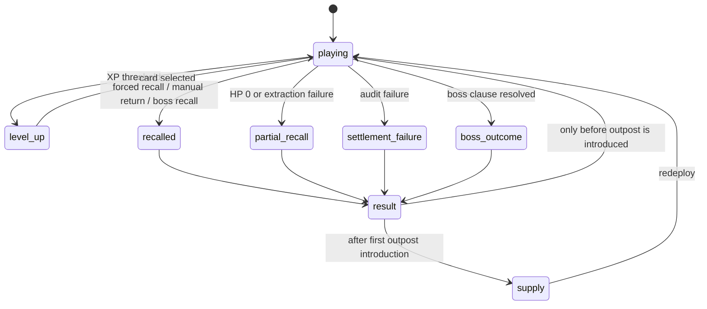

규칙:

- `game_over`라는 감각을 일반 유저 화면 중심 용어로 쓰지 않는다.
- 런 종료 UI는 상황별 결과명으로 표시한다: 귀환 성공, 긴급 인양, 일부 인양, 정산 실패, 미완 귀환, 결절 처리.
- 보급소가 소개된 뒤에는 결과에서 바로 재시작하지 않는다.

현재 구현 확인 대상:

- `scripts/main.gd`
- `scripts/run_result_evaluator.gd`
- `scripts/hud_controller.gd`
- `scripts/meta_progression.gd`

## 2. Core Sortie System Flow

목적:

- 0.2의 핵심 루프를 단순 생존 재시작이 아니라 출격, 정산, 배분, 재방문 변화로 고정한다.

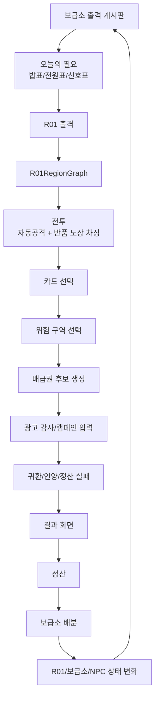

규칙:

- 0.2의 목표는 BM 구현이 아니라 이 루프가 재미있는지 검증하는 것이다.
- 카드, 차징, R01 구역, 정산, 배분은 따로 놀면 안 된다.
- 다음 런 변화가 보이지 않으면 RPG 구조가 실패한 것이다.

## 3. R01RegionGraph Flow

목적:

- R01을 시간 기반 배경 전환이 아니라 실제 이동과 정산 의미를 가진 넓은 지역으로 만든다.

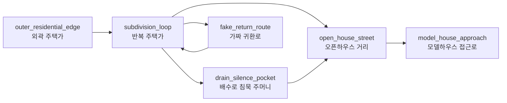

노드 데이터:

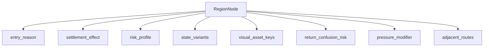

규칙:

- `scripts/r01_layout_blockout.gd`의 넓은 bounds는 유지한다.
- 가장 가까운 anchor 판정은 임시이며, 다음 단계는 graph/route/POI 기반 판정이다.
- `scripts/r01_map_controller.gd`의 legacy 시간 기반 배경 드로잉과 graph/blockout 구조는 정리해야 한다.
- `fake_return_route`는 절대 실제 귀환 UI처럼 보이면 안 된다.

## 4. Card And Rule Engine Flow

목적:

- 발라트로식 재미의 핵심인 누적 시너지, 룰 변경, 판세 변화를 액션 RPG에 맞게 적용한다.

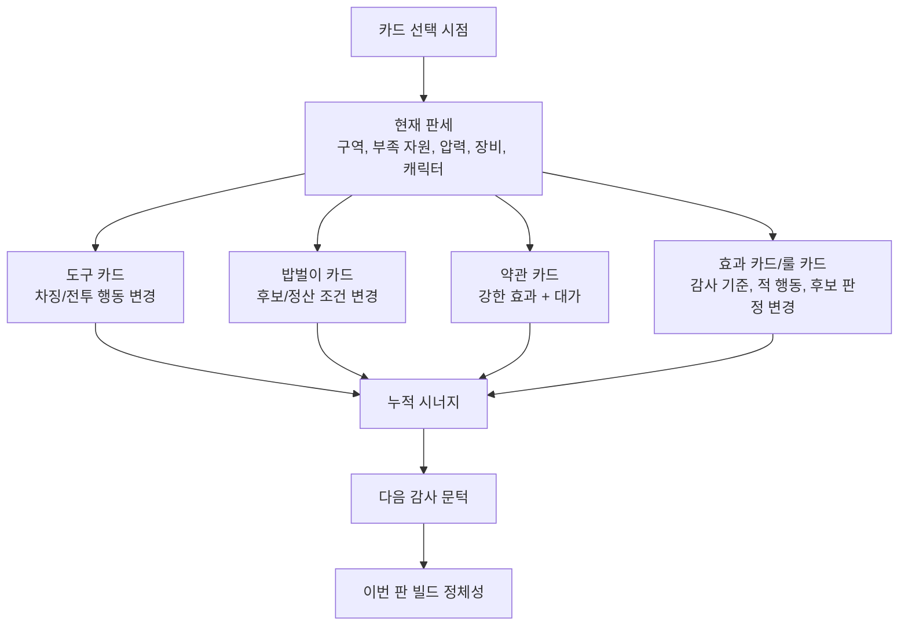

규칙:

- 카드 12장은 첫 검증용 뼈대이지 최종 카드 시스템의 한계가 아니다.
- 좋은 카드는 "피해 +10%"가 아니라 이번 판 규칙을 바꿔야 한다.
- 다음 카드가 나오기 전까지 적 압박과 감사 문턱이 상승해야 한다.
- 압박은 단순 HP inflation만으로 만들지 않는다. 이동속도, 밀도, 역할, 방어 타입, 구역 압력, 감사 이벤트를 함께 쓴다.

## 5. Pressure And Damage Threshold Flow

목적:

- 발라트로의 점수 문턱 상승을 액션 전투에서는 "다음 압박을 넘길 만큼 피해/처리/정산 조건을 만들었는가"로 번역한다.

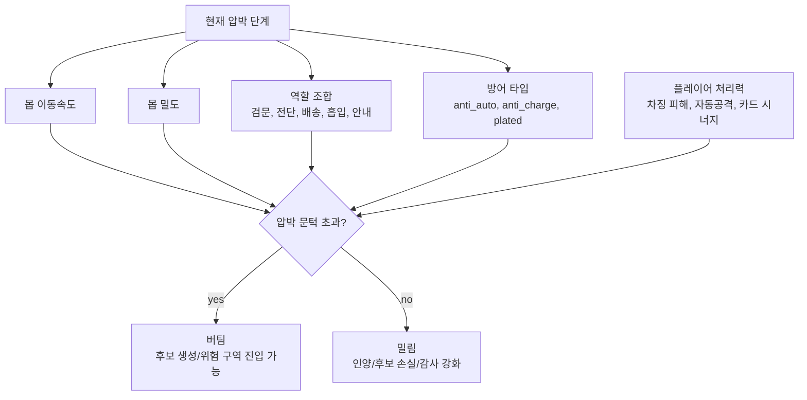

규칙:

- R01이 넓어질수록 도망만 되는 구조가 되면 안 된다.
- 몹은 충분히 빨라야 하고, 플레이어는 카드/차징/장비로 처리 기준을 넘겨야 한다.
- 다만 압박은 불공정한 즉사나 화면 가림이 아니라 판독 가능한 증가여야 한다.

## 6. Ration Candidate And Settlement Flow

목적:

- 배급권을 골드가 아니라 생존권으로 작동하게 한다.

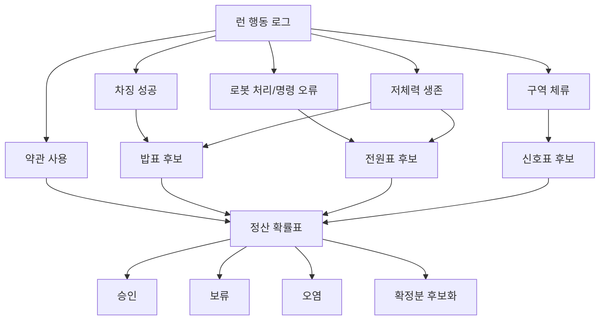

규칙:

- 확정 배급권과 후보 배급권을 분리한다.
- 정산은 완전 랜덤이 아니라 행동이 만든 확률표다.
- 승인/보류/오염 사유는 짧고 납득 가능해야 한다.
- 실제 돈이나 광고 시청으로 밥표/전원표/신호표를 지급하지 않는다.

## 7. Outpost Allocation Flow

목적:

- 보급소를 상점이 아니라 살아남는 장소로 유지한다.

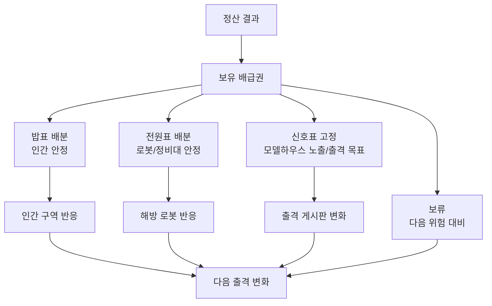

규칙:

- 모두를 동시에 완벽하게 살릴 수 없어야 한다.
- 보급소 배분은 관리 피로가 아니라 다음 출격 이유로 작동해야 한다.
- 인간만 살리는 단일 선악 구조로 만들지 않는다.

## 8. Boss Outcome Probability Flow

목적:

- 보스는 죽는 적이 아니라 지역 약관의 얼굴이라는 기준을 시스템으로 고정한다.

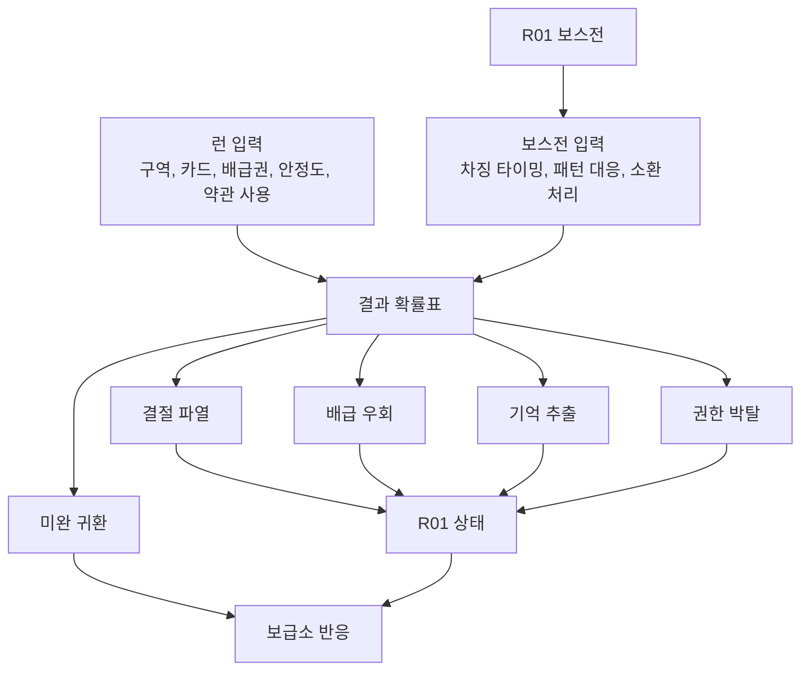

규칙:

- 전투 후 단순 A/B/C 선택으로 처리하지 않는다.
- 런 중 행동과 보스전 행동이 결과 확률표를 만든다.
- 후보가 비슷할 때만 보급소 자원으로 마지막 개입을 허용한다.
- 보스 조우만으로 코어 파편 지급 금지.
- 보스 조우만으로 코어 파편 지급 없음. 코어 파편은 보스 승리 또는 HP 임계 기반 보스 긴급 인양 보상에서만 정산한다.
- R01 보스 비주얼은 기존 v04 사용 금지. 신규 concept board가 필요하다.

## 9. Asset Gate Flow

목적:

- 에셋을 먼저 끼워 넣지 않고, 스토리/지역/시스템 요구가 확정된 뒤 제작한다.

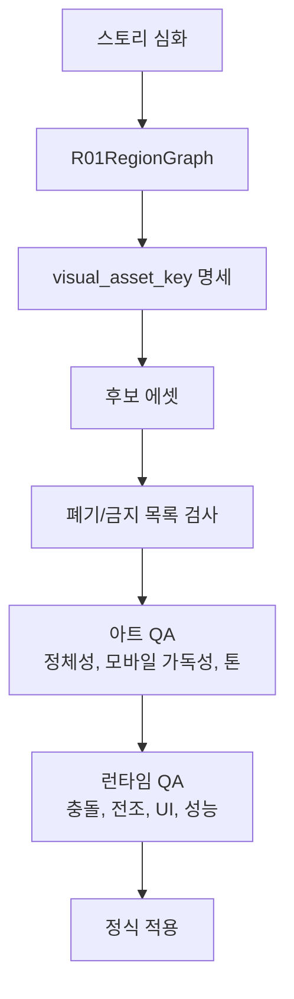

금지:

- 윤서 v05 최종 사용 금지.
- 스마일 홈 시어머니 v04 최종 사용 금지.
- 기존 pixel player/enemy는 dev fallback만 허용.
- `generated_assets/01_atomic_steampunk`, `generated_assets/03_cute_dystopian_atomic`, `assets/art_inbox/rejected` 사용 금지.
- `assets/art_inbox`와 `assets/style_samples/p0_direction` bulk import 금지.

## 10. Character And Equipment Monetization Boundary

목적:

- 조 단위까지 노리는 장기 구조는 가능하게 열되, 0.2 핵심 경험과 생존권 판매 금지는 깨지지 않게 한다.

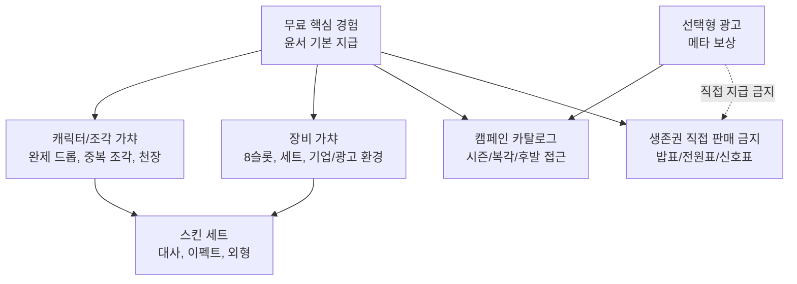

규칙:

- 0.2에는 실제 과금, 캐릭터 가챠, 장비 가챠, 시즌 카탈로그 판매를 넣지 않는다.
- 윤서는 기본 지급이지만 약하면 안 된다.
- 윤서 조각은 장기적으로 가챠/플레이/이벤트/패스로 획득 가능하다.
- 스킨은 외형, 대사, 이펙트 세트 판매가 적합하다.
- 장비는 8슬롯 후보를 열어두되 0.2에는 넣지 않는다.

## 11. Reputation And Route Flow

목적:

- 명성/평판을 단일 선악 점수가 아니라 여러 노선으로 다룬다.

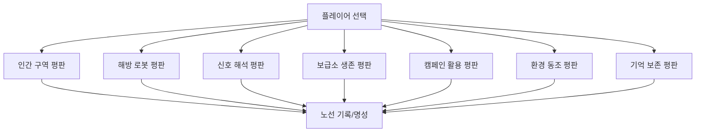

규칙:

- 모든 평판을 동시에 1등으로 만드는 구조는 피한다.
- 인간을 살리는 선택만 선한 정답으로 만들지 않는다.
- 환경 신봉자, 캠페인 활용자 같은 루트 가능성도 세계 안에서 인정한다.
- 0.2에서는 전체 평판 시스템을 구현하지 않고 씨앗만 둔다.

## 12. QA Gate Flow

목적:

- 문서상 구조가 아니라 실제 모바일 플레이 감각으로 검증한다.

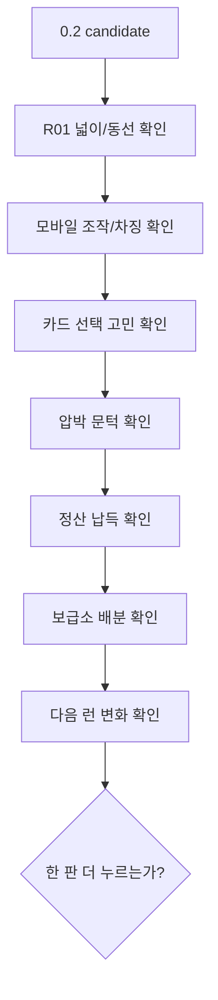

규칙:

- R01이 좁으면 제대로 테스트한 것이 아니다.
- 시청각/공간 볼륨이 부족한 상태에서 최종 재미 판단을 내리지 않는다.
- 첫 5분 안에 차징, 카드, 위험 구역, 정산, 보급소 중 최소 3개 이상은 체감되어야 한다.
- 일반 UI에 internal id를 노출하지 않는다.
- `debug label`과 내부 상태값은 `F12` 디버그 화면에서만 노출한다.

## Logic Invariant Checklist

| # | invariant |
|---:|---|
| 1 | 내부 장르는 `출격형 광고 정산 액션 RPG`다. |
| 2 | 외부 표현은 모바일 액션 RPG 쪽으로 간다. |
| 3 | 윤서는 죽지 않는다. |
| 4 | 실패는 인양/정산 실패/후보 손실/지역 결과로 처리한다. |
| 5 | 첫 회수 후 결과는 보급소를 거친다. |
| 6 | 보급소는 상점이 아니라 정산과 배분의 장소다. |
| 7 | 밥표/전원표/신호표는 0.2 핵심 자원이다. |
| 8 | 밥표/전원표/신호표는 실제 돈이나 광고 시청으로 직접 판매/지급하지 않는다. |
| 9 | 정산은 행동 기반 확률표다. |
| 10 | 확정 배급권과 후보 배급권을 분리한다. |
| 11 | 카드는 단순 스탯이 아니라 규칙과 정산 방향을 바꿔야 한다. |
| 12 | 다음 카드 전까지 적 압박과 감사 문턱이 올라야 한다. |
| 13 | R01은 넓은 출격형 지역이어야 한다. |
| 14 | R01RegionGraph가 지역/정산/에셋 키를 연결해야 한다. |
| 15 | `fake_return_route`는 실제 회수 UI처럼 보이면 안 된다. |
| 16 | 보스는 죽는 적이 아니라 지역 약관의 얼굴이다. |
| 17 | 보스 결과는 런 행동과 보스전 행동이 만든 확률표다. |
| 18 | 윤서 v05는 최종 주인공 에셋으로 사용하지 않는다. |
| 19 | 스마일 홈 시어머니 v04는 최종 보스 에셋으로 사용하지 않는다. |
| 20 | 기존 pixel player/enemy는 dev fallback만 허용한다. |
| 21 | 0.2에는 실제 과금을 넣지 않는다. |
| 22 | 장비/캐릭터/카탈로그 BM은 장기 구조로만 문서화한다. |
| 23 | 무과금도 핵심 세계와 각 지역 핵심 결과를 볼 수 있어야 한다. |
| 24 | 과금은 성장 속도, 빌드 폭, 수집 완성도, 스킨/대사/이펙트를 제공한다. |
| 25 | 명성/평판은 단일 선악이 아니라 다중 노선이다. |

## Current Biggest Gaps

| 우선순위 | 구멍 | 이유 | 다음 작업 |
|---:|---|---|---|
| P0 | 스토리 심화 부족 | 에셋 명세가 아직 흐려짐 | R01 광고 생태계, 윤서, 보스, 보급소 인물 심화 |
| P0 | R01RegionGraph 미구현 | 넓은 blockout이 아직 RPG 지역으로 완전히 작동하지 않음 | graph/route/POI 데이터 구조 추가 |
| P0 | 카드 룰 변경 깊이 부족 | 12장 뼈대만으로는 발라트로식 폭발력이 부족 | 룰 카드, 감사 문턱, 누적 시너지 확장 |
| P0 | 에셋 게이트 미잠금 | 폐기 에셋이 런타임에 남을 위험 | asset allow/deny 기준을 코드/QA에 반영 |
| P1 | 보스 결과 확률표 미구현 | 보스가 아직 일반 전투 보상처럼 보일 수 있음 | outcome probability data 설계 |
| P1 | 모바일 UI 최종 검증 필요 | 카드/정산/보급소가 작은 화면에서 터질 수 있음 | 480x270, touch-first QA |
