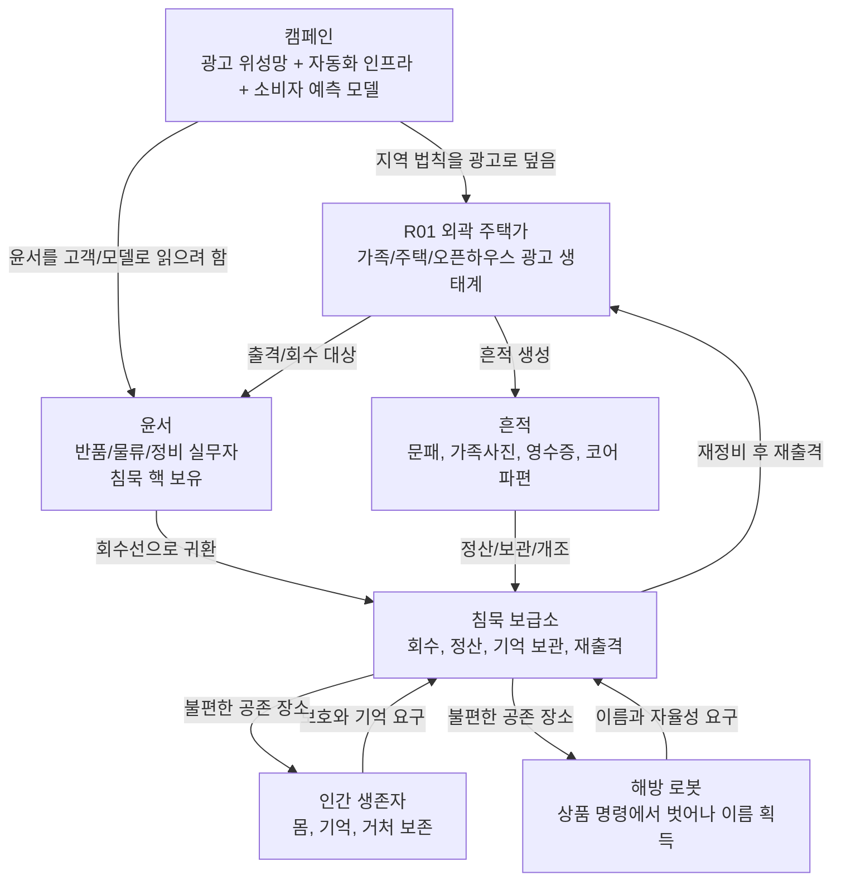
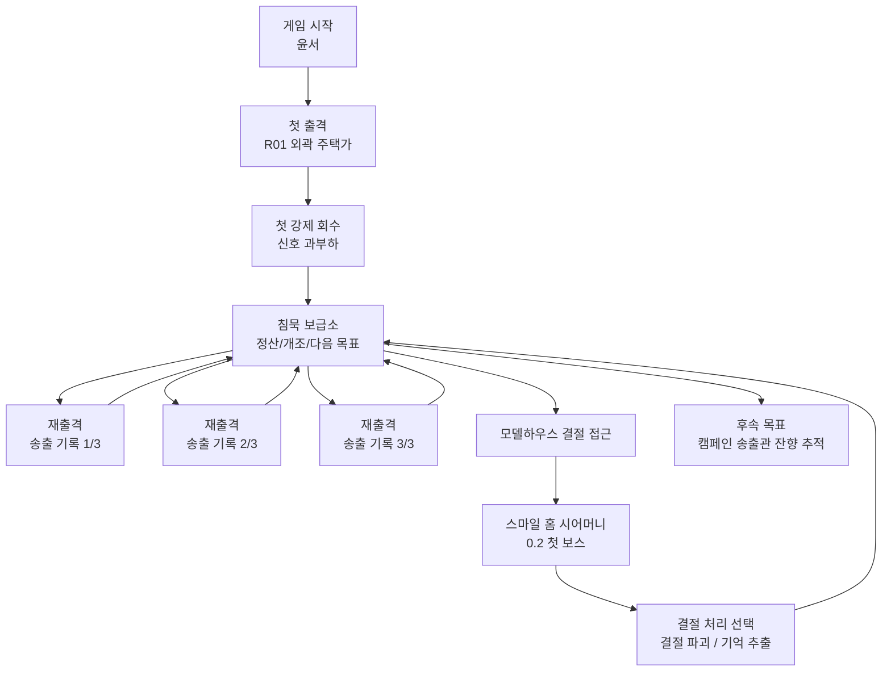
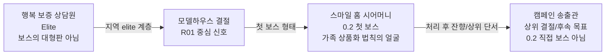
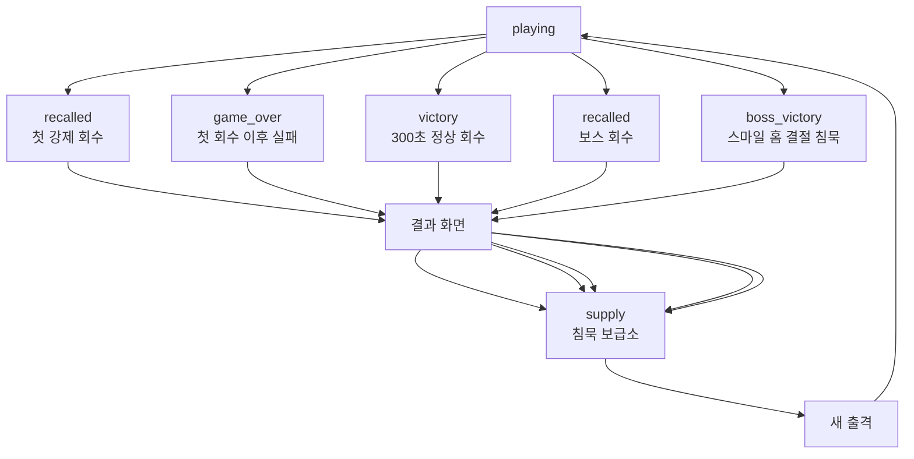
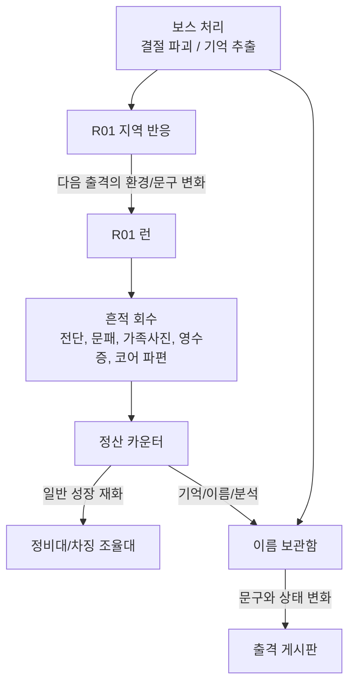
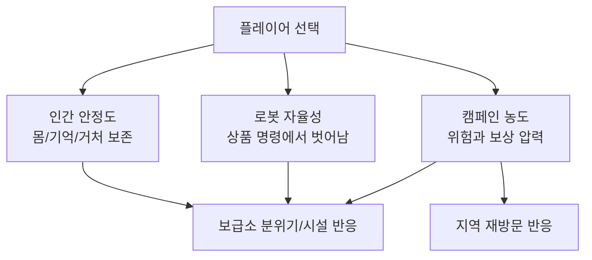
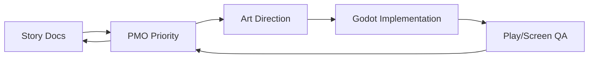

# World Story Diagrams

This document is the shared diagram layer for story, PMO, art, and implementation. It should prevent the team from mixing up the 0.2 scope, the first boss identity, and the long-term campaign structure.

## 1. Core World Relationship

## 2. 0.2 Vertical Slice Story Loop

## 3. Boss Identity Boundary

Rules:

- The first visible boss is `스마일 홈 시어머니`.
- `캠페인 송출관` remains a higher signal and follow-up objective in 0.2.
- `행복 보증 상담원` is an elite enemy direction, not the boss base.

## 4. Run Result Routing

Rule: after the outpost has been introduced, a run ending should return to the outpost instead of jumping straight into a new run.

## 5. Trace And Choice Flow

## 6. Faction Pressure

0.2 does not need the full faction system implemented. It only needs visible seeds:

- outpost text changes,
- R01 route phrase changes,
- trace preservation/usage implications,
- boss outcome differences.

## 7. Art/Implementation Guardrails

Guardrails:

- Art must read the R01/suburb/outpost story before making production candidates.
- Code must preserve the run-state contract before adding new systems.
- PMO should decide scope before asset replacement or major UI changes.
- QA should check whether story intent is visible on screen, not only whether code runs.
