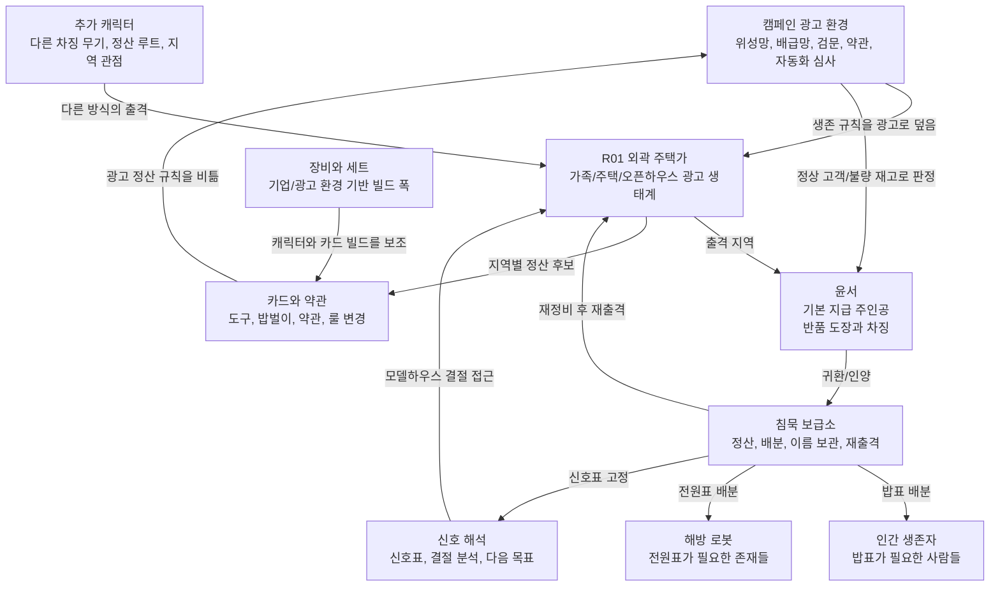
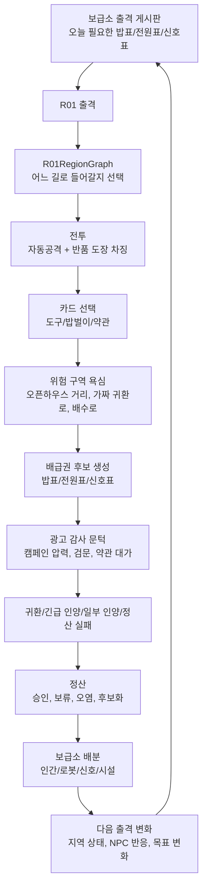
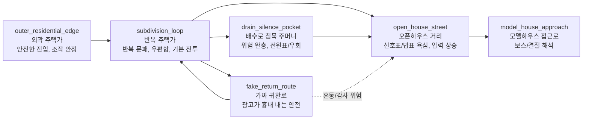
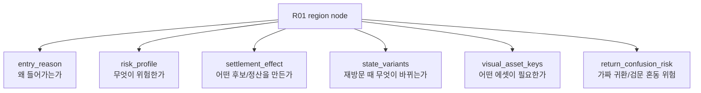
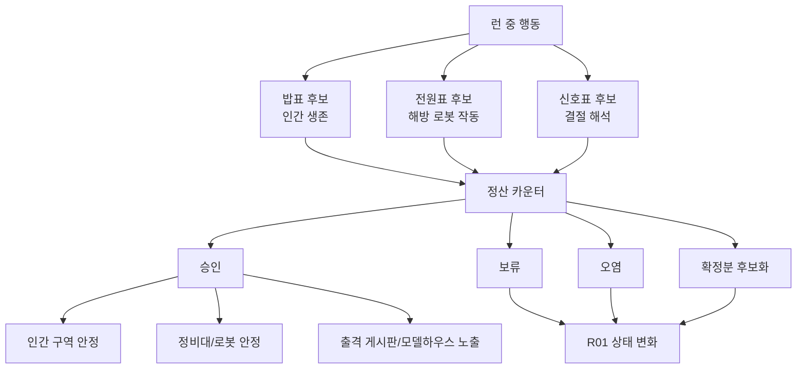
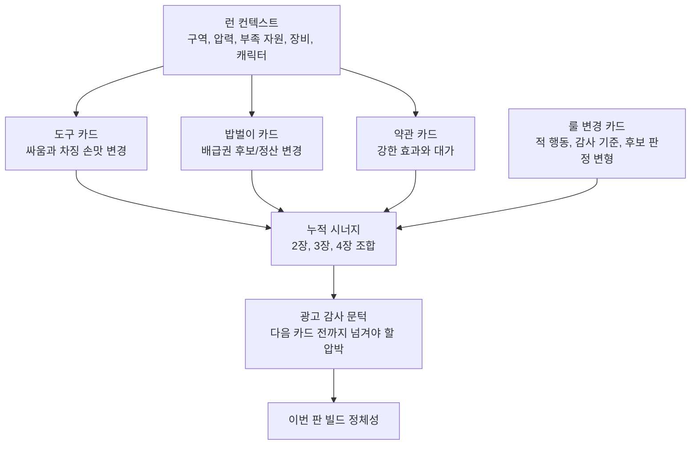
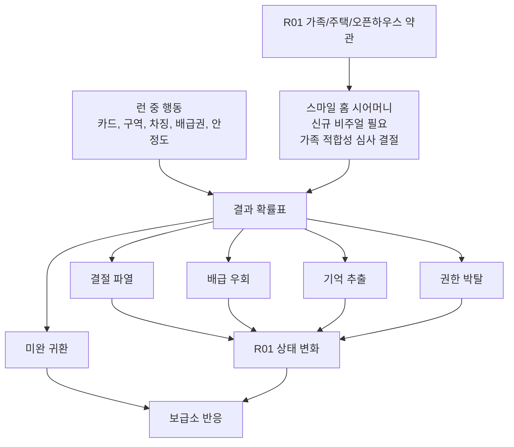
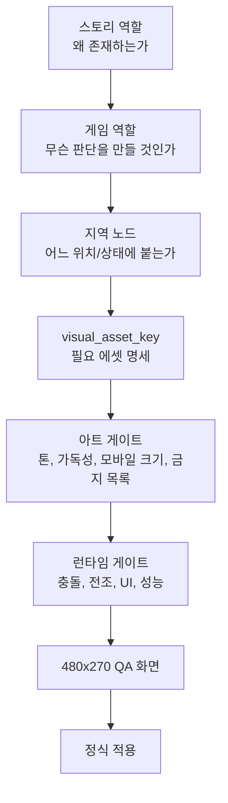
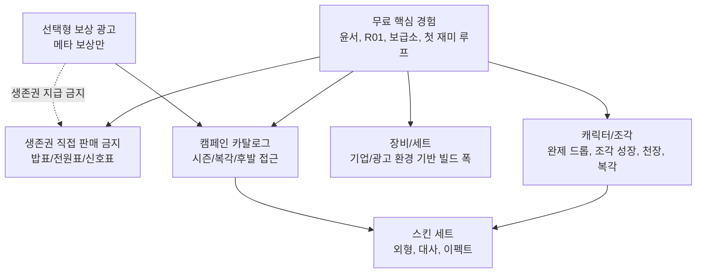
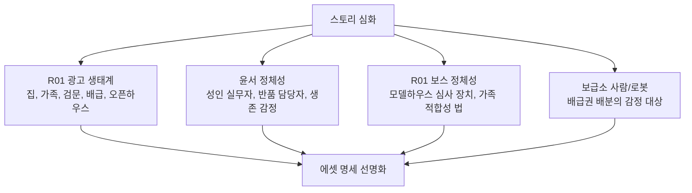

# World Story Diagrams

이 문서는 `Atomic Ad Survivors 0.2`의 세계, 스토리, R01 지역, 보급소, 카드, 정산, 에셋 제작 방향을 같은 그림으로 맞추기 위한 공유 다이어그램 문서다.

현재 기준:

> Atomic Ad Survivors는 광고가 생존권을 쥔 세계에서, 윤서와 여러 캐릭터가 출격해 광고 약관과 정산 규칙을 비틀고, 밥표/전원표/신호표를 확보하며, 그 결과가 보급소와 지역 상태를 바꾸는 모바일 액션 RPG다.

주의:

- 이 게임은 단순 로그라이크, 단순 로그라이트, 단순 뱀서류가 아니다.
- 광고는 적이 아니라 환경이다.
- 실패는 죽음이 아니라 인양, 정산 실패, 후보 보류, 지역 결과로 남는다.
- R01은 작은 아레나가 아니라 반복 출격과 정산 결과를 기억하는 RPG 지역이다.
- 에셋 제작은 스토리 기능과 지역 역할이 확정된 뒤에 한다.

## 1. Core World Relationship

## 2. 0.2 Sortie RPG Loop

## 3. R01 Region Graph

R01은 `2 + 3 + 보조 1` 구조로 간다. 구역 이름은 배경 이름이 아니라 정산과 위험 규칙을 가진 노드다.

각 노드는 최소한 다음 값을 가져야 한다.

## 4. Ration Ticket And Settlement Meaning

## 5. Card And Rule-Bending Flow

카드는 단순 공격력 상승이 아니라 이번 판의 규칙과 정산 방향을 바꾸는 장치다.

## 6. Boss Is A Regional Clause Face

보스는 죽이는 적이 아니라 지역 광고 약관의 얼굴이다.
캠페인 송출관은 스마일 홈 시어머니보다 높은 상위 결절이며, 0.2에서는 직접 보스가 아니라 후속 목표로 남긴다.

## 7. Story To Asset Gate

에셋은 먼저 만들고 끼우는 것이 아니라, 스토리 기능과 지역 역할이 확정된 뒤 제작한다.

금지:

- 윤서 v05를 최종 주인공으로 사용하지 않는다.
- 스마일 홈 시어머니 v04를 최종 보스로 사용하지 않는다.
- 기존 pixel player/enemy 임시본을 최종 에셋으로 취급하지 않는다.
- `generated_assets/01_atomic_steampunk`, `generated_assets/03_cute_dystopian_atomic`, `assets/art_inbox/rejected`는 사용하지 않는다.
- `assets/art_inbox`와 `assets/style_samples/p0_direction`은 후보/참고이지 bulk import 대상이 아니다.

## 8. Monetization Boundary

0.2에는 실제 과금이 없다. 그러나 장기 구조는 처음부터 세계관과 충돌하지 않게 설계한다.

## 9. What Must Be Deepened Before Final Assets

결론:

> 스토리가 깊어져야 에셋이 명확해진다.
> R01 지역 구조가 먼저고, 그 다음이 에셋이다.
> 윤서와 R01 보스는 신규 제작 대상이다.
