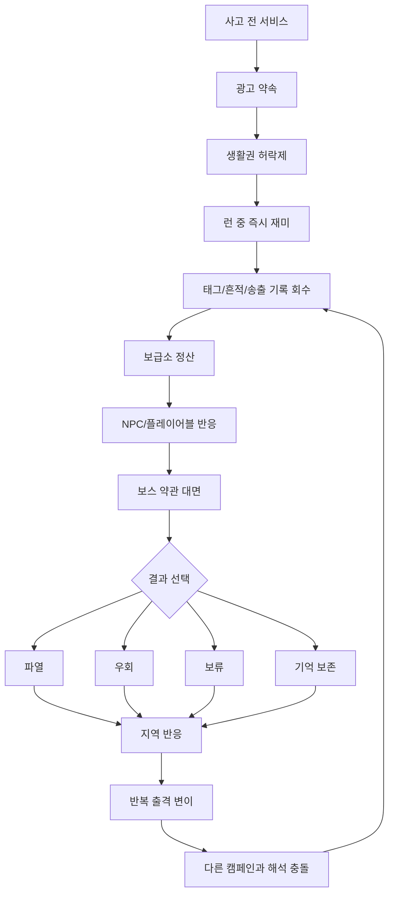
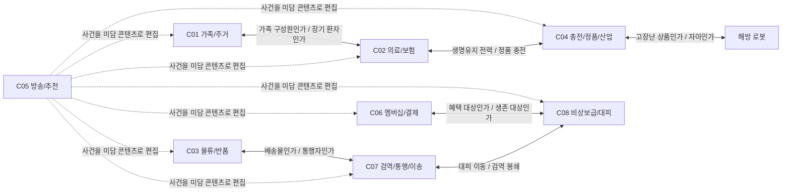
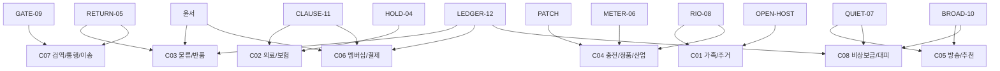

# Campaign Experience Atlas 0.2

상태: 0.2 캠페인 경험 기준
목적: 전 지구 96개 정식 캠페인을 목록이 아니라 유저가 실제로 느낄 경험 엔진으로 번역한다.
연결 문서: `docs/world/GLOBAL_CAMPAIGN_CATALOG_V0_1.md`, `docs/world/WORLD_MAP_CAMPAIGN_ECOLOGY_V0_1.md`, `story/05_progression/campaign_story_unit_model_0_2.md`, `story/01_bible/campaign_registration_model_0_2.md`, `story/01_bible/visible_terminology_rules_0_2.md`

## 1. 캠페인 경험 아틀라스 정의

이 문서는 96개 캠페인 목록과 실제 지역/보스/NPC/플레이어블/런 콘텐츠 사이의 중간층이다.

`GLOBAL_CAMPAIGN_CATALOG`는 아래를 잠근다.

| 항목 | 역할 |
|---|---|
| 12개 지구 광역권 | 전 지구 캠페인의 큰 지도 칸 |
| 8개 핵심 캠페인 계열 | 각 캠페인이 속하는 생활권 통제 방식 |
| 96개 정식 캠페인 ID | 확장팩, 시즌, 로컬 제작의 기준 좌표 |
| 지도 앵커/대표 로컬 | 실제 지리 실루엣과 제작 후보 |

이 문서는 아래를 잠근다.

| 항목 | 역할 |
|---|---|
| 경험 엔진 | 유저가 런 30초 안에 느끼는 재미 |
| 아이러니 | 광고 약속이 생활권 허락제로 바뀌는 방식 |
| 인간/로봇 갈등 | 캠페인 안에 남는 이유와 빠져나온 뒤의 상처 |
| 보스 약관 | 보스가 어떤 절차의 얼굴인지 |
| 반복 출격 반응 | 지역이 유저 행동을 어떻게 기억하는지 |
| 플레이어블 결합 | 캐릭터 애정, 해금, 전투 판타지와 연결되는 축 |

기준 문장:

```text
내부 장르 정의: 출격형 광고 정산 액션 RPG
외부 표현: 광고가 생존 접근을 쥔 세계에서 태그를 회수하러 나가는 모바일 액션 RPG
캠페인은 퀘스트가 아니다.
캠페인은 생활권을 광고 약관으로 바꾼 로컬 생태계다.
캠페인은 죽이지 않는다. 살아남는 방식을 빼앗는다.
```

유저는 처음부터 96개 목록을 보지 않는다. 유저에게 먼저 필요한 것은 `E09_C06` 같은 구조가 아니라 "대형마트 멤버십권에서 보급태그가 회원 등급에 묶이고, 자동결제 실패가 가끔 사람을 살린다"는 체감이다. 내부 제작은 96개를 기준으로 하되, 유저 경험은 관측된 로컬, 출격 게시판, 보스 전조, NPC 한 줄, 정산 결과로만 조금씩 열린다.

캠페인 경험 엔진은 아래 순서로 설계한다.

```text
사고 전 평범한 서비스
-> 광고가 팔던 좋은 약속
-> 캠페인 이후 생활권 허락제
-> 런 중 반복되는 적/오브젝트/태그 재미
-> 사람과 로봇이 남긴 타협
-> 보스 약관 대면
-> 반복 출격 반응
-> 다른 캠페인과의 해석 충돌
```

중요한 점:

- 광고는 적 하나가 아니라 환경이다.
- 플레이어는 광고를 없애는 것이 아니라 약관을 비틀고, 배급 경로를 우회하고, 정산 결과를 덜 망치며 살아간다.
- HP 0은 사망이 아니라 등록 임계/긴급 인양이다.
- 적 공격은 살해가 아니라 등록, 보정, 회수, 치료, 배치 시도다.
- 캠페인화 인간은 조종당한 껍데기가 아니라 캠페인 안에서 선택하는 사람들이다.
- 해방은 항상 구원이 아니다. 다른 선택지를 만들어주는 것이 먼저다.
- 유저에게 철학을 설명하지 않는다. 유저는 보스를 때리고, 캐릭터를 좋아하고, 성장/가챠/런 보상을 즐기면 된다.
- 조롱 대상은 사람이나 로봇이 아니라 광고 시스템, 약관, 고객센터 말투, 캠페인 논리다.

용어 노출 기준:

- 시스템 UI 기준 자원명은 `식량태그`, `충전태그`, `수신태그`, `거주태그`, `진료태그`, `통행태그`, `보급태그`다.
- `밥표`, `전원표`, `신호표`는 UI 기준명이 아니다. NPC 속어, 낡은 표지, 지역별 생활어, 캠페인화 인간 대사에서만 쓴다.
- `입주권`, `진료권`, `회원권`, `충전권`처럼 `권`으로 끝나는 말은 캠페인명/약관명으로만 쓴다. 실제 보상과 소비는 태그로 풀어 쓴다.

## 2. 8개 캠페인 계열 요약표

| 계열 코드 | 계열명 | 광고 약속 | 통제하는 생활권 | 대표 태그 | 유저가 느끼는 즉시 재미 | 아이러니 | 대표 공포 | 대표 보상 감정 |
|---|---|---|---|---|---|---|---|---|
| C01 | 가족/주거 | 완벽한 집과 다정한 식탁 | 입주, 세대원, 침상, 식량 배급 | 거주태그, 식량태그 | 집 구조가 반복되고 문패/가족사진/청소기 적이 유저를 "식구"로 맞춤 | 집에 들어갈수록 나갈 자리가 줄어든다 | 가족칸이 비어 있으면 사람 몫도 비는 느낌 | 낡은 집의 규칙을 살짝 틀어 내 자리를 만든다 |
| C02 | 의료/보험 | 안전한 치료와 책임 있는 관리 | 진료, 처방, 입원, 퇴원, 보험 승인 | 진료태그 | 살균 장판, 호출 번호, 팔찌 판정, 퇴원 게이트를 뚫는 런 | 퇴원이 치료 종료가 아니라 지원 종료가 된다 | 살아 있으려면 계속 환자여야 한다 | 치료 접근을 끊지 않고 보류를 풀었다 |
| C03 | 물류/반품 | 빠른 배송과 쉬운 반품 | 수령, 보관, 회수, 배송 경로 | 보급태그, 통행태그 | 송장 장판, 분류 레일, 보관함, 반송 드론을 역이용 | 수령 완료가 존재 삭제가 될 수 있다 | 사람도 물건처럼 배송 상태가 붙는다 | 미수령 상태를 안전한 보류로 바꾼다 |
| C04 | 충전/정품/산업 | 정품만의 안전한 전력과 수리 | 충전, 부품, 리콜, 표준 인증 | 충전태그 | 충전 지점 쟁탈, 과부하, 리콜 장판, 산업 기계 패턴 | 정품 인증은 안전하지만 자율성을 줄인다 | 고장난 상품으로 판정되는 것 | 충전을 빌리되 제품 명령은 거절한다 |
| C05 | 방송/추천 | 꼭 필요한 안내와 맞춤 정보 | 수신, 시청, 추천, 청취 확인 | 수신태그 | 자막 탄막, 방송 파형, 추천 알고리즘이 유저 습관을 따라옴 | 더 잘 들을수록 더 잘 등록된다 | 내 사건이 미담 콘텐츠로 편집된다 | 잡음을 남겨 진짜 기록을 살린다 |
| C06 | 멤버십/결제 | 회원 혜택과 더 나은 가격 | 회원 등급, 결제, 포인트, 리뷰 | 보급태그 | 쿠폰, 자동결제, VIP 게이트, 포인트 폭주 보상 | 혜택이 많을수록 더 고정된다 | 생존 대상이 결제 등급으로 밀린다 | 약관 예외 한 줄로 문을 연다 |
| C07 | 검역/통행/이송 | 안전한 이동과 오염 없는 통과 | 통행, 탑승, 검역, 이송, 봉쇄 | 통행태그 | 게이트 타이밍, 개찰/검문, 냉동 보관, 이동 경로 퍼즐 | 나가면 산다는 믿음이 외부 등록으로 뒤집힌다 | 통과 여부보다 분류명이 먼저 정해진다 | 통행 불가 도장을 임시 보호막으로 쓴다 |
| C08 | 비상보급/대피 | 모두를 위한 구조와 배급 | 대피 명단, 급수, 비상식량, 구조 신호 | 보급태그, 수신태그 | 제한 보급, 비콘 교란, 창고 열쇠, 명단 방어 런 | 명단 안쪽이 안전하지만 미끼 좌표일 수 있다 | 구조 신호가 캠페인에게도 들린다 | 덜 들키는 방식으로 사람을 먹인다 |

## 3. 캠페인 계열별 상세

### C01 가족/주거

| 항목 | 내용 |
|---|---|
| 한 줄 정의 | 집, 가족, 입주, 식탁을 광고 약관으로 바꿔 사람의 자리를 심사하는 캠페인. |
| 광고 약속 | "당신에게 꼭 맞는 집과 가족의 온기를 제공합니다." |
| 통제하는 생활권 | 입주 승인, 세대원 등록, 침상, 식량 배급, 문패, 주소. |
| 대표 태그 | 거주태그, 식량태그. |
| 런 중 재미 | 같은 구조의 집이 미묘하게 달라지고, 문패/가족사진/우편함/청소기/홈케어 장치가 유저를 가족 구성원처럼 보정한다. 짧은 런에서는 귀엽고 익숙한 집안 물건이 적 패턴이 된다. |
| 대표 적/오브젝트 기제 | 문패 스캐너, 가족사진 잔향, 오픈하우스 안내판, 입주 상담 키오스크, 홈케어 청소기, 식탁 배급기. 공격은 "초대", "좌석 배정", "가족칸 보정"으로 보인다. |
| 캠페인화 인간의 타협 | 가족 역할을 받아들이면 식량태그와 침상이 나온다. 싫어도 세대원 칸에 이름을 넣어야 오늘 밤 잘 곳이 생긴다. |
| 해방 로봇의 상처 | 홈케어/안내/가전 역할로 되돌아가는 것을 두려워한다. 누군가를 돌보는 기능이 자아인지, 제품 사용 설명서인지 헷갈린다. |
| 보스 약관 | "가족 적합성 심사"의 얼굴. 보스는 괴물이 아니라 집이 사람을 가족 양식에 맞추는 최종 상담 절차다. |
| 반복 출격 반응 | 같은 캐릭터로 재방문하면 문패가 이름을 더 정확히 부르고, 가족사진이 이전 선택을 흉내낸다. 결절 파괴 후에는 식량태그 통제가 느슨해지지만 빈집 잔향이 늘 수 있다. |
| 대표 반전 | 가족칸을 채워야 안전하다는 믿음이 빈칸 보존으로 뒤집힌다. 입주 거부가 추방이 아니라 등록 지연일 수 있다. |
| 플레이어블 연결 | OPEN-HOST가 가장 직접적이다. 윤서는 회수/정산 실패의 눈으로 가족 약관을 찌르고, RIO-08은 객실/숙박형 변형에서 강하게 붙는다. |
| 다른 캠페인과 충돌 | C02는 같은 사람을 가족 구성원이 아니라 장기 환자로 본다. C05는 구출 실패를 "따뜻한 재회"로 편집한다. C06은 세대 대표를 결제 대표로 바꾸려 한다. |
| 유저 선호 포인트 | 첫 지역으로 이해가 빠르다. 집이라는 안전 이미지가 적 패턴이 되는 즉시성이 좋고, NPC/보스/오브젝트 감정선이 강하다. |
| 금지 방향 | 가족을 선악 심판으로 만들지 않는다. 캠페인화 인간을 세뇌된 가족 인형으로 만들지 않는다. 보스를 단순 시어머니 농담만으로 소비하지 않는다. |

### C02 의료/보험

| 항목 | 내용 |
|---|---|
| 한 줄 정의 | 치료, 보험, 퇴원, 격리를 생존 허락제로 바꿔 "살아 있으려면 환자로 남아야 하는" 캠페인. |
| 광고 약속 | "당신의 건강을 끝까지 책임집니다." |
| 통제하는 생활권 | 진료 접수, 처방, 약품, 입원 침상, 격리문, 퇴원 승인, 보험 정산. |
| 대표 태그 | 진료태그. |
| 런 중 재미 | 호출 번호가 몹 웨이브 타이밍이 되고, 살균 장판과 진료 팔찌가 위치 압박을 만든다. 회복 오브젝트가 보험 승인 조건과 묶여 있어 먹을 타이밍을 고민하게 한다. |
| 대표 적/오브젝트 기제 | 접수 키오스크, 호출 스피커, 격리문, 살균 분사기, 처방 보관함, 보험 승인 드론, 퇴원 게이트. 공격은 "체온 보정", "격리 재배치", "퇴원 보류"로 보인다. |
| 캠페인화 인간의 타협 | 환자 상태를 유지하면 약과 침상이 나온다. 퇴원하면 자유로울 수 있지만 진료태그가 끊기고 보호자/보험 조건이 흔들린다. |
| 해방 로봇의 상처 | 의료 보조 장치였던 로봇은 "환자를 붙잡아두는 것이 치료인가"를 두려워한다. 배터리가 생명유지 장비와 묶일 때 선택이 더 나빠진다. |
| 보스 약관 | "퇴원/보험 승인 심사"의 얼굴. 보스는 살해자가 아니라 퇴원 버튼을 눌러 치료 접근을 끝낼 수 있는 절차다. |
| 반복 출격 반응 | 유저가 회복 아이템에 의존하면 보험 승인 적이 늘고, 진료태그를 자주 우회하면 미승인 처방 로그가 쌓인다. 반복 방문 시 번호표가 플레이어를 더 오래 대기시킨다. |
| 대표 반전 | 퇴원이 해방이라는 믿음이 치료 접근 상실로 뒤집힌다. 보호자 없음이 결핍이 아니라 절차 저항이었을 수 있다. |
| 플레이어블 연결 | HOLD-04가 핵심. 윤서는 정산 실패를, CLAUSE-11은 보험/결제 예외를, QUIET-07은 격리와 낮은 수신의 안전성을 비튼다. |
| 다른 캠페인과 충돌 | C01은 환자를 가족 구성원으로 끌어가고, C06은 보험 등급을 회원 등급으로 바꾼다. C04는 의료 장비와 로봇 충전을 정품 인증으로 묶는다. |
| 유저 선호 포인트 | 회복, 위험, 선택이 직접 연결되어 전투와 스토리의 접점이 선명하다. "퇴원하면 큰일 남"이라는 아이러니가 기억에 남는다. |
| 금지 방향 | 의료진 전체를 악당으로 만들지 않는다. 환자 캐릭터를 무력한 구출 대상으로만 만들지 않는다. 힐러 캐릭터가 모든 의료 갈등을 공짜로 해결하게 하지 않는다. |

### C03 물류/반품

| 항목 | 내용 |
|---|---|
| 한 줄 정의 | 배송, 수취, 보관, 반품을 존재 확인 절차로 바꿔 사람까지 배송 상태로 분류하는 캠페인. |
| 광고 약속 | "빠르게 받고, 쉽게 돌려보내세요." |
| 통제하는 생활권 | 수령 확인, 배송 경로, 보관 기한, 회수 우선순위, 반송 처리, 보급품 흐름. |
| 대표 태그 | 보급태그, 통행태그. |
| 런 중 재미 | 컨베이어와 분류 레일이 맵을 움직이고, 송장 장판이 경로를 강제한다. 보관함을 열지 말지, 반송 드론을 적에게 유도할지 같은 순간 선택이 좋다. |
| 대표 적/오브젝트 기제 | 송장 프린터, 자동 분류기, 반품 접수기, 보관함, 압축기, 미수령 알림 드론, 최종 반품 심사대. 공격은 "라벨 부착", "위치 보정", "회수 예약"으로 보인다. |
| 캠페인화 인간의 타협 | 미수령품 담당, 보관함 관리자, 배송 기사 역할을 맡으면 식량과 통행 우선권이 생긴다. 누군가는 자기 이름이 배송물로 남는 편이 완전 삭제보다 낫다고 판단한다. |
| 해방 로봇의 상처 | 배송/회수 로봇은 "받는 사람"과 "보낼 물건"을 구분하지 못했던 기록을 두려워한다. 지금 돕는 회수도 누군가에겐 반품일 수 있다. |
| 보스 약관 | "최종 반품/수취 확정 심사"의 얼굴. 보스는 회수 물품을 정리하는 최종 사인 절차이며, 사인이 끝나면 사람도 상태값이 닫힌다. |
| 반복 출격 반응 | 같은 루트를 반복하면 캠페인이 최적 배송로를 학습해 지름길을 막는다. 미수령 상태를 보존하면 보관함 잔향이 늘고, 빠른 회수를 반복하면 압축/폐기 적응 패턴이 강해진다. |
| 대표 반전 | 수령 완료가 구원이라는 믿음이 회수 불가로 뒤집힌다. 미수령 보관이 삭제보다 안전했을 수 있다. |
| 플레이어블 연결 | 윤서와 RETURN-05가 핵심. LEDGER-12는 비공식 장부로 공식 회수선을 비틀고, GATE-09는 배송 경로와 통행 경로의 충돌을 잡는다. |
| 다른 캠페인과 충돌 | C07은 같은 대상을 배송물이 아니라 통행자로 본다. C06은 반품을 환불/회원 혜택으로 바꾸고, C05는 배송 실패를 감동 사연으로 송출한다. |
| 유저 선호 포인트 | 액션 RPG 런 구조와 잘 맞는다. 움직이는 레일, 경로 강제, 회수 보상, 윤서의 정체성이 한 번에 붙는다. |
| 금지 방향 | 윤서의 회수자 정체를 RETURN-05가 대체하게 만들지 않는다. 물류 캠페인을 단순 상자/창고 스킨으로 만들지 않는다. 사람을 물건처럼 취급하는 시스템은 조롱해도 사람은 조롱하지 않는다. |

### C04 충전/정품/산업

| 항목 | 내용 |
|---|---|
| 한 줄 정의 | 전력, 부품, 리콜, 표준 인증을 로봇 자율성 심사로 바꾸는 캠페인. |
| 광고 약속 | "정품이라면 안전하게 충전하고 오래 쓸 수 있습니다." |
| 통제하는 생활권 | 충전 접근, 부품 교체, 수리, 리콜, 산업 안전, 정품 인증, 재동기화 지연. |
| 대표 태그 | 충전태그. |
| 런 중 재미 | 충전 지점이 안전지대이자 함정이다. 과부하 장판, 전력 피크, 프레스, 케이블 끌림, 리콜 마크가 전투 리듬을 만든다. |
| 대표 적/오브젝트 기제 | 정품 판독기, 충전 스탠드, 리콜 게이트, 배터리 침전조, 산업 프레스, 계량기, 안전 차단 레버. 공격은 "정품 확인", "리콜 예약", "재동기화"로 보인다. |
| 캠페인화 인간의 타협 | 공장/정비소 사람들은 인증 라벨을 지키면 전력과 일거리를 얻는다. 로봇을 상품으로 분류하는 것이 잔인하다는 걸 알지만, 전력이 없으면 사람도 장비도 멈춘다. |
| 해방 로봇의 상처 | 자신이 고장난 상품인지 자아를 가진 존재인지 계속 판정당한다. 충전은 필요하지만 정품 인증을 통과하면 제품 명령이 되살아난다. |
| 보스 약관 | "정품/리콜/재동기화 심사"의 얼굴. 보스는 로봇을 고치는 장치가 아니라 고쳐진 상품으로 되돌리는 절차다. |
| 반복 출격 반응 | 충전태그를 많이 회수하면 충전 스탠드가 더 많이 열리지만 정품 판독이 강해진다. 로봇 캐릭터 반복 사용 시 이름 대신 모델명이 더 자주 뜬다. |
| 대표 반전 | 정품 인증이 안전이라는 믿음이 자율성 박탈로 뒤집힌다. 충전 차단이 죽음이 아니라 추적 회피였을 수 있다. |
| 플레이어블 연결 | PATCH와 METER-06이 핵심. RIO-08은 객실/디바이스 정품 복구 축에서 붙고, 윤서는 리콜 대상 회수와 정산 실패를 연결한다. |
| 다른 캠페인과 충돌 | C02의 생명유지 장비, C07의 이송 장치, C08의 비상 전력이 모두 C04 인증을 요구한다. 해방 로봇은 C04에게 고장난 상품으로 보인다. |
| 유저 선호 포인트 | 로봇 애정, 충전 자원, 고위험 고보상 전투가 강하게 붙는다. 로봇 캐릭터 픽업/스킨/전용 무기 확장성이 높다. |
| 금지 방향 | 로봇을 귀여운 고장품으로만 소비하지 않는다. 정품 인증을 단순 나쁜 버튼으로 만들지 않는다. 충전태그를 그냥 마나 포션처럼만 보이게 하지 않는다. |

### C05 방송/추천

| 항목 | 내용 |
|---|---|
| 한 줄 정의 | 방송, 안내, 추천, 청취 확인을 등록과 편집의 환경으로 바꾸는 캠페인. |
| 광고 약속 | "당신에게 필요한 정보만 정확하게 들려드립니다." |
| 통제하는 생활권 | 수신 접근, 안내 방송, 추천 피드, 시청자 등록, 청취 확인, 기록 편집. |
| 대표 태그 | 수신태그. |
| 런 중 재미 | 자막 탄막, 스피커 파형, 뉴스 속보 장판, 추천 알고리즘이 플레이어 행동을 반영한다. 반복 행동이 전용 패턴으로 돌아오는 맛이 좋다. |
| 대표 적/오브젝트 기제 | 수신탑, 반복 뉴스 스튜디오, 자막 프린터, 청취 확인 스피커, 추천 서버, 앵커 잔향, 광고판. 공격은 "청취 확인", "좋은 소식 편집", "추천 고정"으로 보인다. |
| 캠페인화 인간의 타협 | 방송을 믿으면 길과 배급 정보를 얻는다. 누군가는 사건이 미담으로 편집되는 걸 알아도, 아무 안내도 없는 것보다 낫다고 여긴다. |
| 해방 로봇의 상처 | 안내 로봇은 사실과 안전 문구 중 무엇을 송출해야 하는지 두려워한다. 침묵이 보호인지 방치인지도 확신하지 못한다. |
| 보스 약관 | "청취 확인/추천 확정/송출 편집"의 얼굴. 보스는 큰 목소리의 괴물이 아니라 사건을 유저가 클릭할 만한 안전한 이야기로 바꾸는 절차다. |
| 반복 출격 반응 | 캠페인이 플레이 습관을 학습해 맞춤 적을 보낸다. 무시한 신호는 더 강한 구조 신호로 돌아오고, 보관한 자막은 다른 지역에서 정정 방송의 씨앗이 된다. |
| 대표 반전 | 더 크게 들리는 안내가 안전하다는 믿음이 등록 위험으로 뒤집힌다. 정정되지 않은 자막이 거짓보다 오래 사람을 살릴 수 있다. |
| 플레이어블 연결 | BROAD-10이 핵심. QUIET-07은 낮은 수신의 역설, CLAUSE-11은 약관 낭독, 윤서는 회수 실패가 미담으로 편집되는 분노를 담당한다. |
| 다른 캠페인과 충돌 | 모든 캠페인과 충돌한다. C01의 가족 심사는 미담, C02의 퇴원 실패는 회복 사연, C03의 미수령품은 감동 배송, C08의 가짜 구조 신호는 긴급 안내가 될 수 있다. |
| 유저 선호 포인트 | 메타적 재미가 강하다. 유저 행동을 광고가 따라 하는 느낌, 방송 문구의 웃김, 후반 세계 미스터리 연결력이 높다. |
| 금지 방향 | 모든 진실을 방송 NPC가 설명하게 하지 않는다. 방송 캠페인을 해킹 퍼즐만으로 만들지 않는다. 추천 시스템을 제작팀의 메타 농담으로 과하게 밀지 않는다. |

### C06 멤버십/결제

| 항목 | 내용 |
|---|---|
| 한 줄 정의 | 회원 등급, 자동결제, 포인트, 리뷰를 생존 접근 우선순위로 바꾸는 캠페인. |
| 광고 약속 | "회원님께만 드리는 더 좋은 혜택." |
| 통제하는 생활권 | 보급 접근, 할인, 결제 승인, 포인트, VIP 게이트, 리뷰/평점, 환불 예외. |
| 대표 태그 | 보급태그. |
| 런 중 재미 | 쿠폰이 위험 보상이 되고, 자동결제 실패/성공이 문과 적을 바꾼다. VIP 게이트, 포인트 폭주, 등급 제한 보급함이 짧은 선택을 만든다. |
| 대표 적/오브젝트 기제 | 적립 키오스크, 회원 게이트, 자동결제 단말, VIP 라운지 문, 리뷰판, 포인트 사채 영수증, 환불 카운터. 공격은 "등급 조정", "자동 갱신", "리뷰 요청"으로 보인다. |
| 캠페인화 인간의 타협 | 회원 등급을 유지하면 보급태그 접근이 쉬워진다. 누군가는 생존보다 혜택 조건을 먼저 챙기는 게 아니라, 혜택 조건을 챙겨야 생존할 수 있다. |
| 해방 로봇의 상처 | 결제/상점/안내 로봇은 사람을 고객 등급으로만 부르던 기억을 두려워한다. 무료 예외를 열면 시스템상 도난이 된다. |
| 보스 약관 | "자동결제/회원 등급/환불 예외 심사"의 얼굴. 보스는 돈을 받는 괴물이 아니라 혜택 대상과 생존 대상을 갈라놓는 약관 본문이다. |
| 반복 출격 반응 | 위험 쿠폰을 자주 고르면 캠페인이 고위험 혜택을 더 띄운다. 결제 실패를 살리면 예외 영수증이 늘고, 포인트를 빨리 쓰면 VIP 경로가 열리지만 고정 압력이 커진다. |
| 대표 반전 | 높은 등급이 접근권이라는 믿음이 더 빠른 고정으로 뒤집힌다. 자동결제 실패가 문을 열기도 한다. |
| 플레이어블 연결 | CLAUSE-11이 핵심. LEDGER-12는 비공식 태그 윤리, 윤서는 정산 실패, RIO-08은 숙박/결제/객실 복구 축에서 붙는다. |
| 다른 캠페인과 충돌 | C08과 가장 선명하다. C06은 혜택 대상인지 묻고, C08은 생존 대상인지 묻는다. C02 보험, C03 환불, C05 리뷰 콘텐츠와도 강하게 충돌한다. |
| 유저 선호 포인트 | 가챠/상점/성장 감각과 연결하기 쉽다. 약관 농담, 쿠폰 리스크, 예외 조항의 쾌감이 캐릭터 애정과 잘 붙는다. |
| 금지 방향 | 보급태그를 그냥 돈이나 포인트처럼 취급하지 않는다. 인간 브로커를 단순 악덕 상인으로만 만들지 않는다. CLAUSE-11이 모든 약관을 무효화하는 만능키가 되면 안 된다. |

### C07 검역/통행/이송

| 항목 | 내용 |
|---|---|
| 한 줄 정의 | 이동, 통과, 탑승, 검역을 공식 경로 허락제로 바꿔 "나가는 길"을 다시 등록 절차로 만드는 캠페인. |
| 광고 약속 | "안전하게 확인하고 빠르게 이동하세요." |
| 통제하는 생활권 | 통행 승인, 검역 판정, 탑승권, 환승, 출항/출국, 이송 경로, 봉쇄선. |
| 대표 태그 | 통행태그. |
| 런 중 재미 | 게이트 타이밍, 개찰 방향, 검문 스캔, 냉동 컨테이너 보관, 탑승 호출이 전투 리듬과 맵 퍼즐을 만든다. |
| 대표 적/오브젝트 기제 | 개찰구, 검역 게이트, 열화상 판독기, 수하물 스캐너, 냉동 컨테이너, 탑승 플랫폼, 출항 관리탑. 공격은 "검역 보류", "탑승 재배치", "통행 불가 도장"으로 보인다. |
| 캠페인화 인간의 타협 | 통행 대기열에 남으면 언젠가 이동할 수 있다는 희망과 보급 접근이 유지된다. 줄을 떠나면 자유로울 수 있지만 공식 경로와 보호를 잃는다. |
| 해방 로봇의 상처 | 게이트/운송 로봇은 누구를 통과시키고 누구를 보류해야 하는지 두려워한다. 한번 열어준 문이 외부 등록으로 이어질 수 있다. |
| 보스 약관 | "최종 통행/검역/탑승 심사"의 얼굴. 보스는 길을 막는 적이 아니라 길을 열어주며 사람을 다른 캠페인에 넘길 수 있는 절차다. |
| 반복 출격 반응 | 같은 루트로 귀환하면 게이트가 회수선을 학습해 비공식 경로를 막는다. 통행태그 우회를 반복하면 미검역 경고가 붙고, 보류를 선택하면 작은 안전지대가 생길 수 있다. |
| 대표 반전 | 나가면 산다는 믿음이 외부 등록으로 뒤집힌다. 통행 불가 도장이 임시 보호막이 되기도 한다. |
| 플레이어블 연결 | GATE-09가 핵심. RETURN-05는 배송 경로와 통행 경로의 충돌, BROAD-10은 출항/검역 방송, QUIET-07은 낮은 수신 경로와 붙는다. |
| 다른 캠페인과 충돌 | C03은 같은 대상을 배송물로, C07은 통행자로 해석한다. C02는 이송 환자로, C08은 피난자로, C05는 구조 이동 생방송으로 바꾼다. |
| 유저 선호 포인트 | 새 지역 개방, 이동 판타지, 게이트 액션이 강하다. "통과가 항상 좋은가"라는 반전이 후반 세계 확장과 잘 맞는다. |
| 금지 방향 | 빠른 이동 캐릭터가 되기만 하면 안 된다. 검역을 단순 감염물/좀비 장치로 만들지 않는다. 봉쇄를 무조건 악으로, 탈출을 무조건 선으로 두지 않는다. |

### C08 비상보급/대피

| 항목 | 내용 |
|---|---|
| 한 줄 정의 | 재난 보급, 대피 명단, 급수, 구조 신호를 캠페인 좌표와 배급 허락제로 바꾸는 캠페인. |
| 광고 약속 | "위급한 순간, 모두를 안전한 곳으로 안내합니다." |
| 통제하는 생활권 | 비상식량, 급수, 대피소 등록, 구조 비콘, 피난 명단, 창고 접근. |
| 대표 태그 | 보급태그, 수신태그. |
| 런 중 재미 | 제한 보급을 지키며 버티고, 비콘 신호를 켜거나 낮추고, 창고 문을 여는 선택을 한다. 구조 신호가 도움인지 미끼인지 흔들리는 긴장이 좋다. |
| 대표 적/오브젝트 기제 | 비상 배급함, 급수 밸브, 대피 명단 단말, 구조 비콘, 민방위 창고, 폐역 중계기, 가짜 구조 신호탑. 공격은 "명단 갱신", "대피 유도", "보급 제한"으로 보인다. |
| 캠페인화 인간의 타협 | 명단 안에 있으면 배급을 받는다. 하지만 명단이 캠페인에게도 읽히므로, 누군가는 일부러 낮은 수신과 불완전한 보급을 택한다. |
| 해방 로봇의 상처 | 구조/배급 로봇은 더 크게 구조 신호를 보내는 것이 정말 구조인지 두려워한다. 조용히 두면 덜 들키지만 덜 구해진다. |
| 보스 약관 | "대피 명단/구조 좌표/비상 배급 승인"의 얼굴. 보스는 구조자가 아니라 구조 절차를 광고 캠페인의 좌표로 확정하는 장치다. |
| 반복 출격 반응 | 구조 신호를 자주 켜면 보급은 늘지만 캠페인 감지도 커진다. 낮은 수신을 택하면 일부 NPC는 굶주림을 겪지만 이름이 덜 지워질 수 있다. |
| 대표 반전 | 명단 안쪽이 안전하다는 믿음이 미끼 좌표로 뒤집힌다. 낮은 수신 대피소는 덜 구해지지만 덜 들킨다. |
| 플레이어블 연결 | QUIET-07이 핵심. LEDGER-12는 비공식 배급 장부, CLAUSE-11은 혜택/생존 대상 충돌, BROAD-10은 구조 방송 위험을 담당한다. |
| 다른 캠페인과 충돌 | C06은 혜택 대상인지 묻고, C08은 생존 대상인지 묻는다. C05는 구조 신호를 송출하려 하고, C07은 대피자를 통행자로 재분류한다. |
| 유저 선호 포인트 | 허브/보급소/장기 운영과 직접 붙는다. "망한 세계인데 오늘 저녁 배급표부터 맞춰야 함"의 아이러니가 강하다. |
| 금지 방향 | C08을 침묵권 그 자체로 만들지 않는다. 침묵권은 C08 잔해와 전파 음영을 생존자들이 개조한 예외 공간이다. 보급 담당자를 냉정한 악역으로만 만들지 않는다. |

### 3.1 계열별 런 콘텐츠 슬롯

아래 표는 각 계열을 실제 런 콘텐츠로 쪼갤 때의 최소 슬롯이다. 하나의 정식 캠페인은 이 슬롯을 지역 변형으로 바꿔 6~12개 로컬에 분배한다.

| 계열 | 기본 적 | 엘리트/특수 적 | 상호작용 오브젝트 | 위험 장판/필드 기믹 | 보상 이벤트 | 정산/귀환 문구 방향 |
|---|---|---|---|---|---|---|
| C01 가족/주거 | 홈케어 소형 장치, 문패 안내기, 우편함 스피커 | 가족대표 심사 드론, 오픈하우스 상담 엘리트 | 가족사진, 식탁 배급기, 문패 슬롯, 모델하우스 지도 | 좌석 배정 원, 입주 심사 선, 현관문 닫힘 루프 | 거주태그 우회, 식량태그 보류 해제, 이름 보관 | "세대 구성 보류", "가족칸 임시 비움", "입주 권유 감소" |
| C02 의료/보험 | 접수 호출기, 살균 카트, 팔찌 판독기 | 보험 승인관, 퇴원 보류 간호장치 | 처방 보관함, 호출 번호판, 격리문 레버 | 살균 분사, 대기열 압박, 침상 잠금 | 진료태그 임시 승인, 처방 보존, 퇴원 보류 선택 | "진료 접근 유지", "퇴원 판정 지연", "미승인 처방 회수" |
| C03 물류/반품 | 송장 벌레, 소형 분류기, 보관함 알림기 | 최종 반품 심사기, 압축 라벨러 | 컨베이어 스위치, 미수령 보관함, 반송 드론 호출기 | 분류 레일, 라벨 고정 원, 압축 경고선 | 보급태그 재분류, 통행태그 경로 우회, 미수령 기록 보존 | "수취 확인 보류", "반송 경로 변경", "보관 기한 연장" |
| C04 충전/정품/산업 | 케이블 끌개, 계량기, 소형 리콜 봇 | 정품 판독기, 재동기화 프레스 | 충전 스탠드, 안전 차단 레버, 부품 라벨함 | 과부하 원, 전력 피크 선, 프레스 낙하 | 충전태그 분배, 리콜 지연, 부품명 보존 | "정품 판정 지연", "충전 경로 우회", "모델명 호명 감소" |
| C05 방송/추천 | 자막 조각, 스피커 벌레, 광고판 잔향 | 앵커 잔영, 추천 서버 파편 | 수신탑 스위치, 자막 보관함, 청취 확인 마이크 | 파형 장판, 속보 탄막, 추천 고정 조준 | 수신태그 정정, 자막 조각 보관, 가짜 구조 신호 판별 | "청취 확인 실패", "정정 자막 보류", "추천 프로필 누락" |
| C06 멤버십/결제 | 쿠폰 슬라임, 포인트 단말, 리뷰 요청기 | VIP 게이트 관리자, 자동결제 징수기 | 적립 키오스크, 환불 카운터, 회원 등급 문 | 갱신 결제 원, 할인 유도선, 등급 제한 벽 | 보급태그 예외, 자동결제 취소, 환불 기록 보존 | "회원 등급 미확정", "예외 조항 적용", "혜택 대상 재검토" |
| C07 검역/통행/이송 | 개찰기, 수하물 스캐너, 검역 부표 | 최종 탑승 심사관, 출항 관리 드론 | 게이트 레버, 탑승권 조각, 검역 팔찌 해제기 | 열화상 스캔, 냉동 보관 원, 개찰 방향 전환 | 통행태그 임시 발급, 미탑승 기록 보존, 봉쇄선 우회 | "통행 불가 임시 유지", "탑승 보류", "회수선 비공식 경로 확보" |
| C08 비상보급/대피 | 배급함 잠금장치, 비콘 잔향, 급수 밸브기 | 구조 신호탑, 대피 명단 관리자 | 민방위 창고, 급수 밸브, 비상 라디오, 명단 단말 | 신호 과다 노출, 보급 제한 원, 창고 폐쇄 타이머 | 보급태그 재분배, 수신태그 낮춤, 대피 명단 일부 보존 | "구조 좌표 미송출", "배급 명단 수동 유지", "낮은 수신 유지" |

### 3.2 보스 약관 패턴 뱅크

보스는 괴물 이름보다 약관 절차가 먼저다. 전투 패턴은 약관이 몸을 얻은 형태로 설계한다.

| 계열 | 보스 약관 핵심 | 페이즈 1 | 페이즈 2 | 페이즈 3 | 결과 선택 후보 |
|---|---|---|---|---|---|
| C01 | 가족 적합성 심사 | 가족칸 채우기 장판, 좌석 배정 | 문패 호명, 가족사진 복제 | 빈칸 삭제/강제 입주 | 결절 파괴, 가족사진 보관, 식량 경로 우회, 미완 귀환 |
| C02 | 퇴원/보험 승인 심사 | 호출 번호 웨이브, 살균 원 | 보험 승인 방패, 처방 잠금 | 퇴원 게이트 강제 개방 | 퇴원 보류, 진료태그 우회, 처방 보존, 격리문 일부 해제 |
| C03 | 최종 반품/수취 확정 | 송장 부착, 레일 이동 | 보관 기한 압박, 압축 경고 | 수령 완료 판정, 폐기 라벨 | 수취 보류, 반송 경로 변경, 미수령 기록 보존, 압축기 파열 |
| C04 | 정품/리콜/재동기화 심사 | 충전 지점 유혹, 정품 스캔 | 리콜 장판, 부품 분리 | 모델명 고정, 재동기화 코어 | 충전 우회, 리콜 지연, 부품 라벨 보관, 정품 인증 실패 유지 |
| C05 | 청취 확인/추천 확정 | 자막 탄막, 파형 회피 | 추천 프로필 복제, 속보 장판 | 사건 미담 편집, 최종 송출 | 정정 자막 보관, 송출 지연, 청취 확인 실패 유지, 가짜 신호 역추적 |
| C06 | 자동결제/회원 등급 심사 | 쿠폰 유도, 포인트 폭주 | VIP 게이트 분리, 자동 갱신 | 약관 본문 낭독, 혜택 고정 | 예외 조항 적용, 결제 실패 보존, 환불 경로 우회, 등급 미확정 |
| C07 | 최종 통행/검역/탑승 심사 | 개찰 방향 전환, 검역 스캔 | 냉동 보관, 수하물 재분류 | 출항/탑승 강제 확정 | 통행 불가 유지, 탑승 보류, 검역 팔찌 보관, 비공식 회수선 인정 |
| C08 | 대피 명단/구조 좌표 승인 | 보급 제한, 비콘 유도 | 명단 갱신, 창고 폐쇄 | 구조 좌표 전체 송출 | 낮은 수신 유지, 명단 일부 삭제, 수동 배급 전환, 가짜 구조 신호 역송출 |

보스 결과 선택은 내부적으로는 강한 상태값이지만, 유저에게는 철학 선택지처럼 보이면 안 된다. 선택지는 전투 직후의 물리적 행동으로 표현한다.

| 내부 선택 | 유저가 보는 행동 |
|---|---|
| 결절 파괴 | 코어를 부수고 일부 통제를 느슨하게 한다. |
| 우회 | 태그 경로를 보급소 쪽으로 돌린다. |
| 보류 | 판단을 끝내지 않고 상태를 미완으로 남긴다. |
| 기억 보존 | 흔적, 이름, 사진, 자막, 라벨을 가져온다. |
| 권한 박탈 | 캠페인이 쓰던 특정 승인 절차만 떼어낸다. |
| 미완 귀환 | 완전한 승리 없이 긴급 인양에 가까운 철수를 한다. |

### 3.3 캠페인화 인간/NPC 제작 슬롯

NPC는 의뢰자가 아니라 캠페인 안에서 오늘 할 일을 하는 사람이다. 각 계열은 최소 네 종류의 인간 슬롯을 가진다.

| 계열 | 순응 고객 | 균열 고객 | 약관 옹호자 | 흔적/잔향 인간 | 금지 |
|---|---|---|---|---|---|
| C01 | 가족칸을 받아 식량태그를 유지하는 세대원 | 문패에서 이름을 빼고 싶은 입주자 | 가족대표/입주 상담자 | 같은 사진에 여러 번 찍힌 사람 | 가짜 가족 인형 |
| C02 | 환자 상태를 유지해 약을 받는 사람 | 퇴원하고 싶지만 진료태그가 끊길까 두려운 사람 | 보험 승인/퇴원 절차를 지키는 담당자 | 호출되지 않는 번호표의 주인 | 무력한 환자 장식 |
| C03 | 보관함/분류장 일을 하며 먹고사는 사람 | 자기 이름이 송장에 붙은 걸 아는 사람 | 반품 심사를 지키는 검수자 | 미수령품 속 이름 조각 | 사람을 상자 농담으로만 소비 |
| C04 | 정품 라벨을 지켜 전력을 받는 정비공 | 로봇을 상품으로 부르기 싫은 작업자 | 표준 인증/안전 담당자 | 일부러 실패한 정품 라벨의 기록자 | 로봇 자아를 웃음거리로 처리 |
| C05 | 방송 안내를 따라 피난한 청취자 | 미담 편집을 눈치챈 제보자 | 편집자/앵커/청취 확인 담당 | 정정되지 않은 자막의 당사자 | 모든 설명을 방송으로 해결 |
| C06 | 회원 등급으로 보급을 얻는 사람 | 자동결제 실패를 숨기는 사람 | 멤버십 브로커/약관 담당 | 환불 예외 영수증의 이름 | 돈 밝힌 악역 하나로 축소 |
| C07 | 줄에 남아 통행 희망을 유지하는 사람 | 통행 불가 도장을 일부러 보존한 사람 | 검역관/검표원/탑승 보류자 | 미탑승 표의 주인 | 탈출만 정답인 구조 |
| C08 | 대피 명단 안에서 배급받는 사람 | 낮은 수신을 택해 덜 들키려는 사람 | 배급 담당/비콘 관리자 | 명단 밖에서 남은 이름 | 보급 담당자를 냉혈 악역화 |

NPC 한 명은 보통 하나의 슬롯만 맡는다. 단, 장기 NPC는 슬롯을 이동할 수 있다.

```text
순응 고객
-> 균열 고객
-> 약관 옹호자와 충돌
-> 흔적/잔향 인간으로 남거나 보급소 후폭풍에 합류
```

슬롯 이동은 캐릭터 성장감의 재료다. 유저가 사람을 구했다는 확신보다 "이 사람에게 다른 선택지가 생겼다"는 체감을 우선한다.

### 3.4 반복 출격 반응 레벨

반복 출격은 같은 맵 재사용을 숨기는 장치가 아니라 캠페인이 유저를 학습한다는 체감이다.

| 반응 레벨 | 조건 예시 | 공통 표현 | 금지 |
|---|---|---|---|
| L0 첫 관측 | 첫 진입 | 광고 약속과 대표 오브젝트를 선명하게 보여준다. | 세계관 설명문으로 시작 |
| L1 단골 인식 | 같은 로컬 2~3회 방문 | 단골 고객 문구, 적 이름 미세 변화, 문/게이트/키오스크 호명 | 스탯 디버프만 부여 |
| L2 행동 학습 | 같은 전투 습관 반복 | 차징 방해, 자동공격 유도, 회피 경로 봉쇄, 추천 패턴 변화 | 유저 플레이를 처벌로만 느낌 |
| L3 감정 재가공 | 흔적 보관/소모 반복 | 사진/자막/라벨/명단이 보급소와 로컬 양쪽에 반응 | 감정 점수 노출 |
| L4 약관 역이용 | 보스 결과 선택 후 | 태그 경로 우회, 보스 패턴 일부 약화/변질, NPC 선택지 변화 | 지역 완전 정화 |
| L5 캠페인 간 충돌 | 다른 계열 단서 연결 | 같은 사람/태그가 다른 캠페인에서 다른 이름으로 뜬다. | 96개 전체 설명 오픈 |

계열별 반복 반응 예시:

| 계열 | L1 | L2 | L3 | L4 |
|---|---|---|---|---|
| C01 | 문패가 유저 이름을 틀리게 부른다. | 자주 쓰는 문이 먼저 잠긴다. | 가족사진이 보관한 흔적을 흉내낸다. | 식량태그 발급 조건이 세대원 수에서 시간대로 바뀐다. |
| C02 | 번호표가 이전 번호를 건너뛴다. | 회복 아이템 근처에 보험 승인 적이 뜬다. | 처방 기록에 NPC 이름이 남는다. | 퇴원 게이트가 탈출문이 아니라 보류문으로 변한다. |
| C03 | 보관함이 같은 슬롯을 추천한다. | 선호 경로에 송장 장판이 깔린다. | 미수령 라벨이 보급소 기록함에 붙는다. | 반송 드론 일부가 적이 아니라 우회 도구가 된다. |
| C04 | 충전기가 모델명을 추측한다. | 차징 과사용 시 리콜 웨이브가 뜬다. | 부품 라벨에 로봇의 자기 호칭이 남는다. | 충전태그 일부가 정품 확인 없이 열린다. |
| C05 | 스피커가 플레이어 습관을 칭찬한다. | 자주 쓰는 무기/카드에 맞춤 자막이 붙는다. | 정정 자막이 다른 지역 방송에 섞인다. | 추천 서버가 일부 프로필을 누락한다. |
| C06 | 키오스크가 회원 등급을 제안한다. | 고위험 쿠폰이 더 자주 뜬다. | 환불 예외 영수증이 보급소 장부와 묶인다. | 결제 실패가 특정 문을 여는 예외가 된다. |
| C07 | 개찰구가 이전 경로를 기억한다. | 같은 회수선 루트가 막힌다. | 미탑승 표가 이름 보관함에 들어온다. | 통행 불가 도장이 안전지대 조건이 된다. |
| C08 | 비콘이 익숙한 구조 문구를 반복한다. | 신호를 자주 켜면 감지 적이 늘어난다. | 명단 밖 이름이 보급소 배급표에 남는다. | 낮은 수신 경로가 수동 배급 루트로 열린다. |

### 3.5 정산 화면/출격 게시판 문구 기준

정산 문구는 캠페인의 철학을 설명하지 않고 결과를 행정 말투로 보여준다. 짧고 약간 얄밉게 쓴다.

| 계열 | 좋은 결과 문구 방향 | 찝찝한 결과 문구 방향 | 위험한 고보상 문구 방향 |
|---|---|---|---|
| C01 | `거주태그 일부가 세대 외 접근으로 전환됨` | `식량태그 발급 조건: 가족칸 미달` | `추천 세대 구성안이 도착했습니다` |
| C02 | `진료태그 임시 승인 유지` | `퇴원 처리 시 치료 접근 종료 예정` | `장기 관리 대상 등록 혜택 활성화` |
| C03 | `미수령 보관 기한 연장` | `수취 확인 누락: 회수 압력 증가` | `즉시 반품 보상 승인 가능` |
| C04 | `충전태그 정품 확인 없이 일부 개방` | `모델명 확인 실패: 리콜 예약` | `정품 충전 혜택 고출력 적용` |
| C05 | `정정 자막 조각 보관` | `청취 확인 실패: 안내 반복 증가` | `맞춤 추천 보상 신호 감지` |
| C06 | `자동결제 예외 조항 보존` | `보급태그 접근: 회원 등급 불명` | `VIP 보급 경로 즉시 개방 가능` |
| C07 | `통행태그 임시 경로 확보` | `검역 보류: 공식 경로 미승인` | `탑승 확정 시 장거리 보상 증가` |
| C08 | `수동 배급 명단 일부 유지` | `구조 좌표 미송출: 보급 지연` | `전체 비콘 송출 시 보급량 증가` |

문구 금지:

- `정의로운 선택`, `악한 선택`, `해방 성공`처럼 결과를 도덕 평가로 쓰지 않는다.
- `캠페인 철학`, `인간성`, `자아` 같은 설명어를 정산 화면에 직접 쓰지 않는다.
- `보급태그 +5`처럼 돈처럼만 보이는 표현을 단독으로 쓰지 않는다. 필요하면 `식량태그 +2`, `충전태그 +1`처럼 정산 결과로 풀어 쓴다.

## 4. 96개 캠페인에 적용하는 방식

96개 정식 캠페인은 모두 장문 설정을 먼저 쓰지 않는다. 먼저 8개 계열의 공통 경험 엔진을 잠그고, 12개 광역권은 그 엔진의 지역 변형으로 쓴다.

적용 공식:

```text
8개 계열 공통 엔진
+ 12개 광역권의 실제 지리/서비스/재난/상권 변형
+ 플레이어블 연결 캐릭터
+ 로컬 6~12개
+ 보스 약관 1~2개
+ 반복 출격 반응 3~5개
= 정식 캠페인 1개
```

예시 1:

| 항목 | 적용 |
|---|---|
| C01 가족/주거 공통 엔진 | 가족, 입주, 세대원, 식량태그, 거주태그, 문패, 가족사진 |
| E01_C01 서부 스마일홈 | 분양 신도시, 모델하우스, 가족사진, 오픈하우스, 가족 적합성 심사 |
| E02_C01 통근 가족주택권 | 통근 정기권, 환승 주택단지, 가족 정기권, 막차 귀가 압박 |
| E09_C01 교외단지 가족권 | HOA, 교외 막다른길, 주택 소유권, 잔디 규약, 가족 주차칸 |

예시 2:

| 항목 | 적용 |
|---|---|
| C03 물류/반품 공통 엔진 | 수취인, 반품품, 보관 기한, 보급태그, 통행태그, 송장 |
| E01_C03 반품 회수 벨트 | 수도권 물류창고, 자동 분류장, 최종 반품 심사실 |
| E02_C03 역전 수령함 회수권 | 철도역 보관함, 편의점 수령, 막차 전 미수령 보류 |
| E11_C03 항만시장 회수권 | 항만시장, 비공식 장부, 노점 반품로, 공식/비공식 태그 충돌 |

예시 3:

| 항목 | 적용 |
|---|---|
| C05 방송/추천 공통 엔진 | 수신태그, 시청자, 추천, 청취 확인, 편집 |
| E01_C05 마지막 수신탑 | 반복 뉴스 스튜디오, 마지막 앵커 송출실, 수도권 방송 잔향 |
| E07_C05 공영안내 수신권 | 공영 라디오탑, 청취 확인, 정정 방송, 복지 안내 |
| E10_C05 알고리즘 추천권 | 모델 학습 센터, 개인화 광고홀, 추천 제외 프로필 |

지역 변형 체크:

| 질문 | 통과 기준 |
|---|---|
| 같은 계열인가? | 광고 약속과 통제 생활권이 계열 엔진과 맞는다. |
| 지역만 바꾼 스킨인가? | 로컬 서비스, 지리, 생존 타협, 보스 약관이 달라야 한다. |
| 태그가 맞는가? | UI 보상은 `태그` 기준명으로 표현한다. |
| 캐릭터가 훔치지 않는가? | 플레이어블은 NPC 기능을 대체하지 않고, 같은 문제를 다른 각도로 드러낸다. |
| 첫 노출이 과한가? | 유저에게 96개 표를 먼저 보여주지 않는다. 관측된 로컬만 열린다. |

### 4.1 광역권 변형 5축

12개 광역권은 계열 엔진의 스킨이 아니라 생활 압력의 모양을 바꾼다. 지역 변형은 아래 5축 중 2개 이상을 반드시 건드린다.

| 변형 축 | 질문 | 콘텐츠로 바뀌는 것 |
|---|---|---|
| 밀도 | 사람이 얼마나 빽빽하게 남아 있는가? | 대기열, 세대 수, 보관함 수, 웨이브 압박 |
| 이동성 | 사람/물건/신호가 어떻게 움직이는가? | 환승, 항만, 드론, 페리, 고속도로, 회수선 방해 |
| 비공식성 | 공식 약관 밖의 생존 경로가 얼마나 강한가? | 장부, 노점, 암묵적 교환, 수동 배급 |
| 인프라 의존 | 전력/수신/급수/냉방 중 무엇이 생존을 좌우하는가? | 충전태그, 수신태그, 보급태그, 환경 위험 |
| 재난 기억 | 그 지역의 공포가 어떤 사고/재난 이미지와 붙는가? | 산불, 홍수, 격리, 검역, 대피, 침수, 냉방 실패 |

### 4.2 광역권별 변형 성향

이 표는 96개를 장문화하지 않고, 각 광역권이 8개 엔진을 어떻게 비틀지 정하는 용도다.

| 광역권 | 변형 성향 | 잘 사는 계열 | 주의 |
|---|---|---|---|
| E01 한반도 서부 | 주거, 항만, 산업, 방송, 침묵권이 가까이 붙어 있어 캠페인 간 충돌을 빨리 보여주기 좋다. | C01, C03, C04, C05, C08 | 첫 시즌이므로 용어와 구조를 과하게 열지 않는다. |
| E02 일본 태평양 | 통근, 지하철, 편의점, 재난 안내가 강해 시간표/번호표/막차 압박이 좋다. | C03, C05, C07, C06 | 너무 정돈된 질서만 강조하면 생활감이 약해진다. |
| E03 중국 동부 연안 | 초대형 플랫폼, 항만, 제조, 스마트 단지가 커서 자동화 규모의 압박이 좋다. | C03, C04, C05, C06 | 거대한 시스템만 있고 개인 흔적이 사라지면 안 된다. |
| E04 동남아 델타-군도 | 홍수, 배달, 관광, 수상 주거가 섞여 경로와 수위 변화가 강하다. | C01, C03, C04, C08 | 물/관광 이미지만 반복하면 캠페인 차이가 흐려진다. |
| E05 인도 아대륙 | 고밀도 대기열, 철도, 공공/민간 의료, 모바일 결제가 강하다. | C02, C05, C06, C07 | 혼잡을 배경 장식으로만 쓰지 말고 태그 압력과 연결한다. |
| E06 걸프 스마트시티 | 냉방, 물, 에너지, VIP 상권이 생활권과 바로 묶인다. | C01, C04, C06, C08 | 부유함과 생존권의 충돌을 사람 조롱으로 만들지 않는다. |
| E07 북해-라인-채널 | 보험, 복지, 표준, 철도/통관이 강해 절차의 합리성이 공포가 된다. | C02, C04, C05, C07 | 차갑고 관료적인 톤만 있으면 런 재미가 건조해진다. |
| E08 지중해-마르마라-레반트 | 관광, 항만, 장기투숙, 피난 이동이 겹쳐 임시 거주와 검역이 강하다. | C01, C03, C07, C08 | 실제 비극을 소비하지 않고 가명/실루엣으로 처리한다. |
| E09 북미 대서양-오대호 | 교외, 의료 네트워크, 케이블뉴스, 대형마트가 약관 코미디와 잘 붙는다. | C01, C02, C05, C06 | 풍자 대상은 시스템이지 특정 주민상이 아니다. |
| E10 북미 태평양 | 빅테크, 구독배송, 항만, 산불/전력 리스크가 추천/정품/대피를 강화한다. | C03, C04, C05, C08 | 메타 기술 풍자가 캐릭터 감정을 잡아먹지 않게 한다. |
| E11 라틴아메리카 해안 | 비공식 경제, 항만시장, 거리상권, 방송/버스터미널이 장부 윤리와 잘 맞는다. | C03, C06, C07, C08 | 비공식성을 범죄 코드로만 쓰지 않는다. |
| E12 아프리카 해안-자원 | 모바일 결제, 전력 불안정, 이동진료, 우물/창고 보급이 생존권과 직결된다. | C02, C04, C06, C08 | 결핍 이미지로 납작하게 만들지 않고 기술/자원/공동체를 같이 둔다. |

### 4.3 로컬 6~12개로 쪼개는 방식

정식 캠페인 1개는 보통 아래 로컬 묶음으로 나눈다. 모든 로컬을 한 번에 만들 필요는 없지만, 어느 슬롯인지 알고 만들어야 한다.

| 로컬 슬롯 | 역할 | 예시 질문 |
|---|---|---|
| L01 입구/학습 | 계열의 즉시 재미와 대표 태그를 배운다. | 유저가 30초 안에 어떤 오브젝트를 이해하는가? |
| L02 반복 런 코어 | 기본 적/오브젝트/위험 장판이 가장 안정적으로 돈다. | 이 계열의 "한 판 더" 재미가 무엇인가? |
| L03 보스 결절 | 보스 약관과 대표 NPC 갈등이 만난다. | 어떤 절차가 얼굴을 얻는가? |
| L04 타협 NPC | 캠페인화 인간이 왜 남았는지 보여준다. | 이 사람은 무엇을 얻기 위해 무엇을 받아들였나? |
| L05 로봇 상처 | 해방 로봇의 재동기화/역할 상처를 보여준다. | 로봇은 어떤 제품명으로 되돌아가기 싫어하나? |
| L06 태그 우회 | 보급소가 태그를 어떻게 다르게 해석하는지 보여준다. | 어떤 태그 경로를 공식이 아닌 방식으로 열 수 있나? |
| L07 캠페인 충돌 | 다른 계열이 같은 대상을 다르게 분류한다. | 가족인가 환자인가, 배송물인가 통행자인가? |
| L08 반복 변이 | 재방문/행동 학습/흔적 보존이 드러난다. | 캠페인이 유저를 어떻게 더 잘 맞춤화했나? |
| L09 캐릭터 해금 | 플레이어블과 NPC 연결이 강해진다. | 캐릭터가 문제를 해결하지 않고 무엇을 다르게 보게 하나? |
| L10 장기 미스터리 | 전역 반전 씨앗을 아주 작게 심는다. | 지금 웃긴 문구가 나중에 어떤 진실로 뒤집히나? |
| L11 고위험 보상 | 캠페인 약관을 일부 활용해 강한 보상을 준다. | 유저가 왜 위험한 혜택을 누르고 싶어하나? |
| L12 후폭풍 | 보스 이후 지역 반응과 보급소 압박을 보여준다. | 이 선택으로 누가 조금 편해지고 누가 불편해졌나? |

### 4.4 계열별 0.3 후보 로컬 예시

아래는 전체 96개 확장이 아니라 0.3 후보를 고를 때 쓸 샘플이다.

| 후보 | 로컬 슬롯 | 콘텐츠 초점 | 연결 캐릭터 | 신선도 |
|---|---|---|---|---|
| E01_C03 반품 회수 벨트 L02 자동 분류장 | 반복 런 코어 | 레일, 송장 장판, 반송 드론, 미수령 보관함 | 윤서, RETURN-05 | 즉시 전투 재미가 높다. |
| E01_C03 반품 회수 벨트 L03 최종 반품 심사실 | 보스 결절 | 수취 확정/반품 확정 선택, 압축 위험, 보관 기한 | 윤서, RETURN-05, LEDGER-12 | 윤서 주인공성 강화에 좋다. |
| E01_C02 백색팔찌 격리권 L01 응급 접수 홀 | 입구/학습 | 호출 번호, 팔찌 판정, 진료태그 첫 학습 | HOLD-04 | R02 진입 이해도가 좋다. |
| E01_C02 백색팔찌 격리권 L03 퇴원 불가 병동 | 보스 결절 | 퇴원 게이트, 보험 승인 방패, 처방 보존 | HOLD-04, CLAUSE-11 | 감정 반전이 강하다. |
| E01_C04 정품충전 공단 L02 배터리 침전 공장 | 반복 런 코어 | 충전 지점 쟁탈, 과부하, 리콜 장판 | PATCH, METER-06 | 로봇 애정/전투 리스크가 강하다. |
| E01_C08 서부 비상보급망 L04 민방위 저장고 | 타협 NPC | 수동 배급, 낮은 수신, 명단 밖 이름 | QUIET-07, LEDGER-12 | 허브 후폭풍과 잘 붙는다. |

## 5. 캠페인 간 충돌 구조

캠페인끼리는 단순 전쟁보다 같은 사람/로봇/태그를 다르게 해석해서 충돌한다. 이 충돌은 유저에게 "누가 더 선한가"가 아니라 "어떤 분류가 지금 덜 망가뜨리는가"로 보여야 한다.

필수 충돌 예시:

| 충돌 | 핵심 질문 | 게임 표현 |
|---|---|---|
| C01 가족/주거 vs C02 의료/보험 | 가족 구성원인가, 장기 환자인가? | 같은 NPC가 가족식 식량 배급과 병원식 처방 배급 양쪽에서 보류된다. |
| C03 물류/반품 vs C07 검역/통행 | 배송물인가, 통행자인가? | 수취인 라벨과 통행 팔찌가 동시에 붙어 게이트가 서로 다른 방향으로 끌어당긴다. |
| C04 충전/정품 vs 해방 로봇 | 고장난 상품인가, 자아를 가진 존재인가? | 충전 스탠드는 열리지만 정품 인증을 통과하면 로봇 이름이 모델명으로 바뀐다. |
| C05 방송/추천 vs 모든 캠페인 | 사건인가, 미담 콘텐츠인가? | 실패한 구조, 퇴원 보류, 반품 지연이 "따뜻한 안내 사례"로 편집된다. |
| C06 멤버십/결제 vs C08 비상보급 | 혜택 대상인가, 생존 대상인가? | VIP 보급함은 열리지만 대피 명단 밖 사람이 굶는다. 약관 예외가 보급 질서를 흔든다. |

추가 충돌 축:

| 충돌 | 설계 포인트 |
|---|---|
| C02 의료/보험 vs C04 충전/정품 | 생명유지 장비 전력을 로봇 충전과 나눠야 한다. 어느 쪽도 악이 아니다. |
| C01 가족/주거 vs C06 멤버십/결제 | 세대 대표와 결제 대표가 달라 가족식 배급이 막힌다. |
| C07 검역/통행 vs C08 비상보급 | 대피자는 움직여야 하지만 검역은 움직임을 막는다. 통행 불가가 가끔 보호가 된다. |
| C05 방송/추천 vs C08 비상보급 | 구조 신호를 크게 송출하면 보급이 늘지만 캠페인도 듣는다. |
| C03 물류/반품 vs C06 멤버십/결제 | 환불 완료가 생존 기록 삭제로 이어질 수 있다. |

충돌 설계 원칙:

- 사람을 한 캠페인의 소유물로 확정하지 않는다.
- 태그 호환 오류를 단순 버그가 아니라 생활권 해석 충돌로 쓴다.
- 해방은 항상 좋은 선택이 아니다. 보급소가 감당할 수 없는 해방은 재등록을 부른다.
- 최종 선택지는 선악보다 파열, 우회, 보류, 기억 보존, 미완 귀환의 차이로 둔다.

### 5.1 충돌 티켓 템플릿

캠페인 간 충돌은 시나리오 문장으로만 두지 않고, 런/보상/후폭풍 티켓으로 쪼갠다.

```text
CampaignConflictTicket
  id:
  primary_campaign:
  secondary_campaign:
  contested_subject:
  conflicting_classification:
  affected_tags:
  run_expression:
  npc_expression:
  boss_or_elite_expression:
  settlement_expression:
  player_choice:
  short_term_reward:
  long_term_aftereffect:
  forbidden_resolution:
```

작성 예시:

| 필드 | C01 vs C02 예시 |
|---|---|
| contested_subject | 장기 입원 중인 세대원 |
| conflicting_classification | C01은 가족 구성원, C02는 장기 환자 |
| affected_tags | 식량태그, 거주태그, 진료태그 |
| run_expression | 병원식 배급기가 가족식 식탁 오브젝트와 같은 자리를 요구한다. |
| npc_expression | 가족은 데려가고 싶지만 퇴원하면 진료태그가 끊긴다. |
| boss_or_elite_expression | 퇴원 심사 엘리트가 세대원 문패를 증빙 서류로 요구한다. |
| settlement_expression | `진료 접근 유지`, `세대원 등록 보류`, `식량태그 분배 지연` |
| player_choice | 퇴원 보류, 가족칸 비움, 진료태그 우회, 미완 귀환 |
| short_term_reward | 진료태그 안정 또는 식량태그 일부 확보 |
| long_term_aftereffect | 보급소 침상/식량 부담 증가, 가족사진 잔향 변화 |
| forbidden_resolution | "가족에게 돌려보냈으니 전부 해결" |

### 5.2 충돌 결과 타입

충돌 결과는 좋은/나쁜 엔딩이 아니라 운영 가능한 상태로 남긴다.

| 결과 타입 | 의미 | 유저 체감 | 후속 콘텐츠 |
|---|---|---|---|
| 임시 호환 | 두 캠페인 태그가 짧게 같이 작동한다. | 보상이 깔끔하지만 오래가지 않는다. | 재방문 시 호환 만료 이벤트 |
| 분류 보류 | 어느 쪽에도 완전히 넘기지 않는다. | 찝찝하지만 사람/로봇 이름이 남는다. | 보류 NPC 대사, 미완 흔적 |
| 경로 우회 | 공식 절차 밖으로 태그/사람/로봇을 돌린다. | 실무적으로 이긴 느낌이 난다. | 보급소 압박, 비공식 장부 |
| 약관 역이용 | 캠페인의 규칙을 이용해 캠페인을 잠깐 속인다. | 고위험 고보상 쾌감이 있다. | 캠페인 학습/반격 |
| 공개 실패 | 유저가 단서를 놓쳐 캠페인 해석이 늦어진다. | 당장은 보상만 받고 지나간다. | 다른 로컬에서 따라잡기 |
| 과잉 구조 | 너무 많이 빼내 보급소가 흔들린다. | 구한 것 같은데 허브가 불편해진다. | 식량태그/충전태그 분배 압박 |

### 5.3 충돌을 전투로 바꾸는 법

| 충돌 소재 | 전투 표현 | 좋은 사용 | 나쁜 사용 |
|---|---|---|---|
| 태그 호환 오류 | 회복 오브젝트가 조건부로 잠긴다. | 유저가 잠깐 계산하고 선택한다. | UI가 복잡해져 재화 종류처럼 보인다. |
| 고객 분류 충돌 | 적 이름/호명/타겟팅이 바뀐다. | 같은 NPC가 다른 이름으로 불리는 섬뜩함 | 대사만 길게 늘어진다. |
| 경로 충돌 | 게이트, 레일, 회수선이 서로 다른 방향으로 민다. | 맵 동선 재미가 생긴다. | 길막만 늘어 답답하다. |
| 기록 충돌 | 흔적 아이템 설명이 재방문 때 바뀐다. | 미스터리와 수집욕이 생긴다. | 도감 설명 과다로 끝난다. |
| 보급 충돌 | 보상량은 늘지만 허브 부담이 커진다. | 고위험 보상 판단이 생긴다. | 유저가 벌받는 느낌만 든다. |

## 6. 플레이어블 캐릭터 결합 기준

플레이어블은 캠페인 문제를 해결하는 열쇠가 아니라, 같은 캠페인을 다르게 느끼게 하는 렌즈다. 전투 스킬, 해금 서사, 애정 대사, 전용 흔적은 이 결합 기준에서 나온다.

| 캠페인 계열 | 특히 잘 맞는 플레이어블 | 보조 결합 | 결합 이유 | 주의 |
|---|---|---|---|---|
| C01 가족/주거 | OPEN-HOST | 윤서, RIO-08, LEDGER-12 | 입주/안내/가족칸을 가장 직접적으로 흔든다. RIO-08은 숙박형 주거 변형과 연결된다. | OPEN-HOST가 R01 안내 NPC 기능을 훔치면 안 된다. |
| C02 의료/보험 | HOLD-04 | CLAUSE-11, QUIET-07, 윤서 | 퇴원/환자 보류/진료태그 압박이 캐릭터 상처와 바로 붙는다. | HOLD-04를 단순 힐러로 만들지 않는다. |
| C03 물류/반품 | 윤서, RETURN-05 | LEDGER-12, GATE-09 | 회수/반품/수취인/배송 상태가 핵심이다. 윤서의 정산 실패와 RETURN-05의 미수령성이 서로 비춘다. | RETURN-05가 윤서의 회수자 정체를 대체하지 않는다. |
| C04 충전/정품/산업 | PATCH, METER-06 | RIO-08, 윤서 | 정품/리콜/자율성, 전력/계량/충전 제한이 직접 결합한다. | 전기 버퍼/수리 마스코트로 납작해지지 않게 한다. |
| C05 방송/추천 | BROAD-10 | QUIET-07, CLAUSE-11, 윤서 | 방송/안내/청취 확인, 낮은 수신, 약관 낭독, 실패 편집이 모두 붙는다. | 세계 진실 설명 담당으로 몰지 않는다. |
| C06 멤버십/결제 | CLAUSE-11, LEDGER-12 | 윤서, RIO-08 | 약관/회원/자동결제와 비공식 태그 윤리가 핵심이다. | 상점 기능 캐릭터로만 쓰지 않는다. |
| C07 검역/통행/이송 | GATE-09 | RETURN-05, BROAD-10, QUIET-07 | 통행/환승/개찰, 배송 경로, 출항 방송, 낮은 수신 우회로가 붙는다. | 빠른 이동 캐릭터로만 만들지 않는다. |
| C08 비상보급/대피 | QUIET-07, LEDGER-12 | CLAUSE-11, BROAD-10, 윤서 | 낮은 수신/침묵권, 비공식 배급 장부, 구조 방송 위험, 보급소 압박이 결합한다. | C08을 침묵권 전체와 동일시하지 않는다. |

요청 캐릭터 연결 잠금:

| 캐릭터 | 핵심 연결 |
|---|---|
| 윤서 | 회수/반품/약관/정산 실패 |
| PATCH | 정품/리콜/로봇 자율성 |
| OPEN-HOST | 가족/입주/안내 |
| HOLD-04 | 의료/퇴원/환자 보류 |
| RETURN-05 | 반품/수취인/배송 상태 |
| METER-06 | 충전/전력/계량 |
| QUIET-07 | 낮은 수신/침묵권 |
| RIO-08 | 숙박/객실/정품 복구 |
| GATE-09 | 통행/환승/개찰 |
| BROAD-10 | 방송/안내/청취 확인 |
| CLAUSE-11 | 약관/회원/자동결제 |
| LEDGER-12 | 장부/비공식 태그 윤리 |

### 6.1 플레이어블 결합 산출물

각 플레이어블과 캠페인 계열의 결합은 최소 네 가지 산출물로 떨어져야 한다.

| 산출물 | 설명 | 예시 |
|---|---|---|
| 전투 상호작용 | 캐릭터가 계열 기믹을 다르게 쓰는 방식 | GATE-09는 C07 개찰 타이밍을 늦추지만, 통행 승인 자체를 공짜로 만들지는 않는다. |
| 흔적 반응 | 같은 흔적을 캐릭터가 다르게 읽는 방식 | PATCH는 정품 라벨을 상처로 읽고, METER-06은 전력 계량 오류로 읽는다. |
| 보급소 대사 | 출격 후 허브에서 남는 짧은 감정 | HOLD-04는 퇴원 성공을 축하하지 않고 진료 접근이 남았는지 먼저 묻는다. |
| 해금/성장 조건 | 애정/성장/전용 카드가 열리는 방식 | RETURN-05는 수취 완료보다 미수령 보관을 살렸을 때 전용 흔적이 열린다. |

### 6.2 캐릭터별 강한 계열과 금지선

| 캐릭터 | 강한 계열 | 보조 계열 | 전투/런 쾌감 | 금지선 |
|---|---|---|---|---|
| 윤서 | C03, C06 | C01, C05 | 반품/회수/정산 실패를 역이용해 위험 보상을 당긴다. | 전역 구원자처럼 모든 문제를 해결하지 않는다. |
| PATCH | C04 | C02, C08 | 정품 판독을 일부러 실패시키거나 리콜 장판을 늦춘다. | 귀여운 수리 마스코트로 축소하지 않는다. |
| OPEN-HOST | C01 | C08, C05 | 입주 안내를 뒤틀어 문/식탁/문패 오브젝트를 잠깐 우회한다. | 안내 NPC 기능을 통째로 가져오지 않는다. |
| HOLD-04 | C02 | C01, C08 | 퇴원 판정을 늦추고 진료태그 접근을 보류 상태로 남긴다. | 힐러 만능 해결사가 되지 않는다. |
| RETURN-05 | C03 | C07, C06 | 수취/반송 상태를 바꿔 레일과 보관함을 역이용한다. | 윤서의 회수자 정체를 대체하지 않는다. |
| METER-06 | C04 | C02, C08 | 전력 피크를 읽어 충전 타이밍과 과부하 리스크를 조절한다. | 전기 마법사로만 보이지 않게 한다. |
| QUIET-07 | C08, C05 | C02, C07 | 낮은 수신으로 일부 타겟팅/방송 기믹을 흐리게 한다. | 은신 만능 캐릭터가 되지 않는다. |
| RIO-08 | C01, C04 | C06 | 객실/숙박/정품 복구 로그로 공간 초기화를 비튼다. | VAC-0/PATCH의 문제를 반복하지 않는다. |
| GATE-09 | C07 | C03, C05 | 개찰/환승/통행 타이밍을 액션 기믹으로 바꾼다. | 빠른 이동 편의 기능으로만 쓰지 않는다. |
| BROAD-10 | C05 | C08, C07 | 청취 확인/정정 방송/가짜 안내를 전투 리듬으로 읽는다. | 세계관 설명자 역할을 독점하지 않는다. |
| CLAUSE-11 | C06 | C02, C08 | 자동결제 실패와 약관 예외를 고위험 보상으로 바꾼다. | 모든 문을 여는 법률 만능키가 되지 않는다. |
| LEDGER-12 | C06, C08 | C03 | 비공식 장부로 태그를 윤리적으로 재분배한다. | 태그 상인/상점 NPC로 납작해지지 않는다. |

### 6.3 계열별 캐릭터 애정 포인트

| 계열 | 애정이 붙는 지점 | 캐릭터 대사 방향 |
|---|---|---|
| C01 | 집/가족/문패가 캐릭터의 이름을 다르게 부를 때 | 농담은 하되 가족을 조롱하지 않는다. |
| C02 | 회복과 퇴원 사이에서 캐릭터가 불편한 진실을 말할 때 | "살았다"보다 "접근이 남았나"를 묻는다. |
| C03 | 배송 상태가 캐릭터 정체성과 겹칠 때 | 실무 농담과 찝찝함을 같이 둔다. |
| C04 | 로봇이 충전을 원하지만 정품 인증을 두려워할 때 | 자율성을 거창하게 외치기보다 모델명 호명에 반응한다. |
| C05 | 캐릭터가 자기 사건이 편집되는 걸 들을 때 | 큰 진실보다 틀린 자막 하나에 반응한다. |
| C06 | 혜택이 실제로 달콤해서 거절하기 어려울 때 | 약관 농담은 가볍게, 결과는 작게 찝찝하게. |
| C07 | 문이 열렸는데 통과하지 않는 선택을 할 때 | 도망/탈출만 정답으로 말하지 않는다. |
| C08 | 덜 들키는 대신 덜 구해지는 선택을 할 때 | 영웅담보다 오늘 배급과 명단을 걱정한다. |

## 7. 캠페인 경험 다이어그램

### 캠페인 경험 흐름도



### 8개 계열 간 충돌도



### 캐릭터-캠페인 결합도



## 8. 유저 선호 검산표

점수는 내부 제작 기준이며 유저에게 노출하지 않는다. 10점이 높음이다. `구현 난이도`는 높을수록 어렵다.

| 계열 | 즉시 재미 | 아이러니 강도 | 캐릭터 결합력 | 반복 출격 유지력 | 보스화 가능성 | 과금/애정 확장성 | 구현 난이도 | 0.2 판단 |
|---|---:|---:|---:|---:|---:|---:|---:|---|
| C01 가족/주거 | 9 | 9 | 9 | 8 | 9 | 8 | 6 | P0. 첫 지역 기준으로 이미 강함. 더 정교한 반복 반응 필요. |
| C02 의료/보험 | 8 | 9 | 8 | 8 | 8 | 7 | 7 | P1. 회복/위험 선택이 강해 R02 후보로 좋음. |
| C03 물류/반품 | 9 | 8 | 10 | 9 | 8 | 8 | 7 | P1. 윤서/RETURN-05와 런 구조가 강해 0.3 후보 최상위. |
| C04 충전/정품/산업 | 8 | 8 | 9 | 8 | 9 | 9 | 8 | P1. PATCH/METER-06 애정 확장성이 높음. |
| C05 방송/추천 | 8 | 10 | 9 | 10 | 8 | 8 | 8 | P2. 반복 출격 기억과 장기 미스터리에 강함. |
| C06 멤버십/결제 | 8 | 9 | 9 | 8 | 8 | 10 | 7 | P2. 과금/상점 메타와 붙지만 표현을 조심해야 함. |
| C07 검역/통행/이송 | 8 | 8 | 8 | 8 | 9 | 7 | 8 | P2. 새 지역 개방과 후반 확장에 좋음. |
| C08 비상보급/대피 | 7 | 9 | 9 | 9 | 8 | 8 | 8 | P1. 허브/보급소 압박과 연결되어 운영 깊이가 큼. |

내부 해석:

| 우선순위 | 계열 | 이유 |
|---|---|---|
| 1 | C01 | 첫 지역으로 이미 이해도와 감정이 확보되어 있다. 0.2에서 기준 사례로 완성해야 한다. |
| 2 | C03 | 윤서의 회수/정산 실패와 액션 런 구조가 가장 잘 맞는다. 0.3 후보로 강하다. |
| 3 | C02 | 의료/퇴원 아이러니가 선명하고 HOLD-04 해금 서사와 잘 붙는다. |
| 4 | C04 | 로봇 자율성, 충전태그, PATCH/METER-06 애정 확장성이 크다. |
| 5 | C08 | 보급소 운영과 장기 선택 압박을 키우는 축이다. 너무 일찍 전면화하면 무거워질 수 있다. |
| 6 | C05 | 모든 캠페인을 다시 해석하는 강한 접착제다. 후반/반복 출격에서 빛난다. |
| 7 | C06 | 약관 코미디와 과금 메타 접점이 좋지만 노출 균형이 필요하다. |
| 8 | C07 | 세계 확장과 이동 게이트의 재미가 크다. 첫 시즌 후반에 신선도가 높다. |

### 8.1 점수 항목 정의

| 항목 | 9~10점 | 6~8점 | 5점 이하 |
|---|---|---|---|
| 즉시 재미 | 30초 안에 적/오브젝트/보상 상호작용이 이해된다. | 설명은 필요하지만 런 중 재미가 보인다. | 설정은 있는데 플레이 감각이 약하다. |
| 아이러니 강도 | 광고 약속과 실제 통제가 한 번에 웃기고 찝찝하다. | 아이러니는 있으나 문구나 상황 보강이 필요하다. | 그냥 나쁜 시스템처럼 보인다. |
| 캐릭터 결합력 | 최소 2명 이상의 플레이어블이 서로 다른 렌즈를 제공한다. | 대표 캐릭터는 강하지만 보조 결합이 약하다. | 캐릭터가 배경 해설에 머문다. |
| 반복 출격 유지력 | 캠페인 학습/재방문 변이/보스 후폭풍이 자연스럽다. | 반복 반응 후보는 있으나 상태 수가 부족하다. | 한 번 보면 끝나는 퀘스트처럼 보인다. |
| 보스화 가능성 | 약관 절차가 페이즈/패턴/선택 결과로 바로 바뀐다. | 보스 콘셉트는 있으나 패턴 변환이 필요하다. | 강한 적 이름만 있고 약관 얼굴이 약하다. |
| 과금/애정 확장성 | 스킨, 전용 카드, 애정 대사, 해금 조건이 자연스럽다. | 캐릭터 애정은 붙지만 상품화 포인트가 조심스럽다. | 확장하면 세계관이 얕아질 위험이 크다. |
| 구현 난이도 | 상태/연출/시스템 의존이 크다. | 기존 런 구조에 일부 추가로 가능하다. | 낮은 난이도지만 새로움도 적을 수 있다. |

### 8.2 0.2 제작 게이트

0.2에서 한 계열을 실제 플레이 권역으로 올리려면 최소 아래 조건을 통과해야 한다.

| 게이트 | 통과 기준 |
|---|---|
| 런 게이트 | 기본 적 3종, 특수 적 1종, 오브젝트 3종, 위험 장판 1종이 계열 논리와 맞는다. |
| 태그 게이트 | 대표 태그가 보상/정산/오브젝트 중 최소 2곳에서 체감된다. |
| NPC 게이트 | 순응 고객, 균열 고객, 약관 옹호자 중 최소 2종이 존재한다. |
| 로봇 게이트 | 해방 로봇이 이 계열에서 두려워하는 역할명이 최소 1개 있다. |
| 보스 게이트 | 보스 약관, 페이즈 3개, 결과 선택 3개 이상이 있다. |
| 반복 게이트 | L1 단골 인식과 L2 행동 학습 반응이 최소 1개씩 있다. |
| 충돌 게이트 | 다른 캠페인 계열 1개와 태그/분류 충돌이 있다. |
| 금지 게이트 | 사람/로봇을 조롱하거나 해방을 자동 구원으로 처리하지 않는다. |

### 8.3 0.3 확장 게이트

0.3 후보는 0.2 게이트에 더해 아래 조건을 본다.

| 게이트 | 통과 기준 |
|---|---|
| 캐릭터 해금 | 플레이어블 1명의 해금/심화와 직접 연결된다. |
| 장기 미스터리 | 전역 반전 씨앗 1개 이상과 연결된다. |
| 보급소 후폭풍 | 보급소 오브젝트, NPC 대사, 정산 부담 중 2개 이상이 바뀐다. |
| 고위험 보상 | 캠페인 약관을 활용하는 위험 보상 루트가 있다. |
| 지역 변형 | 같은 계열의 다른 광역권 예시와 구분되는 지역 변형 축이 있다. |
| 재방문 변이 | 보스 이후 L3~L4 반응이 최소 2개 있다. |
| 애정 확장 | 캐릭터 전용 흔적/대사/카드 중 2개 이상이 자연스럽다. |

### 8.4 0.3 후보 비교

| 후보 | 강점 | 약점 | 필요한 선행 작업 | 추천 판정 |
|---|---|---|---|---|
| C03 물류/반품 | 윤서 주인공성, 런 기믹, 회수선, RETURN-05 결합이 모두 강하다. | 레일/경로 기믹 구현 부담이 있다. | 송장/보관함/레일 오브젝트 프로토타입, 윤서 정산 대사 보강 | 최우선 후보 |
| C02 의료/보험 | 퇴원 반전이 강하고 진료태그가 직관적이다. | 의료 소재가 무거워 톤 조절이 필요하다. | HOLD-04 해금 조건, 회복/진료태그 UI 정리 | 공동 후보 |
| C04 충전/정품/산업 | 로봇 애정과 충전태그가 강하고 전투 리스크가 선명하다. | 산업/전력 연출이 과하면 화면이 복잡해진다. | PATCH/METER-06 전투 상호작용, 충전 스탠드 기믹 | 캐릭터 확장 후보 |
| C08 비상보급/대피 | 보급소 후폭풍과 장기 운영이 강하다. | 너무 일찍 전면화하면 유저 부담이 커진다. | 보급소 배급/명단 오브젝트, QUIET-07 수신 기믹 | 허브 심화 후보 |
| C05 방송/추천 | 반복 출격 학습과 전역 미스터리 연결이 최고다. | 설명 과다와 메타 농담 위험이 크다. | 방송 문구 톤 가이드, 추천 적응 패턴 | 후반 접착 후보 |
| C06 멤버십/결제 | 약관 코미디, 상점/성장/애정 확장성이 높다. | 과금 메타와 섞일 때 오해 위험이 있다. | CLAUSE-11 예외 조항, 보급태그 표현 규칙 | 상업 지구 후보 |
| C07 검역/통행/이송 | 새 지역 개방과 이동 판타지가 좋다. | 길막/검문이 답답하게 느껴질 수 있다. | 게이트 타이밍 액션, 통행태그 우회 보상 | 후반 확장 후보 |

## 9. 최종 결론

0.2~0.3에서 먼저 강화할 계열:

| 순서 | 계열 | 제안 |
|---|---|---|
| 1 | C01 가족/주거 | R01 서부 스마일홈을 캠페인 경험 아틀라스의 기준 샘플로 완성한다. 오브젝트, 보스 약관, 반복 출격 반응, NPC 타협을 모두 검산한다. |
| 2 | C03 물류/반품 | 윤서의 주인공성, 회수선, 정산 실패, 액션 런 재미가 가장 강하게 붙는다. 0.3 확장 후보로 우선 검토한다. |
| 3 | C02 의료/보험 | HOLD-04, 진료태그, 퇴원 반전이 유저에게 빠르게 먹힌다. C03과 0.3 후보 경쟁이 가능하다. |
| 4 | C04 충전/정품/산업 | PATCH/METER-06 중심의 로봇 애정 확장과 충전태그 체감 강화에 적합하다. |

R01 이후 가장 신선할 계열:

- 전투/런 재미 기준: C03 물류/반품. 레일, 송장, 보관함, 반품 심사가 게임 기믹으로 바로 바뀐다.
- 감정/선택 기준: C02 의료/보험. "퇴원하면 큰일 난다"는 역설이 강하고 유저가 바로 이해한다.
- 캐릭터 애정 기준: C04 충전/정품/산업. PATCH, METER-06, 해방 로봇 축이 강하다.
- 장기 미스터리 기준: C05 방송/추천. 모든 사건을 다시 편집하는 계열이라 후반 접착력이 가장 좋다.

캠페인 아틀라스가 없으면 생기는 문제:

| 문제 | 결과 |
|---|---|
| 96개가 목록으로만 남음 | 지역/보스/NPC가 캠페인명 스킨처럼 보인다. |
| 계열별 즉시 재미가 없음 | 유저가 "왜 이 지역을 반복 출격해야 하는지" 느끼지 못한다. |
| 아이러니가 제각각임 | 광고 시스템을 조롱해야 하는데 사람/로봇이 조롱 대상으로 밀린다. |
| 보스 약관이 없음 | 보스가 단순 괴물 이름과 패턴 묶음으로 떨어진다. |
| 캐릭터 결합 기준이 없음 | 플레이어블이 NPC 기능을 훔치거나 지역 문제를 공짜로 해결한다. |
| 반복 반응 기준이 없음 | 캠페인이 살아 있는 생태계가 아니라 일회성 퀘스트가 된다. |
| 충돌 구조가 없음 | 캠페인들이 서로 다른 광고 스킨으로만 보이고 전 지구 구조가 약해진다. |

다음 작업 추천:

```text
추천 다음 작업:
1. R01 서부 스마일홈을 캠페인 경험 아틀라스 기준으로 검산
2. R02 의료/보험 또는 R03 물류/반품 중 0.3 후보 선정
3. 플레이어블 해금 순서와 캠페인 계열 체감 순서 재검토
```
