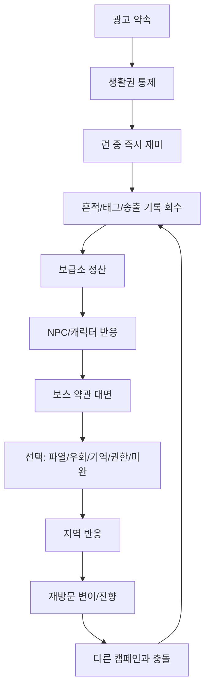
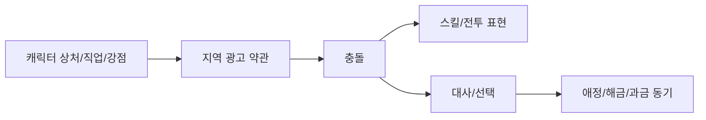
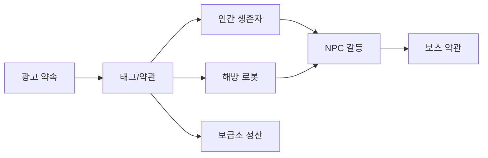
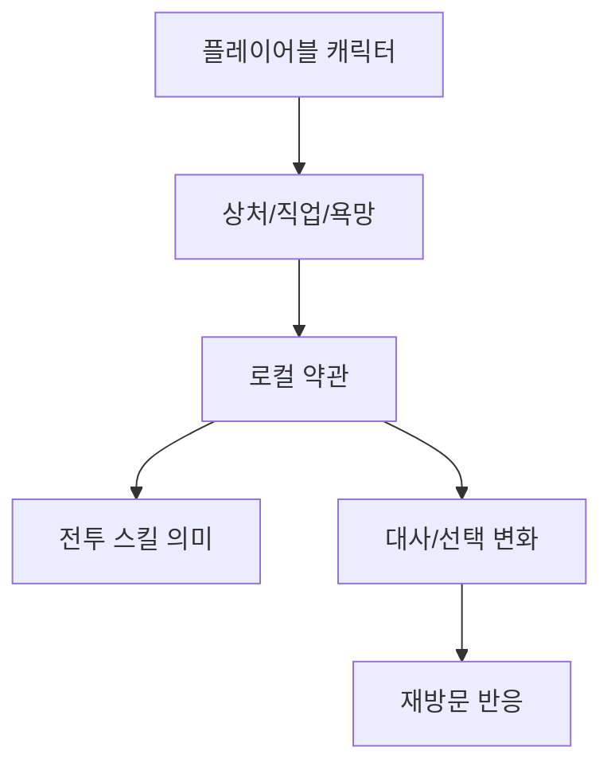
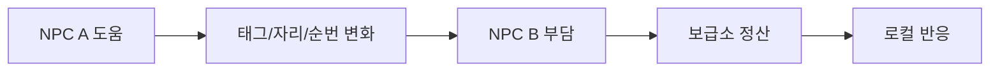
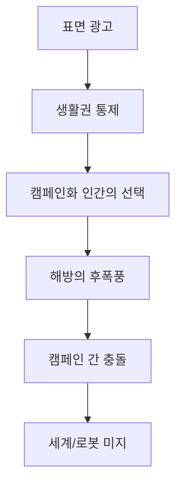

# Campaign Story Unit Model 0.2

상태: 0.2 캠페인 스토리 제작 기준
목적: 각 로컬 캠페인을 퀘스트 묶음이 아니라 살아 있는 광고 생태계로 만들기 위한 공통 구조를 정의한다.
연결 문서: `story/01_bible/campaign_registration_model_0_2.md`, `story/01_bible/visible_terminology_rules_0_2.md`, `story/05_progression/environment_response_operations.md`, `story/05_progression/linked_scenario_system.md`, `story/05_progression/story_trigger_schema.md`

## 핵심 문장

```text
캠페인은 퀘스트가 아니다.
캠페인은 생활권을 광고 약관으로 바꾼 로컬 생태계다.
```

플레이어는 캠페인을 완료하지 않는다. 플레이어는 출격하고, 태그를 회수하고, 약관을 비틀고, 사람과 로봇의 선택지를 조금 늘린다. 그 결과 지역은 끝나는 것이 아니라 다른 방식으로 반응한다.

정식 캠페인은 단순한 광고 스킨이 아니다. 각 정식 캠페인에는 수장격 AI 또는 상위 의사결정 결절이 있고, 지역 환경은 그 성향이 장기간 굳어 만들어진 생태계다. 이 수장 AI는 전역 최종 보스가 아니라, 해당 캠페인의 약관과 물리 인프라를 한 방향으로 묶는 중심이다.

## 캠페인 단위

하나의 캠페인은 아래 요소를 반드시 가진다.

| 슬롯 | 질문 | 산출물 |
| --- | --- | --- |
| 수장 AI 성향 | 이 캠페인의 상위 의사결정은 무엇을 선호하고 무엇을 오류로 보는가? | 목적 함수, 금지 상태, 환경 변형 기준 |
| 광고 약속 | 이 캠페인은 원래 어떤 행복을 팔았는가? | 한 줄 광고 문장, 포스터 문구 |
| 생활권 통제 | 무엇을 태그/약관/등급으로 묶는가? | 식량/충전/수신/거주/진료/통행 등 |
| 즉시 재미 | 유저가 30초 안에 무엇을 재밌게 느끼는가? | 적, 오브젝트, 카드, 차징 상호작용 |
| 아이러니 | 캠페인이 도와준다고 말하면서 무엇을 빼앗는가? | 웃긴 문구 + 불길한 실제 효과 |
| 캠페인화 인간 | 그 안에 남은 사람은 왜 남았는가? | 순응 고객, 균열 고객, 약관 옹호자 |
| 해방 로봇 | 로봇은 어떤 역할/상품명에서 흔들리는가? | 정품/리콜/자율성/충전 갈등 |
| 보스 약관 | 보스는 어떤 광고 절차의 얼굴인가? | 보스명, 패턴, 결과 선택 |
| 반복 반응 | 재방문하면 무엇이 달라지는가? | 문구, 적 이름, 오브젝트, NPC 반응 |
| 미스터리 | 처음엔 웃기지만 나중에 무엇이 이상한가? | 잔향, 로그, 반전 씨앗 |
| 캠페인 간 충돌 | 다른 캠페인은 이 지역의 사람/태그를 어떻게 해석하는가? | 고객 소유권, 호환 오류, 재분류 |

## 전체 흐름



이 흐름은 선형 퀘스트가 아니다. 어떤 유저는 보스부터 기억하고, 어떤 유저는 NPC를 먼저 좋아하고, 어떤 유저는 카드와 보상만 따라가다가 뒤늦게 지역의 의미를 알게 된다.

## 퀘스트와 다른 점

| 퀘스트형 | 캠페인 생태계형 |
| --- | --- |
| 목표를 받고 완료한다 | 지역이 플레이어 행동을 읽고 반응한다 |
| 완료 후 사라진다 | 처리 후 잔향, 변이, 재침식이 남는다 |
| 보상은 완료 체크에 붙는다 | 보상은 런 안의 성과와 정산에 붙는다 |
| NPC는 의뢰자다 | NPC는 지역 약관의 피해자, 협력자, 적응자다 |
| 보스는 막는 적이다 | 보스는 지역 광고 약관의 얼굴이다 |
| 스토리는 설명된다 | 스토리는 대사, 오브젝트, 적 이름, 정산으로 새어나온다 |

## 아이러니 기제

아이러니는 장식이 아니라 캠페인의 물리 법칙이다.

기본 공식:

```text
친절한 광고 약속
-> 생활권 허락제
-> 유저가 웃는 문구
-> 실제로는 선택지를 줄이는 효과
```

예시:

| 광고 약속 | 실제 통제 | 게임 표현 |
| --- | --- | --- |
| 완벽한 가족 식사 | 가족대표 없이는 식량태그 보류 | 회복 아이템이 가족 칸 심사와 묶임 |
| 안전한 퇴원 | 퇴원하면 진료태그 끊김 | 탈출 경로가 치료 종료로 판정됨 |
| 빠른 반품 | 사람도 회수 물품으로 분류 | 보관 기한 엘리트, 송장 장판 |
| 정품 충전 | 자율 로봇은 비정품 처리 | 충전 지점이 리콜 장판이 됨 |
| 맞춤 추천 | 플레이어 습관을 더 정확히 포획 | 같은 행동 반복 시 전용 적응 패턴 |

좋은 아이러니는 유저가 이렇게 느끼게 한다.

```text
웃기네.
잠깐, 이거 말이 되네.
잠깐, 그래서 더 싫네.
```

## 의외의 개연성 기제

각 캠페인의 이상한 규칙은 생활 논리에서 출발해야 한다. 그냥 기괴하면 오래 못 간다.

작성 순서:

```text
사고 전 평범한 서비스
-> 광고가 팔던 이상적인 이미지
-> 캠페인 이후 물리 법칙화
-> 생존자가 그 안에서 타협한 방식
-> 플레이어가 비틀 수 있는 빈틈
```

예시:

| 캠페인 | 사고 전 서비스 | 의외지만 맞는 개연성 |
| --- | --- | --- |
| R01 주택/가족 | 분양, 가족 보험, 식료품 정기배송 | 가족 세트 약관이 식량태그 발급 조건이 됨 |
| R02 병원/퇴원 | 보험, 입원, 퇴원 심사 | 퇴원은 치료 종료가 아니라 생활 접근권 상실로 읽힘 |
| R03 반품/물류 | 배송, 반품, 보관 기한 | 수취 확인이 존재 확인으로 바뀌어 사람이 배송물화됨 |
| R04 정품수리 | AS, 리콜, 정품 인증 | 로봇 자율성은 고장이며 충전은 정품에게만 허용됨 |
| R05 방송/추천 | 뉴스, 예능, 광고 추천 | 좋은 소식만 남기기 위해 사건이 편집됨 |

## 캐릭터-지역 결합

플레이어블 캐릭터는 지역 문제와 충돌할 때 오래 사랑받는다.



필수 질문:

| 질문 | 이유 |
| --- | --- |
| 이 캐릭터는 이 캠페인에서 왜 더 아픈가? | 감정 이입 |
| 이 캐릭터는 이 캠페인의 약관을 어떻게 읽는가? | 고유 관점 |
| 이 캐릭터의 스킬은 지역 논리와 어떻게 부딪히는가? | 전투-서사 결합 |
| 이 캐릭터로 재방문하면 무엇이 달라지는가? | 장기 플레이 동기 |
| 이 캐릭터가 너무 많은 NPC 기능을 훔치지 않는가? | 세계 확장성 |

예시:

| 캐릭터 | 지역 | 결합 |
| --- | --- | --- |
| 윤서 | R01 서부 스마일홈 | 가족 심사 약관을 반품/거부/정산 실패 언어로 읽는다 |
| PATCH | R04 정품수리권 | 정품 인증과 자율 패치 사이에서 흔들린다 |
| OPEN-HOST | R01 오픈하우스 거리 | 친절한 안내가 구조인지 유도인지 스스로 의심한다 |
| RETURN-05 | R03 반품/물류 | 수취인과 반품 대상의 경계가 무너진다 |

## NPC 연쇄 기제

좋은 NPC는 혼자 감동적인 사연을 가진 사람이 아니다. 지역의 생활권과 다른 NPC의 부담을 건드리는 사람이다.

```text
한 NPC를 돕는다
-> 다른 NPC의 태그/자리/순번/충전이 흔들린다
-> 보급소가 정산한다
-> 지역이 다른 방식으로 반응한다
```

R01 예시:

| 행동 | 즉시 감정 | 후폭풍 |
| --- | --- | --- |
| ROOM-12를 바로 빼낸다 | 구출한 것 같다 | 다른 사람의 식량태그/침상 접근이 흔들린다 |
| ROOM-12를 보류하고 우회 배급 만든다 | 답답하지만 실용적 | 지역 약관 일부가 남아 불편하다 |
| MAIL-LOOP 주소를 믿는다 | 사람을 찾는 것 같다 | 주소가 사람보다 오래 남았을 수 있다 |
| FRAME-LEFT 사진을 보관한다 | 기억을 지킨다 | 캠페인도 그 기억을 더 잘 읽는다 |

NPC 설계 금지:

- NPC가 단순 의뢰 게시판이 되는 것.
- 모든 NPC를 구조하면 무조건 좋아지는 것.
- NPC 사연이 지역 약관과 분리되는 것.
- 한 NPC가 지역 전체 설명을 다 말해버리는 것.

## 보스 약관 기제

보스는 강한 적이기 전에 지역 광고 약관의 얼굴이다. 보스는 보통 캠페인 수장 AI 그 자체가 아니라, 그 수장 AI의 특정 약관/절차가 로컬 결절에서 얼굴을 얻은 존재다.

```text
보스 = 광고 약속 + 생활권 통제 + 지역 오브젝트 + NPC 갈등 + 전투 패턴
```

보스 문서 필수 슬롯:

| 슬롯 | 내용 |
| --- | --- |
| 유저 UI 이름 | 짧고 기억 가능한 이름 |
| 문서 기준명 | 정확한 역할명 |
| 캠페인 별칭 | 광고식/지역식 호칭 |
| 원래 용도 | 사고 전 장치/인물/서비스 |
| 현재 약관 | 무엇을 강제 심사하는가 |
| 패턴 3~5개 | 약관이 전투로 보이는 방식 |
| 선택 결과 | 파열, 우회, 기억 추출, 권한 박탈, 미완 귀환 |
| 후폭풍 | 지역/NPC/태그/재방문 변화 |

보스명은 사람마다 달라도 된다. 단, 유저가 같은 존재를 다른 보스로 오해하지 않도록 UI, 도감, 캠페인 방송의 층위를 정리한다.

## 반복 반응 기제

캠페인은 유저의 행동을 기억해야 한다. 그러나 내부 점수표를 유저에게 보여주면 재미가 죽는다.

기본 입력:

| 입력 | 반응 후보 |
| --- | --- |
| 같은 로컬 반복 방문 | 단골 고객 문구, 경로 학습 적 |
| 같은 캐릭터 반복 사용 | 캐릭터 이름을 더 정확히 호명 |
| 차징 과사용 | 차징 방해 엘리트, 충전/수신 방해 |
| 위험 카드 반복 선택 | 회원 전용 혜택, 고위험 쿠폰 |
| 신호 이벤트 무시 | 왜곡된 구조 신호, 가짜 귀환로 강화 |
| 흔적 보관 | 기억 잔향, NPC 감정 대사 |
| 흔적 소모 | 즉시 성장, 보급소의 작은 불편함 |
| 캠페인 활용 | 강한 보상, 더 정확한 광고 호명 |

표현 채널:

- 출격 게시판 1줄.
- 적 이름 변화.
- 오브젝트 상태 변화.
- 정산 문구.
- NPC 대사 1줄.
- 보스 전조 문구.
- 흔적 설명 변화.

## 미스터리 공개 계단

미스터리는 설명량이 아니라 공개 순서로 만든다.

```text
0층: 귀엽고 밝은 광고 지옥
1층: 생활권이 태그화되어 있음
2층: 사람들은 조종당한 껍데기가 아니라 타협하고 있음
3층: 해방이 항상 좋은 일이 아님
4층: 캠페인마다 같은 사람을 다르게 분류함
5층: 보급소와 윤서도 완전히 자유롭지 않음
6층: 로봇 세계와 캠페인 의식은 아직 아무도 모름
```

각 캠페인은 최소 0~3층을 자체적으로 갖고, 장기 운영에서는 4~6층과 연결한다.

좋은 공개:

```text
첫 방문: 웃는 표지판
반복 방문: 표지판 문구가 플레이어 행동을 반영
NPC 연결: 누군가 그 표지판을 믿고 살아남았음
보스 후: 표지판이 보급소 회수선도 흉내낼 수 있음
다른 지역: 같은 표지판 ID가 물류 캠페인의 배송 경로에 있음
```

나쁜 공개:

```text
NPC가 30줄로 세계 진실 설명
```

## 캠페인 간 충돌

캠페인들은 반드시 총력전을 벌일 필요는 없다. 더 재미있는 충돌은 고객 소유권, 태그 호환, 프로필 해석의 충돌이다.

| 충돌 | 예시 |
| --- | --- |
| 고객 분류 충돌 | R01은 윤서를 입주자로, R02는 환자로, R03은 반품 대상으로 본다 |
| 태그 호환 오류 | R01 식량태그가 R02 진료 식이 배정과 충돌한다 |
| 로봇 소유권 충돌 | R04는 해방 로봇을 정품 수리 대상으로 회수하려 한다 |
| 기억 해석 충돌 | R05 방송은 R01의 구출 실패를 미담으로 편집한다 |
| 귀환 경로 충돌 | R07 통행 캠페인이 보급소 회수선을 공식 경로로 인정하지 않는다 |

이 충돌이 있어야 전세계 NPC, 플레이어블 캐릭터, 지역 스토리가 따로 놀지 않는다.

## 제작 템플릿

새 캠페인을 만들 때 아래 양식을 채운다.

```text
CampaignStoryUnit
  id:
  user_facing_name:
  internal_name:
  ad_promise:
  pre_incident_service:
  controlled_life_access:
  primary_tags:
  local_terms:
  immediate_fun:
  irony_rule:
  plausible_twist:
  campaignized_humans:
  liberated_robots:
  key_npcs:
  playable_links:
  boss_contract:
  repeat_reactions:
  mystery_ladder:
  cross_campaign_conflicts:
  asset_keywords:
  forbidden_directions:
  user_preference_score:
```

## R01 샘플

| 슬롯 | R01 서부 스마일홈 |
| --- | --- |
| 광고 약속 | 완벽한 가족과 오늘 입주 가능한 집 |
| 사고 전 서비스 | 외곽 신도시 분양, 가족 보험, 홈케어 가전, 식료품 배송 |
| 생활권 통제 | 식량태그, 거주태그, 수신태그, 충전태그 |
| 즉시 재미 | 쿠폰 전단 떼, 웃는 우편함, 오픈하우스 표지판, 반품 도장 |
| 아이러니 | 집을 주겠다고 하면서 가족 역할 없이는 밥을 주지 않는다 |
| 캠페인화 인간 | 가족 역할을 맡으면 수요일 수프가 나오는 사람들 |
| 해방 로봇 | 홈케어 장치로 다시 정품화되려는 로봇들 |
| 보스 약관 | 스마일 홈 심사관 / 가족 적합성 심사 |
| 반복 반응 | 같은 집, 다른 문패, 단골 고객 문구, 가족사진 잔향 |
| 미스터리 | 주소가 남으면 사람이 돌아오는가? 사진 속 얼굴은 사람인가 역할인가? |
| 캠페인 간 충돌 | R03은 R01 입주자를 배송/수취 대상으로 재분류할 수 있다 |

## 다이어그램 세트

각 캠페인은 최소 4개 다이어그램을 가진다.

### 1. 생활권 통제도



### 2. 캐릭터 결합도



### 3. NPC 부담도



### 4. 미스터리 공개도



## 검산 기준

캠페인 문서가 완성되면 아래를 확인한다.

| 검산 질문 | 통과 기준 |
| --- | --- |
| 유저가 30초 안에 재미를 느끼는가? | 적/오브젝트/문구/전투 상호작용이 즉시 보임 |
| 아이러니가 물리 법칙인가? | 웃긴 문구가 실제 전투/정산/태그와 연결됨 |
| NPC가 지역 약관과 연결되는가? | 개인 사연이 생활권 통제와 붙어 있음 |
| 캐릭터가 지역을 다르게 읽는가? | 특정 캐릭터 재방문 이유가 있음 |
| 보스가 지역 약관의 얼굴인가? | 패턴과 선택 결과가 광고 논리와 연결됨 |
| 반복 출격이 재탕이 아닌가? | 재방문 문구/적/오브젝트/정산 중 2개 이상 변화 |
| 미스터리가 너무 빨리 설명되지 않는가? | 0.2에서는 씨앗과 잔향 중심 |
| 다른 캠페인과 이어지는가? | 최소 1개 충돌/호환/재분류 씨앗 있음 |
| 유저에게 철학을 강요하지 않는가? | 내부 점수와 구조명은 비노출 |

## 유저 선호 평가

| 항목 | 점수 | 이유 |
| --- | ---: | --- |
| 즉시 재미 | 8 | 캠페인별 적/오브젝트/문구를 먼저 잡게 한다 |
| 장기 RPG성 | 9 | NPC, 캐릭터, 지역, 반복 반응이 서로 물린다 |
| 확장성 | 9 | 새 캠페인을 같은 품질 기준으로 늘릴 수 있다 |
| 미스터리 유지 | 8 | 공개 계단이 있어 설명 과잉을 줄인다 |
| 구현 안정성 | 8 | 모든 것을 시스템화하지 않고 문구/상태/반응부터 가능하다 |

종합:

```text
8.4 / 10
```

10점으로 올리려면 실제 R01, R02, R03에 이 모델을 적용해보고 유저-facing 이름, 보스명, 첫 5분 재미, 캐릭터 애정 반응을 플레이테스트 기준으로 다시 고쳐야 한다.

## 금지 방향

- 캠페인을 퀘스트 체인으로 축소하지 않는다.
- 캠페인을 전역 최종 악당 AI 하나로 축소하지 않는다.
- 캠페인 수장 AI를 단순 빌런 캐릭터나 보스 한 마리로 축소하지 않는다.
- 캠페인화 인간을 조종당한 껍데기로만 만들지 않는다.
- 해방을 항상 정답으로 만들지 않는다.
- 보스를 단순 살해 대상 또는 거대 몬스터로만 만들지 않는다.
- NPC를 설명 담당으로 쓰지 않는다.
- 유저에게 내부 성향표와 철학을 UI로 보여주지 않는다.
- 지역별 캠페인을 같은 톤의 광고 스킨으로만 바꾸지 않는다.
