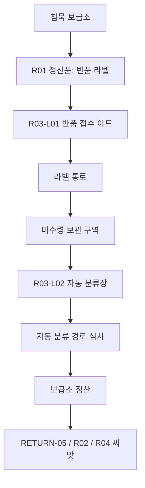
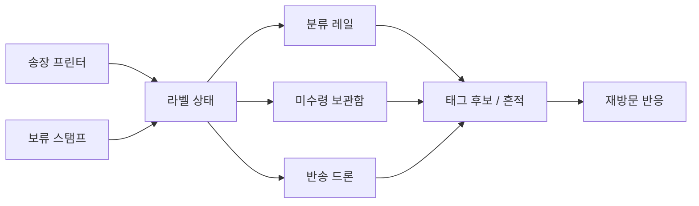
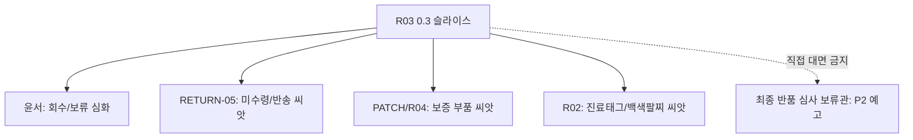

# R03 0.3 슬라이스 상세 v0.2

## 문서 상태

```text
상태:
초안 v0.2

판정:
R03-L01 반품 접수 야드와 R03-L02 자동 분류장을 0.3 주 슬라이스로 지정.
R03-L03 보증 심사 창고는 조건부 씨앗으로만 둔다.
R03-L04, R03-L05는 0.3에서 열지 않는다.

용도:
R03 0.3 후보 판정을 실제 지역, 런 오브젝트, 정산, 반복 출격, 캐릭터 씨앗 제작 기준으로 바꾼다.
```

기준 문서:

```text
story/05_progression/campaign_experience_atlas_0_2.md
story/05_progression/r02_r03_0_3_candidate_selection_0_2.md
docs/world/E01_P1_EXPANSION_DESIGN_V0_1.md
docs/world/E01_FIRST_SEASON_LOCAL_NODES_V0_1.md
docs/world/CHARACTER_UNLOCK_STRUCTURE_V0_1.md
story/03_regions/r03_final_return_review_officer_profile_v1_0.md
story/06_characters/yunseo_profile_v1_0.md
story/06_characters/return_recipient_profile_v1_0.md
```

---

## 0. 잠금 요약

R03 0.3의 목표는 "반품 회수 벨트 전체 공개"가 아니다.

목표:

```text
R01 이후 유저가 처음으로
지역 자체의 조작 감각, 정산 감각, 반복 반응이 달라진다는 것을 느끼게 한다.
```

0.3에서 잠글 것:

| 항목 | 판정 |
|---|---|
| 주 지역 | R03-L01 반품 접수 야드, R03-L02 자동 분류장 |
| 조건부 씨앗 | R03-L03 보증 심사 창고 입구 |
| 핵심 재미 | 라벨 부착, 분류 레일, 미수령 보관함, 반송 드론, 보류 스탬프 |
| 핵심 정산 | 보급태그 후보, 통행태그 후보, 목적지 누락 로그, 보류 도장 흔적 |
| 핵심 캐릭터 | 윤서 심화, RETURN-05 U1~U2 씨앗, PATCH/R04 보증 부품 씨앗 |
| 금지 | R03-L05 보스권 소모, RETURN-05 정식 U5 해금, 윤서 과거 설명 과다 |

R03은 속도 배송 밈 지역이 아니다.

```text
R03은 목적지 판정이 사람에게 붙어버린 지역이다.
```

---

## 1. 유저 경험 목표

### 1.1 첫 느낌

유저가 R03에 들어와서 3분 안에 느껴야 하는 것:

| 시간 | 체감 | 구현 장치 |
|---:|---|---|
| 0~30초 | R01과 다른 공간이다 | 컨테이너 야드, 라벨 안내음, 출고 게이트, 회수선 불안정 |
| 30~90초 | 상태가 붙으면 길이 바뀐다 | 송장 프린터 라벨 장판, 분류 레일 |
| 90~150초 | 보상은 그냥 열면 되는 상자가 아니다 | 미수령 보관함, 보관 기한, 보급태그 후보 |
| 150~180초 | 시스템을 역이용할 수 있다 | 반송 드론 유도, 보류 스탬프 |

유저에게 설명하지 말고 손으로 알게 한다.

권장 감각:

```text
라벨이 붙었다.
레일이 나를 다른 길로 밀었다.
보관함을 열었더니 보상이지만, 뭔가 따라왔다.
드론을 적에게 붙였더니 웃겼고, 다음 런에 들켰다.
```

### 1.2 R01과의 차이

| 기준 | R01 가족/주거 | R03 물류/반품 |
|---|---|---|
| 공간 감각 | 집, 문, 주소, 오픈하우스 | 야드, 컨테이너, 레일, 보관함 |
| 캠페인 등록 | 가족 구성원/입주자 | 수취인/미수령자/반송 대상 |
| 압박 방식 | 집이 이름과 가족 역할을 붙인다 | 경로와 목적지가 상태를 닫으려 한다 |
| 즉시 재미 | 생활 설비가 적처럼 작동 | 맵의 흐름이 적처럼 작동 |
| 반복 반응 | 귀환 패턴 학습, 가족심사 강화 | 배송 경로 학습, 보관 기한/압축 경고 강화 |
| 보상 감정 | 이름/집/가족 기준을 비튼다 | 목적지/보관/반송 판정을 비튼다 |

---

## 2. 해금과 범위

### 2.1 월드맵 해금

R03은 R01-L03 첫 보스 직후 즉시 모든 노드를 열지 않는다.

| 노드 | 최초 표시 | 실제 출격 조건 | 0.3 처리 |
|---|---|---|---|
| R03-L01 반품 접수 야드 | 해석 가능 | R01 정산품의 반품 라벨 또는 R01-L05 가짜 귀환로 단서 분석 | 출격 가능 |
| R03-L02 자동 분류장 | 숨김 -> 접근 계산 | R03-L01 완료 후 회수선 좌표 안정화 | 출격 가능 |
| R03-L03 보증 심사 창고 | 숨김 -> 접근 계산 | R03-L02에서 보증 스티커/부품 케이지 단서 회수 | 조건부 씨앗 |
| R03-L04 파쇄 전 대기라인 | 원격 경고 | 압축 경고선 누적 | 0.3 출격 불가 |
| R03-L05 최종 반품 심사실 | 표시 안 함 | P2 윤서 핵심 압박 | 0.3 출격 불가 |

### 2.2 R01 보스 선택 영향

R01-L03 처리 결과는 R03의 내용 자체를 영구 차단하지 않는다. 정보량과 위험도만 바꾼다.

| R01 결과 | R03 영향 | 유저 체감 |
|---|---|---|
| 결절 파괴 | R03-L01 좌표 해석이 느리다. 대신 첫 출격 압력이 낮다. | "단서는 적지만 덜 따라붙는다." |
| 기억 추출 | R03-L01 라벨 신호가 선명하다. 대신 R01-L05 가짜 귀환로와 연결된 오배송 흔적이 빨리 뜬다. | "빨리 찾았는데, 저쪽도 나를 빨리 찾았다." |
| 미완 귀환 | R03-L01은 신호 감지까지만. R01 재방문/보급소 분석이 먼저 필요하다. | "나갈 곳이 늘어난 게 아니라, 잡음이 늘었다." |

---

## 3. 지역 슬라이스 구조

### 3.1 권장 동선

```text
침묵 보급소
-> R03-L01 반품 접수 야드
-> 라벨 통로
-> 미수령 보관 구역
-> R03-L02 자동 분류장
-> 자동 분류 경로 심사
-> 보급소 정산
```

### 3.2 구역별 역할

| 구역 | 역할 | 핵심 오브젝트 | 첫 방문 목표 | 재방문 변화 |
|---|---|---|---|---|
| 야드 진입로 | R03 첫 인상 | 컨테이너, 접수 번호판, 끊긴 출고문 | 캠페인이 사람을 배송 상태로 읽는다는 감각 | 출고문 안내가 윤서의 이전 동선을 언급 |
| 반품 접수 야드 | 라벨 상태 학습 | 접수 키오스크, 송장 프린터, 보류 스탬프 | 라벨 부착과 보류를 배운다 | 같은 라벨을 자주 떼면 재부착 간격 단축 |
| 라벨 통로 | 상태와 경로 연결 | 라벨 장판, 방향 표식, 반송 안내판 | 라벨에 따라 이동 압박이 바뀜 | 캠페인이 자주 간 통로를 "정상 경로"로 고정 |
| 미수령 보관 구역 | 보상 선택 | 보관함, 보관 기한 표시, 이름 조각 | 열기/남기기 선택 | 남긴 보관함이 다음 런에 잔향으로 표시 |
| 자동 분류장 | 메인 전투 기믹 | 분류 레일, 색상 게이트, 반송 드론 | 레일과 드론을 역이용 | 드론이 유저의 악용 패턴을 기억 |
| 보증 창고 입구 | R04/PATCH 씨앗 | 보증 스티커, 부품 케이지, 정품 확인 로그 | 로봇 부품 거래 흔적 | 0.3에서는 출격 구역 확장 금지 |

### 3.3 공간 비율

| 구역 | 권장 비율 | 이유 |
|---|---:|---|
| 진입/접수 | 20% | 규칙을 안전하게 배운다. |
| 라벨 통로 | 20% | 상태 부착과 이동 압박을 빠르게 체감한다. |
| 보관 구역 | 20% | 보상 선택과 다음 런 잔향을 만든다. |
| 자동 분류장 | 30% | 0.3의 전투 핵심이다. |
| 보증 창고 입구 | 10% | R04 씨앗만 남긴다. |

---

## 4. 핵심 오브젝트 상세

### 4.1 송장 프린터

| 항목 | 기준 |
|---|---|
| 역할 | 라벨 상태를 붙이는 기본 장치 |
| 전조 | 바닥에 얇은 사각 송장 윤곽, 짧은 인쇄음 |
| 효과 | 윤서/적/오브젝트에 `미수령`, `반송 대기`, `경로 보정` 중 하나를 붙인다 |
| 플레이 재미 | 라벨을 피하거나, 적에게 붙이거나, 보류 스탬프로 멈춘다 |
| 정산 연결 | 라벨 상태를 비틀면 보급태그/통행태그 후보 보정 |
| 반복 반응 | 같은 라벨을 자주 무효화하면 재부착 프린터가 늘어난다 |

유저-facing 문구 후보:

```text
라벨이 붙었습니다.
경로가 다시 계산됩니다.
수취 확인이 보류되었습니다.
```

금지:

```text
라벨을 맞으면 죽습니다.
택배 폭탄.
배송 밈용 프린터.
```

### 4.2 자동 분류 레일

| 항목 | 기준 |
|---|---|
| 역할 | 맵 자체가 이동 방향과 전투 리듬을 바꾼다 |
| 전조 | 레일 방향 화살표, 낮은 모터음, 게이트 색상 |
| 효과 | 플레이어/적/드론의 이동속도 또는 방향을 구간별로 바꾼다 |
| 플레이 재미 | 레일 위에서 위험을 피하거나 적을 게이트 쪽으로 밀어 넣는다 |
| 정산 연결 | 우회 경로를 만들면 통행태그 후보 |
| 반복 반응 | 같은 레일 악용 시 다음 런에 역방향 구간 추가 |

레일은 답답한 길막이 아니라 리듬 변화여야 한다.

### 4.3 미수령 보관함

| 항목 | 기준 |
|---|---|
| 역할 | 보상과 다음 런 잔향을 동시에 가진 선택 오브젝트 |
| 상태 | 닫힘, 열림, 남김, 오염, 보류 |
| 열기 | 보급태그 후보, 통행태그 후보, 흔적 중 하나를 즉시 얻는다 |
| 남기기 | 다음 런에 이름 조각/목적지 누락 로그가 남는다 |
| 위험 | 많이 열면 미수령 알림 드론이 늘어난다 |
| 보급소 후폭풍 | 미나가 보관 기한과 실제 물자 부담을 언급 |

보관함은 "상자 보상"처럼 보이면 실패다.

권장 문구:

```text
보관함을 열었습니다. 안쪽 물자는 멀쩡하지만, 목적지 기록이 같이 깨어났습니다.
보관함을 남겼습니다. 다음 출격 때 같은 번호가 다시 잡힐 수 있습니다.
```

### 4.4 반송 드론

| 항목 | 기준 |
|---|---|
| 역할 | 표식 대상에게 돌진하는 유도형 위험 |
| 전조 | 스캔 선, 짧은 접수음, 라벨 번호 호출 |
| 효과 | 라벨이 붙은 대상에게 돌진해 위치 보정/반송 판정을 시도 |
| 플레이 재미 | 적에게 라벨을 붙인 뒤 드론을 유도한다 |
| 정산 연결 | 드론을 적에게 유도하면 보급태그 후보 또는 흔적 보정 |
| 반복 반응 | 악용이 누적되면 드론이 윤서의 표식을 먼저 검사 |

공격 표현:

```text
회수 예약
반송 확인
수취인 재확인
위치 보정
```

### 4.5 보류 스탬프

| 항목 | 기준 |
|---|---|
| 역할 | 윤서의 정체성과 직접 붙는 0.3 핵심 상호작용 |
| 효과 | 라벨 상태, 보관함 기한, 드론 대상 지정 중 하나를 짧게 멈춘다 |
| 사용감 | 만능 해제가 아니라 판단 지연 |
| 윤서 연결 | 윤서가 "끝내는 것"보다 "잘못 끝내지 않는 것"에 능하다는 체감 |
| 정산 연결 | 보류 사용이 많으면 흔적 보존은 오르지만 보관 압박도 오른다 |

금지:

```text
보류 스탬프를 만능 디스펠로 만들기.
윤서가 반품 전문가라고 자랑하는 대사.
보류가 항상 좋은 선택처럼 보이기.
```

### 4.6 압축 경고선

| 항목 | 기준 |
|---|---|
| 역할 | R03-L04 파쇄 전 대기라인 예고 |
| 0.3 범위 | 장판/방송/카운트다운 잔향만 사용 |
| 효과 | 일정 시간 뒤 위험 구역이 되지만, 즉시 실패로 연결하지 않는다 |
| 반복 반응 | 빠른 회수/보관함 대량 열기/보류 남발 시 더 빨리 등장 |
| 금지 | 0.3에서 실제 파쇄 라인 보스나 최종 판정을 열지 않는다 |

유저-facing 문구 후보:

```text
대기열이 압축 라인 쪽으로 밀립니다.
보관 기한이 줄었습니다. 아직 폐기는 아닙니다. 고객센터식 위로 고맙습니다.
```

---

## 5. 라벨 상태 모델

라벨은 태그가 아니다.

라벨은 R03 안에서 붙는 상태, 장판, 오브젝트 반응, 정산 사유다.

| 상태 | 의미 | 전투 효과 | 정산/서사 효과 |
|---|---|---|---|
| 미수령 | 아직 확인되지 않은 대상 | 드론 추적이 느리지만 보관함 반응 증가 | 흔적 보존 가능 |
| 반송 대기 | 되돌려야 할 대상으로 분류 | 반송 드론 우선 대상 | 통행태그 후보와 충돌 |
| 경로 보정 | 다른 레일/게이트로 보내려는 상태 | 레일 영향 증가 | 우회 성공 시 통행태그 후보 |
| 보류 | 판정을 잠시 닫지 않음 | 상태 변화 지연 | 흔적 보존, 보관 압박 증가 |
| 완료 임박 | 판정이 곧 닫힘 | 압축 경고선/게이트 압박 증가 | 보급태그 후보는 오르지만 흔적 손실 위험 |

내부 상태값은 디버그/설계용이다. 일반 UI에는 라벨명과 짧은 결과만 보여준다.

---

## 6. 런 구조

### 6.1 한 판 기본 흐름

| 단계 | 플레이 | 목표 |
|---:|---|---|
| 1 | 야드 진입 | R03의 시각/소리/라벨 문법을 체감 |
| 2 | 송장 프린터 회피/유도 | 라벨 상태를 적에게 붙여 보는 첫 성공 |
| 3 | 보관함 선택 | 즉시 보상과 다음 런 잔향 선택 |
| 4 | 자동 분류 레일 진입 | 이동 리듬 변화와 적 유도 |
| 5 | 반송 드론 압박 | 시스템을 역이용하거나 들키는 재미 |
| 6 | 자동 분류 경로 심사 | 0.3 미니 절차 처리 |
| 7 | 보급소 정산 | 보급태그/통행태그 후보와 흔적 후폭풍 |

### 6.2 첫 3회 출격 의도

| 출격 | 목표 | 새로 보여줄 것 | 끝나고 남는 것 |
|---:|---|---|---|
| 1 | R03-L01 진입 | 라벨 부착, 보관함 선택 | 반품 라벨 해석, 윤서 짧은 반응 |
| 2 | R03-L02 접근 | 레일, 반송 드론, 통행태그 후보 | 같은 경로 반복 시 캠페인 학습 |
| 3 | 자동 분류 경로 심사 | 라벨/레일/드론 복합전 | RETURN-05 씨앗, R03-L03 보증 흔적 |

3회 안에 보스권 NPC를 직접 만나지 않는다.

---

## 7. 자동 분류 경로 심사

0.3의 중간 이벤트는 최종 보스가 아니다.

명칭:

```text
자동 분류 경로 심사
```

역할:

| 항목 | 기준 |
|---|---|
| 기능 | R03-L02의 미니 절차/중간 체크포인트 |
| 얼굴 | 사람 보스가 아니라 분류 게이트, 드론, 스캐너, 방송의 조합 |
| 목표 | 최종 판정을 닫는 것이 아니라, 자동 분류장의 경로 판정을 한 번 비튼다 |
| 보상 | 보급태그/통행태그 후보, 목적지 누락 로그, 보류 도장 흔적 |
| 금지 | 코어 파편, 최종 반품 심사 보류관 직접 대면, R03-L05 보스전 |

### 7.1 단계

| 단계 | 패턴 | 유저 판단 |
|---:|---|---|
| 1 | 접수 번호 호출 | 라벨 장판을 피하거나 적에게 붙인다 |
| 2 | 레일 방향 전환 | 유리한 레일로 적/드론을 유도한다 |
| 3 | 미수령 보관함 개방 | 즉시 열지 남길지 선택한다 |
| 4 | 반송 드론 집중 검사 | 드론 표식을 보류하거나 적에게 넘긴다 |
| 5 | 경로 심사 결과 | 보류/반려/우회 중 하나의 결과 라인을 받는다 |

### 7.2 결과

| 결과 | 조건 | 효과 |
|---|---|---|
| 보류 성공 | 보류 스탬프를 적절히 사용하고 흔적을 보존 | 목적지 누락 로그 +1, 다음 런 보관 잔향 |
| 경로 우회 | 레일/드론 유도 성공 | 통행태그 후보, 자동 분류장 지름길 일부 열림 |
| 회수 정산 | 보관함을 열고 안정적으로 귀환 | 보급태그 후보, 보급소 물자 반응 |
| 심사 과열 | 라벨 상태를 오래 방치하거나 빠른 회수만 반복 | 압축 경고선 조기 등장, R03-L04 원격 경고 |

---

## 8. 정산 기준

R03의 정산은 보급태그와 통행태그를 중심으로 한다.

| 행동 | 후보 | 사유 문구 방향 |
|---|---|---|
| 미수령 보관함 회수 | 보급태그 후보 | 보관함 회수로 보급태그 후보가 올라왔습니다. |
| 분류 레일 우회 | 통행태그 후보 | 분류 경로 우회로 통행태그 후보가 생겼습니다. |
| 라벨을 적에게 유도 | 보급태그 후보 또는 흔적 | 반송 판정이 적 웨이브를 잘못 접수했습니다. 실수는 소중합니다. |
| 보류 스탬프 사용 | 흔적 보존 | 보류 도장이 목적지 누락 로그를 남겼습니다. |
| 보관함을 남김 | 다음 런 잔향 | 미수령 상태가 다음 출격까지 남습니다. 좋은 일인지는 아직 모릅니다. |
| 압축 경고선 안에서 버팀 | 고위험 보상 후보 | 압축 대기열 안에서 흔적을 회수했습니다. 고객센터라면 박수 효과음을 넣었을 겁니다. |

금지:

```text
보급태그를 돈처럼 단순 지급하기.
통행태그를 빠른 이동권처럼만 쓰기.
R03 전용 신규 태그 만들기.
라벨을 태그 자원으로 표시하기.
```

### 8.1 정산 화면 문구 샘플

```text
런 정산 기준: 반품 접수 야드 회수
확정 태그: 보급태그 1
태그 후보: 보급태그 2, 통행태그 1
후보 정산: 통행태그 후보 1장 보류, 보급태그 후보 2장 중 1장 승인
정산 사유: 미수령 보관함 회수
정산 사유: 분류 경로 우회
흔적: 목적지 누락 로그
주의: 같은 반송 드론 유도 방식이 다음 출격에서 재검사됩니다.
```

---

## 9. 반복 출격 반응

### 9.1 상태 레벨

| 레벨 | 조건 | 지역 변화 | 보급소 변화 |
|---:|---|---|---|
| L0 첫 진입 | R03-L01 첫 출격 | 라벨 장판과 보관함이 기본 상태 | 보급소가 "이건 물자가 아니라 목적지도 같이 왔다"고 반응 |
| L1 라벨 기억 | 같은 라벨 상태 반복 해제 | 송장 프린터 재부착 간격 단축 | 세븐이 라벨 패턴을 기록하지만 정답은 주지 않음 |
| L2 경로 학습 | 같은 레일/지름길 반복 | 일부 지름길 게이트가 정상 배송로로 고정 | 미나가 보급태그 후보보다 따라온 기록을 걱정 |
| L3 보관 잔향 | 보관함 남기기 반복 | 남긴 보관함 번호와 이름 조각이 재등장 | 복희가 이름과 주소를 따로 적어야 한다고 말함 |
| L4 압축 예고 | 빠른 회수/보류 남발/보관함 대량 개방 | 압축 경고선 조기 등장 | R03-L04 파쇄 전 대기라인 원격 경고 |

L4는 0.3에서 실제 출격 지역을 열지 않는다. 경고와 후속 티켓만 만든다.

### 9.2 반복 조건별 티켓화

| 티켓명 | 트리거 | 구현 단위 |
|---|---|---|
| R03-REVISIT-01 라벨 재부착 | 같은 라벨 3회 이상 해제 | 프린터 빈도/장판 위치 변화 |
| R03-REVISIT-02 경로 고정 | 같은 레일 우회 2회 이상 | 다음 런에 게이트 하나 잠김 또는 방향 변경 |
| R03-REVISIT-03 보관함 잔향 | 보관함 남김 2회 이상 | 같은 번호 보관함 재등장, 이름 조각 문구 |
| R03-REVISIT-04 드론 악용 기록 | 반송 드론으로 적 처리 5회 이상 | 드론 스캔 우선순위 변화 |
| R03-REVISIT-05 압축 예고 | 빠른 회수 또는 보류 남발 | 압축 경고선과 R03-L04 원격 방송 |

---

## 10. 캐릭터와 NPC 씨앗

### 10.1 윤서

윤서는 R03에서 설명자가 아니다.

윤서가 해야 할 일:

| 상황 | 윤서 반응 방향 |
|---|---|
| 첫 라벨 부착 | 짧게 질색한다. "붙이는 건 여전하네." 정도 |
| 보관함 선택 | 열기 전에 멈칫한다. 물자가 아니라 목적지도 따라올 수 있음을 안다 |
| 보류 스탬프 | 능숙하지만 자랑하지 않는다 |
| 드론 악용 | "저쪽 접수 실수, 우리 책임 아님. 아마." 같은 건조한 농담 |
| 목적지 누락 로그 | 과거 설명 없이 말수가 줄어든다 |

금지:

```text
윤서가 사고 전 반품 센터 숙련 직원이었다고 확정하기.
윤서가 R03 규칙을 전부 해설하기.
윤서가 반품 전문가라고 자랑하기.
윤서가 모든 선택의 정답을 말하기.
```

### 10.2 RETURN-05 / 한이루

0.3에서 이루는 정식 플레이어블이 아니다.

0.3 허용 범위:

| 단계 | 표현 | 목적 |
|---|---|---|
| U0 | 미수령 보관함의 이름 없는 수취인 기록 | 존재 암시 |
| U1 | 수취인 확인 실패 로그, 반송 스티커 잔향 | RETURN-05의 질문 제시 |
| U2 | "반송된다고 돌아가는 건 아니다" 계열 짧은 기록 | 윤서와 다른 관점 예고 |

금지:

```text
이루 직접 조작.
이루 정식 U5 해금.
이루가 윤서 회수 기능을 대체.
이루를 택배원, 도적, 스캐너 천재로 표시.
```

### 10.3 PATCH/R04 씨앗

R03-L03 보증 심사 창고 입구는 R04를 여는 근거만 준다.

허용:

| 씨앗 | 표현 |
|---|---|
| 보증 스티커 | 로봇 부품 케이지에 붙은 정품/보증 판정 흔적 |
| 부품 케이지 | 물류 상태와 로봇 자율성 문제가 겹치는 장면 |
| 짧은 로그 | "수리품인지 반품품인지 확인 불가" 수준 |

금지:

```text
PATCH를 수리 마스코트로 전면화.
R04 재동기화 코어를 R03에서 설명.
로봇 자율성 문제를 R03 보상 루프로 소비.
```

### 10.4 최종 반품 심사 보류관

0.3에서 직접 대면하지 않는다.

허용 표현:

| 표현 | 위치 |
|---|---|
| 서명 없는 심사 화면 | R03-L02 종료 후 |
| 보류 도장 흔적 | 보류 스탬프 튜토리얼 |
| 짧은 음성 잔향 | 자동 분류 경로 심사 결과 |
| 최종 심사실 잠긴 문 | 멀리 보이는 배경 또는 월드맵 원격 경고 |

금지:

```text
최종 반품 심사 보류관 보스전.
윤서 과거 설명자화.
이루 전투 기능 반복.
완료 판정을 정답처럼 보이게 만들기.
```

---

## 11. R02 보조 씨앗

R02는 0.3에서 전면 오픈하지 않는다.

R03 안에서 R02를 살짝 비추는 방식:

| 씨앗 | R03 위치 | 효과 |
|---|---|---|
| 진료태그 부족 로그 | 미수령 보관함 내부 기록 | 태그가 생활 접근권이라는 감각 강화 |
| 백색팔찌 포장물 | 보관 구역 | 가족/환자/수취인 분류 충돌 |
| HOLD-04 원격 번호 | 보급소 게시판 | 힐러가 아니라 퇴원 보류자 씨앗 |
| 처방 봉투 오배송 | 반품 접수 야드 | R02-L01 응급 접수 홀로 이어지는 단서 |

주의:

```text
R02 씨앗은 R03의 초점을 흐리면 안 된다.
R02는 0.3에서 "가야 할 다른 지역"처럼 보이면 충분하다.
```

---

## 12. UI/문구 은행

### 12.1 월드맵

| 상태 | 문구 |
|---|---|
| 신호 감지 | 라벨 없는 물류 신호가 잡힙니다. 좌표는 아직 출고 전입니다. |
| 해석 가능 | 반품 라벨을 분석하면 접수 야드 좌표를 좁힐 수 있습니다. |
| 접근 계산 | 회수선이 자동 분류장 방향을 잡았습니다. 레일이 계속 경로를 바꿉니다. |
| 출격 가능 | 반품 접수 야드로 출격할 수 있습니다. 수취인 확인은 권장하지 않습니다. |

### 12.2 출격 게시판

```text
반품 접수 야드의 라벨 신호를 확인한다.
미수령 보관함을 열거나 남긴다.
자동 분류장 레일을 우회한다.
반송 드론의 접수 실수를 유도한다.
```

### 12.3 오브젝트 반응

| 오브젝트 | 문구 |
|---|---|
| 송장 프린터 | 송장이 출력됩니다. 고객님의 목적지는 방금 바뀌었습니다. 축하할 일은 아닙니다. |
| 분류 레일 | 경로가 정상화됩니다. 정상이라는 말은 여기서 대체로 나쁜 소식입니다. |
| 보관함 | 미수령 보관함입니다. 열면 물자가 나오고, 안 열면 기록이 남습니다. 둘 다 귀찮습니다. |
| 반송 드론 | 반송 확인 중입니다. 누구를 돌려보내는지는 아직 모릅니다. |
| 보류 스탬프 | 판정을 보류합니다. 해결은 아니고, 망하는 시간을 조금 늦춥니다. |

### 12.4 보급소 반응

| 조건 | 반응 |
|---|---|
| 보관함 대량 회수 | 미나: "물자는 고맙지. 그런데 목적지 기록까지 같이 들어오면 창고가 좀 무서워져." |
| 보관함 남김 | 복희: "이름이랑 주소를 따로 적어둘게요. 같이 두면 자꾸 누가 따라와요." |
| 드론 악용 | 세븐: "시스템이 자기 실수를 기억하기 시작했어요. 음, 대단히 싫은 성장입니다." |
| 보증 부품 회수 | PATCH 관련 로그: "이 부품은 수리품인지 반품품인지 아직 결정되지 않았습니다." |
| R02 씨앗 | 보급소 게시판: "진료태그 부족으로 일부 처방 접근이 보류되었습니다." |

---

## 13. Mermaid 다이어그램

### 13.1 슬라이스 흐름



### 13.2 오브젝트 상호작용



### 13.3 캐릭터 씨앗



---

## 14. 제작 티켓 분해

| 우선 | 티켓 | 산출물 | 통과 기준 |
|---:|---|---|---|
| P0 | R03-L01 블록아웃 | 접수 야드, 라벨 통로, 보관 구역 | 첫 3분 안에 라벨/보관함 체감 |
| P0 | R03-L02 블록아웃 | 자동 분류장, 레일, 게이트 | 레일이 답답한 길막이 아니라 리듬 변화로 작동 |
| P0 | 송장 프린터 프로토타입 | 라벨 장판, 상태 부착, 전조 | 피할 수 있고 적에게 붙일 수 있음 |
| P0 | 분류 레일 프로토타입 | 이동 방향/속도 변화 | 모바일 화면에서 방향 전조가 명확 |
| P0 | 미수령 보관함 프로토타입 | 열기/남기기 선택 | 즉시 보상과 다음 런 잔향이 분리 |
| P0 | 반송 드론 프로토타입 | 표식 추적, 적 유도 | 적에게 유도하는 성공 감각 |
| P0 | 보류 스탬프 상호작용 | 상태 지연, 기한 지연 | 만능 해제가 아니라 판단 지연 |
| P1 | R03 정산 문구 은행 | 결과/보급소/게시판 문구 | 보급태그/통행태그/흔적 기준 통일 |
| P1 | 윤서 R03 반응 은행 | 전투/정산/재방문 대사 | 해설이 아니라 짧은 현장 판단 |
| P1 | RETURN-05 씨앗 티켓 | U0~U2 기록/잔향 | 윤서 기능 대체 없이 존재감 생성 |
| P1 | R02 보조 씨앗 패치 | 진료태그 로그/백색팔찌 오브젝트 | R02 전면 오픈 없이 후속 후보 체감 |
| P1 | QA 게이트 | 금지선 체크리스트 | 상자 스킨, 배송 밈, U5 선공개 방지 |

---

## 15. QA 게이트

| 게이트 | 통과 기준 | 실패 징후 |
|---|---|---|
| R01 차별 | 레일/라벨/보관함이 R01의 집/주소 감각과 다르게 느껴진다 | 주택가 스킨만 창고로 바꾼 느낌 |
| 즉시 재미 | 첫 3분 안에 라벨, 레일, 보관함 중 2개 이상 체감 | 설정 로그만 많고 조작이 없음 |
| 윤서 심화 | 윤서가 R03 규칙을 다르게 읽지만 해설하지 않는다 | 윤서가 과거를 줄줄 설명 |
| RETURN-05 씨앗 | 미수령/반송 관점이 보이나 정식 해금은 아님 | 이루가 윤서 회수 기능을 대체 |
| 태그 정산 | 보급태그/통행태그 후보가 자연스럽다 | 라벨을 신규 자원처럼 사용 |
| 반복 반응 | 같은 루트/보관함/드론 악용이 다음 런에 남는다 | 한 번 보면 끝나는 창고 스테이지 |
| 톤 | 광고 시스템과 약관 말투가 웃기고 사람은 조롱하지 않는다 | 배송 노동자/피해자/생존자 조롱 |
| 범위 | R03-L05 보스권이 소비되지 않는다 | 최종 반품 심사 보류관이 0.3 보스로 등장 |

금지어 검산:

```text
유저-facing 자원명은 보급태그, 통행태그, 수신태그 등 기준 태그만 사용한다.
라벨, 송장, 보류 도장, 보관함은 태그가 아니라 상태/오브젝트/흔적이다.
```

---

## 16. 최종 잠금

```text
R03 0.3은 R03 전체가 아니다.
R03 0.3은 "목적지 판정이 전투와 정산을 바꾸는 첫 외부 슬라이스"다.

열 것:
R03-L01 반품 접수 야드
R03-L02 자동 분류장

씨앗만 둘 것:
R03-L03 보증 심사 창고 입구
RETURN-05 U0~U2
R02 진료태그/백색팔찌
R04 보증 부품

열지 말 것:
R03-L04 파쇄 전 대기라인
R03-L05 최종 반품 심사실
RETURN-05 정식 U5
최종 반품 심사 보류관 직접 대면
```

추천 다음 작업:

```text
1. R03 런 오브젝트 6종 프로토타입 티켓 작성
2. 윤서 R03 반응/정산 문구 은행 작성
3. RETURN-05 U0~U2 씨앗 티켓 작성
4. R02 보조 씨앗 패치 작성
```
