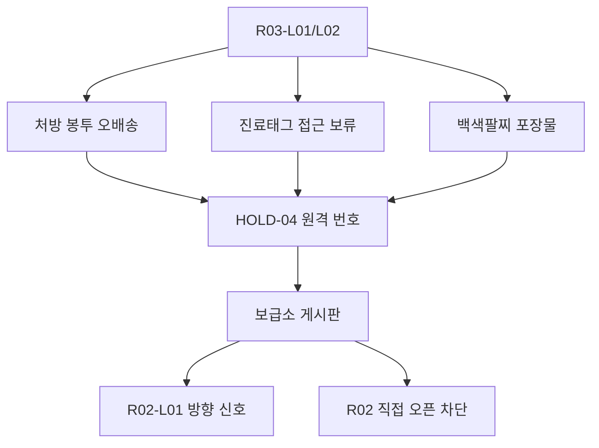
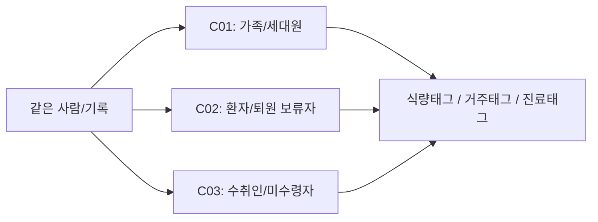

# R03 안의 R02 보조 씨앗 패치 v0.2

## 문서 상태

```text
상태:
초안 v0.2

판정:
R03 0.3 슬라이스 안에 R02 의료/보험 보조 씨앗을 낮은 강도로 심는다.

용도:
R03 물류/반품 경험을 흐리지 않으면서, R02 백색팔찌 격리권과 HOLD-04의 필요성을 다음 후보로 예고한다.

범위:
R03-L01 반품 접수 야드
R03-L02 자동 분류장
보급소 정산/게시판

금지:
R02 지역 직접 오픈
R02-L04/R02-L05 선공개
HOLD-04 정식 해금
힐러 예고
의료 캠페인 악역화
```

기준 문서:

```text
story/05_progression/r03_0_3_slice_detail_0_2.md
story/05_progression/r01_c02_conflict_ticket_0_2.md
story/05_progression/campaign_experience_atlas_0_2.md
story/06_characters/discharge_hold_patient_profile_v1_0.md
story/03_regions/r02_discharge_review_face_profile_v1_0.md
docs/world/CHARACTER_UNLOCK_STRUCTURE_V0_1.md
docs/world/E01_FIRST_SEASON_LOCAL_NODES_V0_1.md
```

---

## 0. 핵심 잠금

R03 안의 R02 씨앗은 새 지역 오픈 알림이 아니다.

0.3에서 유저가 느낄 것은 아래 정도다.

```text
물류/반품 캠페인은 약품, 팔찌, 처방 기록도 배송 상태로 처리한다.
그 기록은 R02에서 "환자인가, 퇴원 보류자인가"라는 문제로 이어진다.
```

R03의 중심 질문은 계속 목적지/수취/반송이다.
R02 씨앗은 그 목적지 기록 안에 진료태그와 환자 번호가 끼어드는 작은 이물감이어야 한다.

좋은 체감:

- 보관함에서 물자와 함께 처방 기록이 나온다.
- 진료태그 부족 로그가 보급소 정산 부담으로 남는다.
- 백색팔찌는 공포 소품이 아니라 환자 등록 흔적이다.
- HOLD-04는 힐러가 아니라 퇴원 보류자라는 질문으로만 남는다.

나쁜 체감:

- R03이 갑자기 병원 스테이지처럼 보인다.
- 하람이 바로 합류하거나 치료 역할로 보인다.
- 의료 캠페인이 악한 병원으로 단순화된다.
- 진료태그가 돈이나 회복 아이템처럼 보인다.

---

## 1. 단계 정의

| 단계 | 내부 이름 | 유저 노출 | 핵심 체감 | 열리는 것 |
|---|---|---|---|---|
| S0 | 의료 흔적 | 오브젝트 로그 | 약품/팔찌 기록이 배송 상태로 섞여 있다 | 없음 |
| S1 | R02 신호 | 보급소 게시판 | 진료태그 조건이 보급소 정산에 부담을 만든다 | R02 방향 신호 |
| S2 | HOLD-04 씨앗 | 원격 번호/짧은 로그 | 퇴원은 해방이 아니라 접근 종료일 수 있다 | 후속 검토 |

0.3 최대 노출:

```text
R02는 "가야 할 다른 지역"처럼 보이면 충분하다.
하람은 "치료해 줄 사람"이 아니라 "퇴원 판정을 보류하는 사람"으로만 남긴다.
```

---

## 2. 요약표

| 티켓 ID | 이름 | 위치 | 트리거 | 출력 | 핵심 금지 |
|---|---|---|---|---|---|
| R03-R02-SEED-01 | 처방 봉투 오배송 | 반품 접수 야드 | 송장 프린터/보관함 조사 | R02-L01 방향 단서 | 병원 구역 오픈 |
| R03-R02-SEED-02 | 진료태그 부족 로그 | 미수령 보관함 | 보관함 열기/남기기 | 진료 접근 보류 기록 | 진료태그 보상화 |
| R03-R02-SEED-03 | 백색팔찌 포장물 | 보관 구역 | 흔적 보존 중간 이상 | 환자/수취인 분류 충돌 | 공포 소품화 |
| R03-R02-SEED-04 | HOLD-04 원격 번호 | 보급소 게시판 | R02 씨앗 2개 이상 | 퇴원 보류자 질문 | 힐러 예고 |
| R03-R02-SEED-05 | 퇴원 보류 번호표 | 자동 분류장 결과 | 경로 심사 보류 성공 | 퇴원/배송 완료 충돌 | R02-L05 선공개 |

---

## 3. 공통 상태값 초안

### 3.1 내부 플래그

| 플래그 | 타입 | 의미 | 초기값 |
|---|---|---|---|
| `r03_r02_seed_stage` | int | 0~2 보조 씨앗 단계 | 0 |
| `r03_r02_prescription_misroute_seen` | bool | 처방 봉투 오배송 확인 | false |
| `r03_r02_treatment_tag_hold_seen` | bool | 진료태그 접근 보류 로그 확인 | false |
| `r03_r02_white_bracelet_seen` | bool | 백색팔찌 포장물 확인 | false |
| `r03_r02_hold04_remote_number_seen` | bool | HOLD-04 원격 번호 확인 | false |
| `r03_r02_discharge_ticket_seen` | bool | 퇴원 보류 번호표 확인 | false |
| `r03_r02_outpost_reviewed` | bool | 보급소 후폭풍 확인 | false |

### 3.2 이벤트 키

| 이벤트 | 발생 조건 | 사용처 |
|---|---|---|
| `r03_r02_trace_found` | R02 계열 흔적 1개 확인 | 정산 후보 |
| `r03_r02_signal_opened` | R02 계열 흔적 2개 이상 | 보급소 게시판 |
| `r03_r02_hold04_seed_seen` | HOLD-04 원격 번호 확인 | 하람 후속 후보 |
| `r03_r02_medical_delivery_conflict` | 처방/팔찌가 배송 상태와 충돌 | R02 진입 단서 |
| `r03_r02_overexposure_blocked` | R02 직접 오픈 요청 차단 | 범위 보호 |

### 3.3 정산 슬롯 후보

| 슬롯 | 설명 | 노출 |
|---|---|---|
| `misrouted_prescription_envelope` | 처방 봉투 오배송 | S0/S1 |
| `treatment_tag_hold_log` | 진료태그 접근 보류 로그 | S0/S1 |
| `white_bracelet_package_record` | 백색팔찌 포장물 기록 | S1 |
| `hold04_remote_number` | 퇴원 보류자 원격 번호 | S2 |
| `discharge_hold_ticket` | 퇴원 보류 번호표 | S2 |

주의:

```text
위 슬롯은 태그 자원이 아니다.
진료태그는 치료, 약품, 병상 접근 조건으로만 다룬다.
```

---

## 4. R03-R02-SEED-01 처방 봉투 오배송

### 4.1 티켓

```text
ticket_id:
R03-R02-SEED-01

name:
처방 봉투 오배송

priority:
P0

goal:
R03의 배송 상태 판정 안에 R02 처방/진료 접근 문제가 섞여 있음을 낮은 강도로 보여준다.
```

### 4.2 위치와 트리거

| 위치 | 트리거 | 출력 |
|---|---|---|
| R03-L01 반품 접수 야드 | 송장 프린터 조사 | 처방 봉투 송장 오류 |
| 미수령 보관함 | 보관함 열기 | 처방 봉투 일부 회수 |
| 미수령 보관함 | 보관함 남기기 | 처방 접근 보류 로그 보존 |
| 보급소 정산 | 해당 흔적 보관 | R02 방향 신호 약화/강화 |

### 4.3 문구 후보

| 채널 | 문구 |
|---|---|
| 송장 | `처방 봉투: 수취인 불일치` |
| 보관함 | `처방 봉투가 배송 상태로 보관되어 있습니다.` |
| 정산 | `처방 봉투 오배송 기록을 보관했습니다.` |
| 윤서 | `약도 목적지를 잃으면 위험해.` |
| 세븐 | `처방 기록이 배송 실패표로 분류되었습니다. 이건 분류가 아니라 사고입니다.` |

금지:

```text
처방 봉투를 회복 아이템처럼 즉시 소비한다.
처방 봉투가 R02-L01을 즉시 연다.
```

---

## 5. R03-R02-SEED-02 진료태그 부족 로그

### 5.1 티켓

```text
ticket_id:
R03-R02-SEED-02

name:
진료태그 부족 로그

priority:
P0

goal:
태그가 생활 접근권이라는 감각을 강화하고, 의료/보험권의 접근 조건을 짧게 예고한다.
```

### 5.2 위치와 트리거

| 위치 | 트리거 | 출력 |
|---|---|---|
| 미수령 보관함 내부 | 보관함 조사 | 진료태그 접근 보류 로그 |
| 보급소 정산 | 보관함 회수 | 진료 접근 조건 미확정 |
| 보급소 게시판 | R02 흔적 2개 이상 | R02 신호 열림 |

### 5.3 문구 후보

| 채널 | 문구 |
|---|---|
| 보관함 로그 | `진료태그 조건 미확정. 처방 접근이 보류되었습니다.` |
| 정산 | `진료태그 접근 보류 기록이 남았습니다.` |
| 게시판 | `진료태그 조건이 배송 기록과 충돌합니다.` |
| 미나 | `약품 기록은 들어왔는데, 접근 조건이 같이 따라왔어. 정산표가 또 얌전하지 않네.` |
| 윤서 | `치료도 접수표가 없으면 길을 잃네.` |

금지:

```text
진료태그를 골드, 포인트, 회복 아이템처럼 말한다.
진료태그가 부족하면 사람 가치가 낮아지는 식으로 표현한다.
```

---

## 6. R03-R02-SEED-03 백색팔찌 포장물

### 6.1 티켓

```text
ticket_id:
R03-R02-SEED-03

name:
백색팔찌 포장물

priority:
P1

goal:
가족/환자/수취인 분류가 같은 사람에게 겹칠 수 있음을 시각적 흔적으로 보여준다.
```

### 6.2 위치와 트리거

| 위치 | 트리거 | 출력 |
|---|---|---|
| R03-L01 보관 구역 | 흔적 보존 중간 이상 | 백색팔찌 포장물 |
| R03-L02 자동 분류장 | 경로 심사 보류 성공 | 팔찌가 배송 라벨과 분리됨 |
| 보급소 정산 | 팔찌 포장물 보관 | R01-C02 충돌 재점화 |

### 6.3 문구 후보

| 채널 | 문구 |
|---|---|
| 오브젝트 | `백색팔찌가 처방 봉투가 아니라 배송 봉투에 들어 있습니다.` |
| 정산 | `환자 팔찌 동봉 기록을 보관했습니다.` |
| 윤서 | `이건 배송물이 아니라 사람 쪽 기록이야.` |
| 복희 | `팔찌 옆에 이름을 적어도 돼요? 아니면 번호만요?` |
| 세븐 | `환자 기록과 배송 기록이 같은 줄에 있습니다. 줄바꿈이 필요합니다.` |

금지:

```text
백색팔찌를 감염/공포 소품으로 소비한다.
팔찌를 장비 아이템처럼 착용시킨다.
```

---

## 7. R03-R02-SEED-04 HOLD-04 원격 번호

### 7.1 티켓

```text
ticket_id:
R03-R02-SEED-04

name:
HOLD-04 원격 번호

priority:
P1

goal:
하람을 힐러가 아니라 퇴원 보류자로 예고한다.
```

### 7.2 발동 조건

권장 조건:

```text
r03_r02_prescription_misroute_seen == true
and
r03_r02_treatment_tag_hold_seen == true
```

대체 조건:

```text
백색팔찌 포장물 보관
and
R03-L02 자동 분류 경로 심사 보류 성공
```

### 7.3 표현

| 채널 | 표현 |
|---|---|
| 보급소 게시판 | `퇴원 보류 번호 수신` |
| 세븐 분석 | `HOLD 계열 원격 번호` |
| 윤서 반응 | `나가는 문이 닫힌 건지, 나가면 무너지는 건지 봐야 해.` |
| 미나 반응 | `사람 하나가 아니라 병상, 약품, 보급 칸이 같이 움직여.` |

금지:

```text
하람 이름 공개 필수화.
HOLD-04 캐릭터 아이콘 표시.
힐러, 치료, 회복 역할 예고.
```

---

## 8. R03-R02-SEED-05 퇴원 보류 번호표

### 8.1 티켓

```text
ticket_id:
R03-R02-SEED-05

name:
퇴원 보류 번호표

priority:
P1

goal:
배송 완료와 퇴원 완료가 모두 위험한 완료 판정일 수 있음을 연결한다.
```

### 8.2 위치와 트리거

| 위치 | 트리거 | 출력 |
|---|---|---|
| R03-L02 자동 분류 경로 심사 | 보류 성공 | 퇴원 보류 번호표 |
| 정산 화면 | 보류 결과 | 진료 조건 미확정 문구 |
| 보급소 게시판 | R02 신호 S2 | R02-L01 방향 후보 |

### 8.3 문구 후보

| 채널 | 문구 |
|---|---|
| 경로 심사 결과 | `퇴원 보류 번호표가 배송 실패표에 끼어 있습니다.` |
| 정산 | `퇴원 보류 번호표를 분리 보관했습니다.` |
| 게시판 | `응급 접수 홀 방향의 낮은 신호가 잡힙니다.` |
| 세븐 | `퇴원과 반송이 같은 완료 칸에 들어가 있었습니다. 아주 불친절한 표입니다.` |
| 윤서 | `완료라는 말이 여기저기서 너무 부지런하네.` |

금지:

```text
R02-L05 퇴원 불가 병동을 직접 예고한다.
퇴원 승인을 정답처럼 보이게 한다.
```

---

## 9. R03 정산 연결

### 9.1 정산 문구

| 조건 | 정산 UI |
|---|---|
| 처방 봉투 회수 | `처방 봉투 오배송 기록을 보관했습니다.` |
| 진료태그 로그 확인 | `진료태그 접근 보류 기록이 남았습니다.` |
| 백색팔찌 포장물 보관 | `환자 팔찌 동봉 기록을 분리했습니다.` |
| HOLD-04 원격 번호 | `퇴원 보류 번호가 보급소 게시판에 남았습니다.` |
| 퇴원 보류 번호표 | `퇴원 보류 번호표를 배송 실패표에서 분리했습니다.` |

### 9.2 태그 영향

| 행동 | 태그/흔적 영향 | 주의 |
|---|---|---|
| 처방 봉투 회수 | 흔적 + R02 신호 | 약품 보상 아님 |
| 진료태그 로그 보관 | 진료태그 조건 힌트 | 즉시 진료태그 지급 아님 |
| 팔찌 포장물 분리 | 흔적 보존 | 공포 연출 아님 |
| HOLD-04 번호 보관 | R02 게시판 신호 | 해금 아님 |
| 번호표 분리 | R02-L01 접근 후보 | R02 전체 오픈 아님 |

---

## 10. 보급소 후폭풍

| 캐릭터 | 조건 | 반응 |
|---|---|---|
| 윤서 | 처방 봉투 | `약도 목적지를 잃으면 위험해.` |
| 윤서 | 퇴원 보류 번호표 | `나가는 문이랑 나가도 된다는 판정은 다르지.` |
| 미나 | 진료태그 로그 | `먹는 것만 계산해도 빡빡한데, 치료 접근까지 표로 오네.` |
| 세븐 | 백색팔찌 | `환자 번호와 배송 번호가 같은 줄에 있습니다. 줄바꿈 권장입니다.` |
| 복희 | 팔찌/이름 | `이름이랑 환자 번호는 따로 적을게요.` |

---

## 11. R01-C02 충돌과 연결

R03의 R02 씨앗은 R01-C02 충돌을 다시 열 수 있다.

연결 기준:

| R01 흔적 | R03 씨앗 | 후속 질문 |
|---|---|---|
| 흰 팔찌 조각 | 백색팔찌 포장물 | 가족 구성원인가, 장기 환자인가? |
| 병원식 배급 라벨 | 진료태그 부족 로그 | 식량태그와 진료태그 중 무엇을 먼저 보류할 것인가? |
| 처방 보류 스티커 | 처방 봉투 오배송 | 처방은 집으로 가야 하는가, 병동으로 돌아가야 하는가? |
| 세대원 등록 보류 | 퇴원 보류 번호표 | 나가는 일과 살아남는 일이 같은가? |

주의:

```text
R01에서 가족으로 보였던 사람이 R02에서 환자로 보일 수 있다.
하지만 R03은 이 충돌을 해결하지 않는다.
R03은 "같은 기록이 서로 다른 캠페인으로 배송된다"는 사실만 보여준다.
```

---

## 12. HOLD-04 보호 기준

| 위험 | 보호선 |
|---|---|
| 하람이 힐러로 보임 | 치료/회복 대사 금지. 퇴원 보류/심사 보류 문법만 사용 |
| 하람 해금이 R03에서 열림 | U 단계 언급 금지. 원격 번호/게시판 신호까지만 |
| 하람 과거를 R03에서 설명 | 금지. R02-L01~L03 초반 결절로 넘김 |
| R02 NPC 기능 침범 | 퇴원 불가 심사 대리 얼굴은 R02-L05에서만 직접 대면 |
| 진료태그 보상화 | 진료태그는 치료 접근 조건이며 돈/포인트가 아님 |

좋은 문장:

```text
퇴원은 문이 열리는 말이 아니라, 접근이 끝나는 말일 수 있다.
```

나쁜 문장:

```text
HOLD-04가 치료해 줄 수 있습니다.
새 힐러 후보를 발견했습니다.
퇴원하면 문제가 해결됩니다.
```

---

## 13. Mermaid 다이어그램

### 13.1 R03 안의 R02 씨앗 흐름



### 13.2 분류 충돌



---

## 14. 구현 우선순위

| 우선순위 | 작업 | 통과 기준 |
|---|---|---|
| P0 | 처방 봉투 오배송 문구 3종 | 송장/보관함/정산에 각각 표시 |
| P0 | 진료태그 부족 로그 | 진료태그가 자원이 아니라 접근 조건으로 읽힘 |
| P1 | 백색팔찌 포장물 | 환자 번호와 배송 번호 분리 |
| P1 | HOLD-04 원격 번호 | 힐러 예고 없이 퇴원 보류 질문만 남김 |
| P1 | 퇴원 보류 번호표 | 자동 분류 경로 심사 결과와 연결 |
| P1 | 보급소 후폭풍 | 윤서/미나/세븐/복희 반응 분기 |

---

## 15. QA 체크리스트

| 체크 | 통과 기준 |
|---|---|
| R03 초점 유지 | R03의 중심은 라벨/레일/보관함/반송 드론이다 |
| R02 전면 오픈 금지 | R02-L01 방향 신호까지만 허용 |
| R02-L04/L05 금지 | 격리문 복도/퇴원 불가 병동 직접 언급 과다 금지 |
| HOLD-04 보호 | 하람은 힐러가 아니라 퇴원 보류자 씨앗으로만 남는다 |
| 진료태그 기준 | 진료태그는 치료/약품/병상 접근 조건이다 |
| 의료 악역화 금지 | R02는 사람을 살려 두려 하지만 환자 역할로 보존한다 |
| 사람 존중 | 환자/생존자/의료 노동자를 조롱하지 않는다 |
| 정산 부담 | 씨앗은 보상보다 보급소 부담과 후속 질문을 남긴다 |

---

## 16. 최종 잠금

R03 안의 R02 씨앗은 아래 5개만 우선 사용한다.

```text
처방 봉투 오배송.
진료태그 부족 로그.
백색팔찌 포장물.
HOLD-04 원격 번호.
퇴원 보류 번호표.
```

0.3에서 열지 않는 것:

```text
R02 직접 출격.
HOLD-04 정식 해금.
하람 본격 조우.
의료 보스권.
R02-L04/R02-L05.
치료/회복 중심 플레이.
```

성공 기준:

```text
유저가 R03을 하다가 "이 기록은 병원 쪽으로 이어지겠네"라고 느낀다.
하지만 지금 손으로 하는 재미는 여전히 라벨, 레일, 보관함, 반송 드론이어야 한다.
```

추천 다음 작업:

```text
1. R03 정산 UI 샘플을 Godot UI compaction probe 문구 후보로 이식
2. R03 오브젝트 QA 체크를 문서/스크립트 검산에 연결
3. 스토리 PMO 인수인계 프롬프트 작성
```
