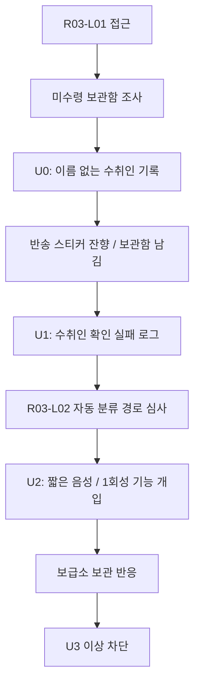
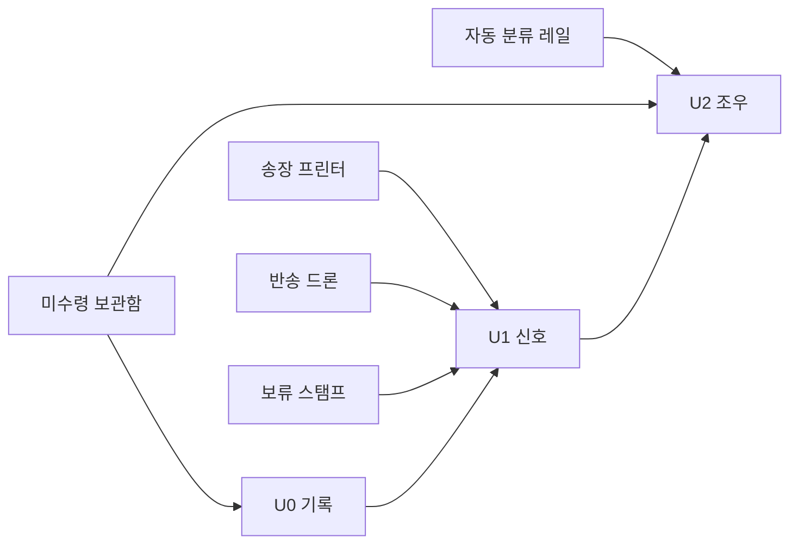
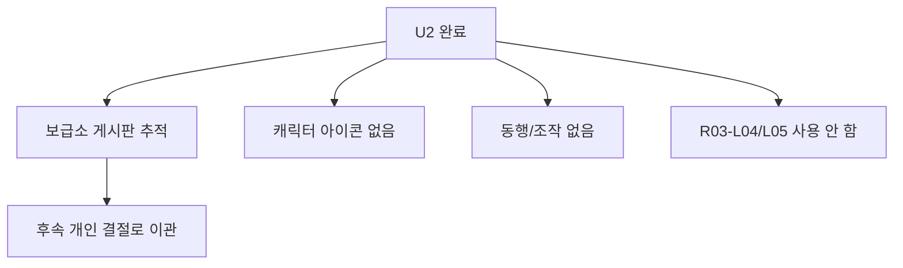

# R03 RETURN-05 U0~U2 씨앗 티켓 v0.2

## 문서 상태

```text
상태:
초안 v0.2

판정:
R03 0.3 슬라이스에서 한이루 / RETURN-05 / 이루, 반송 수취인의 U0~U2 씨앗만 구현한다.

용도:
R03-L01 반품 접수 야드와 R03-L02 자동 분류장 안에서 RETURN-05의 존재감을 흔적, 신호, 짧은 조우로 나누어 제작 티켓화한다.

범위:
U0 미감지
U1 신호 해금
U2 조우

금지:
U3 거점 협력
U4 동행/임무
U5 정식 플레이어블
R03-L03 본격 진입
R03-L04/R03-L05 선공개
윤서 회수 기능 대체
```

기준 문서:

```text
story/05_progression/r03_0_3_slice_detail_0_2.md
story/05_progression/r03_run_object_prototype_tickets_0_2.md
story/05_progression/r03_yunseo_reaction_settlement_phrase_bank_0_2.md
story/06_characters/return_recipient_profile_v1_0.md
story/06_characters/return_recipient_playable_condition_patch_v0_1.md
docs/world/CHARACTER_UNLOCK_STRUCTURE_V0_1.md
```

---

## 0. 핵심 잠금

RETURN-05 씨앗은 R03의 결론이 아니다.

0.3에서 유저가 느껴야 하는 것은 아래 하나다.

```text
R03에는 물건이 아니라 사람도 "도착하지 못한 상태"로 보관되는 절차가 있다.
그 상태를 자기 생존 기술로 쓰기 시작한 누군가가 있다.
```

유저에게 처음부터 "한이루가 다음 플레이어블입니다"라고 말하지 않는다.

대신 아래 순서로 체감시킨다.

1. 이름 없는 수취인 기록이 있다.
2. 같은 기록이 여러 오브젝트에서 반복된다.
3. 기록의 주체가 아직 닫히지 않은 사람처럼 반응한다.
4. 짧은 목소리나 기능 개입이 남는다.
5. 정식 합류는 아직 아니다.

조롱 대상은 자동 분류 시스템, 고객센터식 안내, 완료 처리를 좋아하는 약관 말투다.
사람, 생존자, 배송 노동자, 환자, 로봇을 농담거리로 만들지 않는다.

---

## 1. 단계 정의

| 단계 | 내부 이름 | 유저 노출 | 핵심 체감 | 플레이어블 여부 |
|---|---|---|---|---|
| U0 | 미감지 | 표시 없음 | 이름 없는 보관 기록이 지나간다 | 불가 |
| U1 | 신호 해금 | 흐린 신호, 관련 아이콘 없음 | 같은 수취인 확인 실패 로그가 반복된다 | 불가 |
| U2 | 조우 | 이벤트, 짧은 목소리, 1회성 기능 개입 | 반송이 귀환이 아니라는 관점이 열린다 | 불가 |

단계별 금지선:

| 단계 | 금지 |
|---|---|
| U0 | 이름, 코드명, 캐릭터 실루엣, 선택 화면 표시 |
| U1 | 캐릭터 아이콘, 스킬 미리보기, 합류 예고 배너 |
| U2 | 조작 가능, 동행, 거점 상주, 캐릭터 성장 재화 연결 |

0.3에서 유저에게 허용되는 최대 문장:

```text
누군가의 반송 로그가 보급소 회수선에 걸렸습니다.
아직 출격자는 아닙니다.
```

---

## 2. 요약표

| 티켓 ID | 단계 | 이름 | 위치 | 트리거 | 출력 | 핵심 금지 |
|---|---|---|---|---|---|---|
| R03-RET05-00 | 공통 | 씨앗 게이트/상태값 | 보급소/R03 공통 | R03 접근 계산 | 내부 플래그와 정산 슬롯 | U5 암시 |
| R03-RET05-01 | U0 | 이름 없는 수취인 기록 | 미수령 보관함 | 첫 보관함 조사 또는 남기기 | 목적지 누락 로그 | 이름 공개 |
| R03-RET05-02 | U1 | 수취인 확인 실패 로그 | R03-L01/R03-L02 | U0 흔적 2개 이상 | 흐린 신호, 정산 문구 | 캐릭터 아이콘 |
| R03-RET05-03 | U2 | 반송 수취인 짧은 조우 | 자동 분류 경로 심사 | U1 + R03-L02 성공 | 음성/기능 개입 | 직접 조작 |
| R03-RET05-04 | 후폭풍 | 보급소 보관/분리 반응 | 정산 후 보급소 | U1 또는 U2 | 윤서/미나/세븐/복희 반응 | 합류 처리 |

---

## 3. 공통 데이터 초안

### 3.1 내부 플래그

| 플래그 | 타입 | 의미 | 초기값 |
|---|---|---|---|
| `r03_return05_seed_stage` | int | 0~2 씨앗 단계 | 0 |
| `r03_return05_unclaimed_logs` | int | 이름 없는 수취인 기록 획득 수 | 0 |
| `r03_return05_return_residue` | int | 반송 스티커 잔향 획득 수 | 0 |
| `r03_return05_locker_left` | int | 보관함을 열지 않고 남긴 횟수 | 0 |
| `r03_return05_voice_heard` | bool | U2 짧은 음성 기록 확인 | false |
| `r03_return05_name_separated` | bool | 이름/주소 분리 보관 처리 | false |
| `r03_return05_outpost_reviewed` | bool | 보급소 후폭풍 확인 | false |

### 3.2 이벤트 키

| 이벤트 | 발생 조건 | 사용처 |
|---|---|---|
| `return05_u0_trace_found` | 이름 없는 수취인 기록 획득 | U0 정산, 보관함 잔향 |
| `return05_u1_signal_opened` | U0 흔적 2개 이상 또는 지정 로그 회수 | 보급소 게시판, 세븐 분석 |
| `return05_u2_contact` | U1 이후 R03-L02 경로 심사 성공 | 짧은 음성/기능 개입 |
| `return05_name_address_split` | U2 후 보급소에서 이름/주소 분리 선택 | 복희/윤서 반응 |
| `return05_overexposure_blocked` | U2 이후 추가 조우 요청 차단 | QA/콘텐츠 게이트 |

### 3.3 정산 슬롯 후보

| 슬롯 | 설명 | 노출 |
|---|---|---|
| `unclaimed_recipient_log` | 이름 없는 수취인 기록 | U0/U1 |
| `failed_recipient_check` | 수취인 확인 실패 로그 | U1 |
| `return_route_residue` | 반송 방향 잔향 | U1 |
| `undelivered_voice_fragment` | 미도착 음성 조각 | U2 |
| `split_name_address_record` | 이름/주소 분리 보관 기록 | U2 후폭풍 |

주의:

```text
위 슬롯은 태그 자원이 아니다.
보급태그, 통행태그, 수신태그 후보와 연결될 수는 있지만, 라벨이나 반송 로그 자체를 자원처럼 쓰지 않는다.
```

---

## 4. R03-RET05-00 공통 게이트 티켓

### 4.1 티켓

```text
ticket_id:
R03-RET05-00

name:
RETURN-05 씨앗 게이트/상태값

priority:
P0

goal:
U0~U2 씨앗이 정식 캐릭터 해금처럼 보이지 않도록 내부 단계와 노출 채널을 분리한다.
```

### 4.2 구현 기준

| 항목 | 기준 |
|---|---|
| 시작 조건 | R03-L01 접근 계산 또는 R01 MAIL-LOOP 계열 주소 잔향 보관 |
| 최대 단계 | 0.3에서는 `r03_return05_seed_stage <= 2` |
| 유저 표시 | U1 이전에는 캐릭터 탭 표시 없음 |
| U1 표시 | 보급소 게시판에 흐린 신호 문구만 표시 |
| U2 표시 | 이벤트 로그에 `미확인 반송 수취인` 수준으로 표시 |
| 차단 | U2 이후 추가 조우는 "신호 불안정"으로 보류 |

### 4.3 게이트 문구

| 조건 | UI 문구 |
|---|---|
| U0 준비 | `미수령 기록을 보관할 수 있습니다.` |
| U1 열림 | `수취인 확인 실패 로그가 반복됩니다.` |
| U2 준비 | `자동 분류장 안쪽에서 미도착 신호가 잡힙니다.` |
| U2 완료 | `반송 로그의 일부가 보급소 회수선에 걸렸습니다.` |
| 초과 접근 차단 | `이 신호는 아직 출격자로 등록할 수 없습니다.` |

금지 문구:

```text
새 캐릭터 해금 가능.
RETURN-05 선택 가능.
이루 합류 준비 완료.
전용 무기 미리보기.
```

---

## 5. R03-RET05-01 U0 티켓: 이름 없는 수취인 기록

### 5.1 티켓

```text
ticket_id:
R03-RET05-01

stage:
U0

name:
이름 없는 수취인 기록

priority:
P0

goal:
캐릭터 이름을 드러내지 않고, R03이 사람을 미수령 보관 상태로 남긴다는 첫 감각을 만든다.
```

### 5.2 위치와 트리거

| 위치 | 트리거 | 결과 |
|---|---|---|
| R03-L01 미수령 보관함 | 첫 조사 | `unclaimed_recipient_log` 후보 표시 |
| R03-L01 보관함 남기기 | 열지 않고 남김 | 다음 런에 같은 번호 잔향 |
| 라벨 통로 | `미수령` 라벨 1회 이상 회피 | 목적지 누락 문구 낮은 확률 등장 |
| 보급소 정산 | U0 흔적 보관 | 세븐이 "완료도 실패도 아님"으로 분류 |

### 5.3 유저 체감

U0은 캐릭터 예고가 아니라 오브젝트의 찝찝함이어야 한다.

좋은 체감:

- 보관함을 열면 물자는 나오지만 기록이 상한다.
- 보관함을 남기면 다음 런에 같은 번호가 다시 보인다.
- 이름은 없고, 수취인 확인 실패 사유만 남는다.
- 유저가 "이건 단순 상자가 아닌데?" 정도를 느낀다.

나쁜 체감:

- 보관함이 보상 상자처럼 보인다.
- 이름 없는 기록이 곧바로 캐릭터 수집 알림으로 바뀐다.
- 윤서가 기록의 의미를 전부 설명한다.

### 5.4 오브젝트 연결

| 오브젝트 | 연결 방식 |
|---|---|
| 미수령 보관함 | U0 핵심 오브젝트. 열기/남기기 선택이 기록 상태를 만든다. |
| 송장 프린터 | 낮은 확률로 `수취인 확인 보류` 문구를 출력한다. |
| 보류 스탬프 | 보관함 기한을 늦추면 기록 훼손을 막는다. |
| 반송 드론 | U0에서는 직접 연결하지 않는다. 드론은 U1에서 반응한다. |

### 5.5 문구 후보

| 채널 | 문구 |
|---|---|
| 보관함 조사 | `수취인 확인 실패. 보관 기한은 갱신되지 않았습니다.` |
| 보관함 열기 | `물자는 회수되었습니다. 기록 일부가 손상되었습니다.` |
| 보관함 남기기 | `미수령 상태가 다음 출격까지 보존됩니다.` |
| 정산 | `이름 없는 수취인 기록이 보관되었습니다.` |
| 세븐 | `완료도 실패도 아닙니다. 시스템이 싫어하는 상태네요.` |
| 윤서 | `실패라고 닫지 마. 안 닫혀서 남은 걸 수도 있어.` |

### 5.6 상태 변화

| 행동 | 플래그 변화 | 비고 |
|---|---|---|
| 기록 조사 | `r03_return05_unclaimed_logs += 1` | U0 흔적 |
| 보관함 남김 | `r03_return05_locker_left += 1` | 다음 런 잔향 |
| 기록 2개 이상 | U1 조건 후보 | 자동 승격은 정산 후 처리 |

### 5.7 QA

| 질문 | 통과 기준 |
|---|---|
| U0에서 이름이 드러나는가? | 드러나지 않는다. |
| 보관함이 상자 보상처럼 보이는가? | 물자와 기록 손상이 같이 표시된다. |
| 윤서가 설명을 독점하는가? | 짧은 판단만 한다. |
| 유저가 다음 런을 궁금해하는가? | 같은 번호 보관함 잔향이 남는다. |

---

## 6. R03-RET05-02 U1 티켓: 수취인 확인 실패 로그

### 6.1 티켓

```text
ticket_id:
R03-RET05-02

stage:
U1

name:
수취인 확인 실패 로그

priority:
P0

goal:
R03의 여러 장치가 같은 미도착 기록을 부른다는 사실을 보여주고, RETURN-05의 핵심 질문을 신호로 연다.
```

### 6.2 발동 조건

권장 기본 조건:

```text
r03_return05_unclaimed_logs >= 2
또는
r03_return05_unclaimed_logs >= 1 and r03_return05_return_residue >= 1
```

대체 조건:

```text
R01 MAIL-LOOP 계열 주소 잔향 보관
and
R03-L01 미수령 보관함을 열지 않고 1회 남김
```

U1 발동은 런 중 즉시 팝업보다 보급소 정산 후가 낫다.
런 중에는 "어?" 하고 지나가고, 정산에서 "같은 로그가 반복된다"가 보여야 한다.

### 6.3 위치별 표현

| 위치 | 표현 | 목적 |
|---|---|---|
| 송장 프린터 | `수취인 확인 실패` 출력 | 같은 실패 로그 반복 |
| 미수령 보관함 | 이전 번호와 닮은 보관 번호 | U0 잔향 연결 |
| 반송 드론 | 라벨 대상에게 `수취인 재확인` 시도 | 드론이 사람을 상태로 읽는 감각 |
| 자동 분류장 입구 | 반송 방향 표식이 잠깐 역방향으로 켜짐 | U2 기능 예고 |
| 보급소 게시판 | 흐린 신호 문구 | 캐릭터 축 선노출 |

### 6.4 유저 표시

허용:

```text
누군가의 신호가 남았습니다.
수취인 확인 실패 로그가 반복됩니다.
미확인 반송 기록을 보관합니다.
```

금지:

```text
한이루 발견.
RETURN-05 해금.
반송 수취인 합류.
전용 스킬 개방.
```

### 6.5 문구 후보

| 채널 | 문구 |
|---|---|
| 정산 | `수취인 확인 실패 로그가 반복됩니다.` |
| 보급소 게시판 | `미확인 반송 기록 보관 중` |
| 세븐 | `같은 실패 사유가 여러 장치에서 호출됩니다. 실패라기보다... 아직 닫지 못한 기록 같습니다.` |
| 미나 | `기록은 늘었는데 물자는 그대로야. 이런 계산이 제일 피곤해.` |
| 복희 | `이름 없는 기록도 따로 적어둘까요?` |
| 윤서 | `이름이 없으면 실패가 되는 건 아니야. 주소랑 분리해 둬.` |

### 6.6 상태 변화

| 행동 | 플래그 변화 | 비고 |
|---|---|---|
| U1 발동 | `r03_return05_seed_stage = max(stage, 1)` | 정산 후 처리 |
| 반송 스티커 잔향 회수 | `r03_return05_return_residue += 1` | U2 준비 |
| 보급소 게시판 확인 | `return05_u1_signal_opened` 기록 | 후속 문구 해금 |

### 6.7 QA

| 질문 | 통과 기준 |
|---|---|
| 캐릭터 아이콘이 뜨는가? | 뜨지 않는다. 흐린 신호만 허용. |
| U1이 보상처럼 느껴지는가? | 보상보다 질문이 먼저다. |
| R01 MAIL-LOOP를 종속시키는가? | 아니다. 주소 잔향은 연결 단서일 뿐이다. |
| 윤서와 겹치는가? | 회수/반품 담당자 문법이 아니라 수취/반송/미수령 문법이다. |

---

## 7. R03-RET05-03 U2 티켓: 반송 수취인 짧은 조우

### 7.1 티켓

```text
ticket_id:
R03-RET05-03

stage:
U2

name:
반송 수취인 짧은 조우

priority:
P1

goal:
RETURN-05의 관점을 짧은 목소리와 1회성 기능 개입으로 보여주되, 정식 합류나 직접 조작으로 오해되지 않게 한다.
```

### 7.2 발동 조건

권장 조건:

```text
r03_return05_seed_stage >= 1
and
R03-L02 자동 분류 경로 심사 성공
and
반송 드론 오유도 또는 보류 스탬프 사용 중 하나를 1회 이상 성공
```

보조 조건:

```text
미수령 보관함을 남긴 기록이 2회 이상이면 U2 이벤트 확률 상승.
보관함을 계속 열기만 하면 U2가 늦어진다.
```

의도:

```text
이루는 물자를 많이 가져온 유저에게 반응하는 것이 아니라,
완료 판정을 닫지 않고 남겨 둔 유저에게 반응한다.
```

### 7.3 이벤트 구성

| 순서 | 장면 | 구현 |
|---:|---|---|
| 1 | 자동 분류장 심사 후 라벨 재계산 | 레일 방향이 짧게 흔들림 |
| 2 | 반송 드론이 플레이어를 다시 확인 | `수취인 재확인` 문구 |
| 3 | 미확인 음성 조각 | "반송된다고 돌아가는 건 아니에요." |
| 4 | 1회성 기능 개입 | 반송 스티커 하나가 `보류`로 뒤집힘 |
| 5 | 정산 보관 | `미도착 음성 조각` 획득 |

### 7.4 기능 개입 기준

기능 개입은 스킬 미리보기가 아니다.

허용:

- 반송 스티커 하나를 `보류` 상태로 뒤집는다.
- 레일 방향 하나를 2~3초 늦게 바꾼다.
- 드론의 수취인 재확인 대상이 빈 보관함으로 빗나간다.

금지:

- 이루의 전용 무기 연출을 보여준다.
- 플레이어가 이루를 조작한다.
- 동행 NPC가 따라온다.
- 윤서보다 더 강한 구출 액션으로 보인다.

### 7.5 U2 문구 후보

| 채널 | 문구 |
|---|---|
| 음성 조각 A | `반송된다고 돌아가는 건 아니에요.` |
| 음성 조각 B | `주소가 남아도, 거기가 내가 갈 곳은 아닐 수 있어요.` |
| 음성 조각 C | `완료 처리하지 마요. 미도착이면 아직 방법이 있어요.` |
| UI | `미도착 음성 조각을 보관했습니다.` |
| 정산 | `반송 로그 일부가 역방향으로 접혔습니다.` |
| 윤서 | `그래. 회수랑 반송은 달라.` |
| 세븐 | `음성의 발신지는 보관함도, 레일도 아닙니다. 네, 이게 더 문제입니다.` |

### 7.6 유저 표시명

0.3에서 권장 표시:

| 위치 | 표시 |
|---|---|
| 이벤트 로그 | `미확인 반송 수취인` |
| 보급소 게시판 | `반송 수취인 신호 보관 중` |
| 세븐 분석 | `RETURN 계열 미확인 신호` |
| 캐릭터 탭 | 표시 없음 |

`한이루` 본명은 0.3에서 필수 공개가 아니다.
본명 공개는 이름/주소 분리 보관 선택과 이후 개인 결절에서 다룬다.

### 7.7 상태 변화

| 행동 | 플래그 변화 | 비고 |
|---|---|---|
| U2 이벤트 시작 | `r03_return05_seed_stage = max(stage, 2)` | 조우 처리 |
| 음성 확인 | `r03_return05_voice_heard = true` | 정산 문구 해금 |
| 이름/주소 분리 선택 | `r03_return05_name_separated = true` | 보급소 후폭풍 |
| U2 완료 후 추가 조우 요청 | `return05_overexposure_blocked` | 초과 노출 차단 |

### 7.8 QA

| 질문 | 통과 기준 |
|---|---|
| U2가 정식 합류처럼 보이는가? | 아니어야 한다. 이벤트 로그와 1회성 개입만 남는다. |
| 기능 개입이 전용 스킬처럼 보이는가? | 아니어야 한다. R03 오브젝트 상태 변경으로만 보인다. |
| 윤서 기능을 대체하는가? | 아니다. 윤서는 회수/보류 판단, 이루는 수취/반송 방향 관점이다. |
| 유저가 다음을 기대하는가? | "이 사람 누구지?"가 남고, "이제 뽑을 수 있나?"가 전면에 오지 않는다. |

---

## 8. R03-RET05-04 보급소 후폭풍 티켓

### 8.1 티켓

```text
ticket_id:
R03-RET05-04

name:
RETURN-05 씨앗 보급소 후폭풍

priority:
P1

goal:
U1~U2 이후 보급소가 기록을 어떻게 보관할지 보여주고, 정식 합류 대신 다음 결절로 넘긴다.
```

### 8.2 후폭풍 선택

선택은 선악이 아니라 보관 방식이다.

| 선택 | 즉시 효과 | 비용 |
|---|---|---|
| 이름/주소 분리 보관 | 수취인 이름이 주소에 끌려가지 않음 | 다음 분석까지 시간이 걸림 |
| 반송 로그 그대로 보관 | 원본 추적 가능 | R03이 같은 로그를 다시 조회할 수 있음 |
| 보관함 번호만 보관 | 안전하지만 정보가 적음 | U2 후속 문구 일부 지연 |

0.3 권장 기본값:

```text
처음에는 이름/주소 분리 보관을 추천 선택지로 둔다.
다만 이것이 완전한 구원처럼 보이면 안 된다.
```

### 8.3 보급소 반응

| 캐릭터 | 조건 | 반응 |
|---|---|---|
| 윤서 | U1 | `이름이랑 주소는 따로 둬. 붙여 놓으면 저쪽이 끌고 가.` |
| 윤서 | U2 | `반송이 귀환이면 좋겠지만, 여긴 그런 말을 너무 쉽게 해.` |
| 미나 | U1 | `기록 하나 보관하는 데도 물자 칸이 필요해. 세상 참 알뜰하게 귀찮다.` |
| 미나 | U2 | `이 사람을 데려온 것도 아닌데 정산표가 늘었어. 역시 세상은 행정으로 망했어.` |
| 세븐 | U1 | `같은 실패 로그가 반복됩니다. 실패라고 부르면 닫힐 수 있으니 보류하겠습니다.` |
| 세븐 | U2 | `음성 조각은 사람의 발화로 보입니다. 시스템 안내음보다 덜 친절하고, 그래서 더 믿을 만합니다.` |
| 복희 | U1 | `이름 없는 기록도 이름표 옆에 둘까요?` |
| 복희 | U2 | `주소 옆에는 안 적을게요. 이름칸은 따로 비워둘게요.` |

### 8.4 게시판 문구

| 단계 | 게시판 문구 |
|---|---|
| U1 | `미확인 반송 기록 보관 중` |
| U1 재확인 | `수취인 확인 실패 로그가 같은 번호를 반복합니다.` |
| U2 | `미도착 음성 조각 보관 중` |
| U2 후 | `반송 로그의 역방향 좌표를 추적 중입니다.` |
| 초과 노출 차단 | `이 신호는 아직 출격자 정보로 변환할 수 없습니다.` |

---

## 9. R03 오브젝트별 연결표

| 오브젝트 | U0 | U1 | U2 |
|---|---|---|---|
| 송장 프린터 | 이름 없는 출력 흔적 | `수취인 확인 실패` 반복 | 출력 방향 1회 역전 |
| 자동 분류 레일 | 직접 연결 낮음 | 반송 방향 표식 잔향 | 레일 방향 지연 개입 |
| 미수령 보관함 | 핵심 흔적 | 같은 번호 보관함 재등장 | 음성 조각 보관함 발생 |
| 반송 드론 | 직접 연결 낮음 | `수취인 재확인` 드론 문구 | 드론 대상이 빈 보관함으로 빗나감 |
| 보류 스탬프 | 기록 손상 방지 | U1 조건 보정 | 반송 스티커를 보류로 뒤집는 연출 |
| 압축 경고선 | 연결 금지 | 원격 경고만 허용 | R03-L04 예고 과다 금지 |

금지:

```text
압축 경고선을 RETURN-05 개인 구출 장면으로 쓰지 않는다.
R03-L04/R03-L05를 U2 이벤트 배경으로 쓰지 않는다.
```

---

## 10. 정산 문구 후보

### 10.1 U0

| 조건 | 정산 문구 |
|---|---|
| 첫 기록 보관 | `이름 없는 수취인 기록이 보관되었습니다.` |
| 보관함 남김 | `미수령 상태가 다음 출격까지 남습니다.` |
| 보관함 열기 | `물자는 회수되었지만 수취인 기록 일부가 손상되었습니다.` |
| 보류 스탬프 사용 | `보류 처리로 목적지 누락 로그가 보존되었습니다.` |

### 10.2 U1

| 조건 | 정산 문구 |
|---|---|
| U1 발동 | `수취인 확인 실패 로그가 반복됩니다.` |
| 반송 스티커 잔향 | `반송 방향 재확인이 필요합니다.` |
| 드론 재확인 | `반송 드론이 같은 실패 로그를 조회했습니다.` |
| 게시판 확인 | `미확인 반송 기록을 보급소에 보관했습니다.` |

### 10.3 U2

| 조건 | 정산 문구 |
|---|---|
| 음성 조각 획득 | `미도착 음성 조각을 보관했습니다.` |
| 기능 개입 발생 | `반송 스티커 하나가 보류 상태로 접혔습니다.` |
| 이름/주소 분리 | `수취인 이름과 주소를 분리 보관했습니다.` |
| 초과 노출 차단 | `추가 반송 신호는 아직 추적할 수 없습니다.` |

---

## 11. 반복 출격 반응

| 조건 | 다음 런 변화 | 의도 |
|---|---|---|
| 보관함 남김 1회 | 같은 번호 보관함 낮은 확률 재등장 | U0 잔향 |
| 보관함 남김 2회 | U1 조건 보정 | 완료하지 않은 선택을 기억 |
| 보관함 계속 개방 | U2 지연, 물자 반응 증가 | 물자 회수와 기록 보존을 분리 |
| 드론 오유도 반복 | 드론이 `수취인 재확인`을 먼저 호출 | U1 신호 강화 |
| 보류 스탬프 반복 | 기록 보존은 늘지만 보관 압박 증가 | 보류의 비용 |
| U2 후 재방문 | 음성 재생 없음, 게시판 추적 문구만 표시 | 과노출 방지 |

---

## 12. R01 MAIL-LOOP 연결 제한

MAIL-LOOP는 R01 주소 잔향으로 독립 유지한다.

허용:

| 연결 | 기준 |
|---|---|
| 주소 잔향 | R03 진입 단서로 약하게 연결 |
| 반송 알림지 | U1 대체 조건으로 사용 가능 |
| 세븐 분석 | "같은 질문의 다른 층" 정도로 표현 |

금지:

```text
MAIL-LOOP가 이루의 과거를 설명한다.
MAIL-LOOP가 이루를 직접 부른다.
이루를 MAIL-LOOP의 주인이나 유일한 수령인으로 고정한다.
MAIL-LOOP의 주소 기능을 RETURN-05 해금 기능으로 흡수한다.
```

연결 문장:

```text
MAIL-LOOP는 주소가 남아 사람을 부르는 R01 잔향이다.
RETURN-05 씨앗은 그 주소가 R03에서 수취/반송/미수령 판정으로 바뀌는 순간이다.
```

---

## 13. 윤서와의 분리 기준

| 비교축 | 윤서 | RETURN-05 씨앗 |
|---|---|---|
| 0.3 역할 | 플레이어블, R03 규칙을 현장에서 읽음 | 흔적/신호/짧은 조우 |
| 핵심 행동 | 회수, 보류, 현장 판단 | 수취 확인 실패, 반송 방향, 미도착 상태 |
| 오브젝트 감각 | 라벨을 피하고 보류한다 | 라벨이 목적지를 닫는 방식을 의심한다 |
| 정산 감각 | 회수물과 흔적을 보급소로 가져옴 | 목적지와 이름을 분리 보관 |
| 금지 | 설명 과다 | 윤서 기능 대체 |

윤서 문구는 짧아야 한다.

좋은 예:

```text
실패라고 닫지 마.
이름이랑 주소는 따로 둬.
그래. 회수랑 반송은 달라.
```

나쁜 방향:

```text
윤서가 이루의 핵심 질문을 대신 결론낸다.
윤서가 RETURN-05의 전투 리듬을 해설한다.
윤서가 "이 사람은 우리 편"이라고 합류를 확정한다.
```

---

## 14. Mermaid 다이어그램

### 14.1 U0~U2 흐름



### 14.2 오브젝트 연결



### 14.3 노출 차단



---

## 15. 구현 우선순위

| 우선순위 | 작업 | 통과 기준 |
|---|---|---|
| P0 | U0 보관함 기록 3종 | 열기/남기기/정산 문구 분리 |
| P0 | U1 발동 플래그 | 기록 2개 또는 기록+잔향 조건으로 신호 열림 |
| P0 | U1 게시판/정산 문구 | 캐릭터 아이콘 없이 흐린 신호만 표시 |
| P1 | U2 짧은 음성 조각 | R03-L02 성공 후 1회만 출력 |
| P1 | U2 기능 개입 | 오브젝트 상태 하나만 보류/역전 |
| P1 | 보급소 후폭풍 | 윤서/미나/세븐/복희 반응 분기 |
| P2 | R01 MAIL-LOOP 대체 조건 | R01 종속 없이 약한 연결 |

---

## 16. QA 체크리스트

| 체크 | 통과 기준 |
|---|---|
| U0 이름 비공개 | 이름, 코드명, 실루엣이 나오지 않는다 |
| U1 신호 제한 | 흐린 신호와 로그만 표시한다 |
| U2 조우 제한 | 짧은 음성/기능 개입으로 끝난다 |
| U5 오해 방지 | 캐릭터 선택, 스킬, 성장 재화, 합류 배너 없음 |
| 윤서 분리 | 윤서가 RETURN-05 관점을 대체하지 않는다 |
| MAIL-LOOP 독립 | R01 NPC가 이루 과거 해설자가 되지 않는다 |
| R03 범위 제한 | R03-L03은 조건부 씨앗, R03-L04/L05는 사용하지 않는다 |
| 오브젝트 연결 | 보관함/프린터/드론/레일/보류가 각각 역할을 갖는다 |
| 태그 기준 | 보급태그, 통행태그, 수신태그 명칭만 기준대로 쓴다 |
| 인간 존중 | 생존자와 노동자를 조롱하지 않는다 |

---

## 17. 최종 잠금

0.3에서 RETURN-05는 아래 상태로만 남긴다.

```text
미수령 보관함에 남은 이름 없는 기록.
반송 스티커가 만든 수취인 확인 실패 로그.
자동 분류장 안쪽에서 들린 짧은 목소리.
보급소가 이름과 주소를 분리해 보관해야 하는 부담.
```

0.3에서 열지 않는 것:

```text
한이루 정식 합류.
RETURN-05 캐릭터 선택.
전용 무기/카드/성장.
R03-L04/R03-L05 개인 결절.
윤서 핵심 보스권 소모.
MAIL-LOOP 과거 해설자화.
```

이 티켓의 성공 기준:

```text
유저가 "새 캐릭터가 열렸다"보다 먼저,
"반송이면 돌아가는 줄 알았는데 아닌가?"를 느낀다.

그리고 다음에 이 사람을 만나고 싶어진다.
```

추천 다음 작업:

```text
1. R02 보조 씨앗 패치 작성
2. R03 정산 UI 샘플을 Godot UI compaction probe 문구 후보로 이식
3. R03 오브젝트 QA 체크를 문서/스크립트 검산에 연결
4. RETURN-05 U3 이후 개인 결절은 R03-L03 이후 재검토
```
